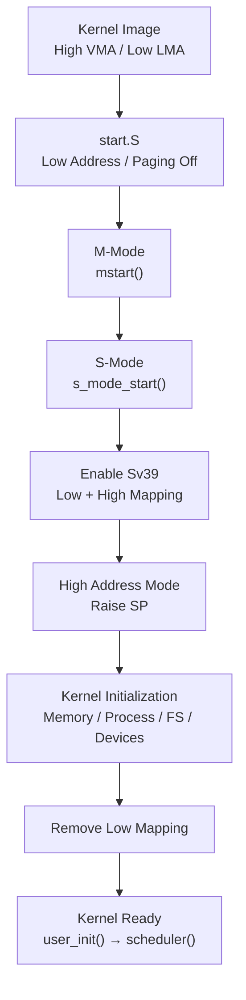
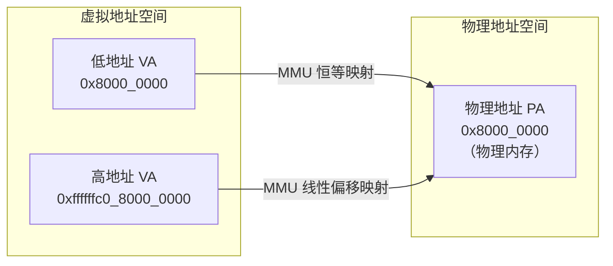

# RISC-V Boot Flow

!!! abstract
    `FrostVista` 当前仅有`RISC-V`一种架构，`virt`是`FrostVista`当前的开发平台

    `virt`提供了一个相对稳定、简单且足以覆盖操作系统核心功能的虚拟硬件环境

## BOOT

!!! info "BOOT"
    `FrostVista`将`Booting`时期分为了两个阶段，第一个阶段是无内存管理的阶段，第二个阶段就是有内存管理的阶段

    划分两个阶段的主要原因: 启用分页前需要内存，此时获取的内存地址为`PA`，而此时`FrostVista`选择不进行完整的内存管理，在分页启用后，内核的主要执行环境切换到了高半区虚拟地址，因此物理内存管理器最好直接向上层提供可访问的内核虚拟地址(`VA`)，而不是让整个内核到处进行 **PA → VA** 转换。

启动流程图：




### linker

`FrostVista`采用了高半区映射的方案，在进行链接时，进行区分`VMA`和`LMA`地址划分

```ld
# linker.ld
MEMORY
{
  VIRT (rwx) : ORIGIN = 0xffffffc080000000 , LENGTH = 128M
  PHYSMEM (rwx) : ORIGIN = 0x80000000, LENGTH = 128M
}
```

| 地址 | 含义 |
|---|---|
| VMA | 链接器认为程序运行的位置 |
| LMA | 程序实际加载的位置 |

!!! warning "静态数据问题"
    如果没有设置`VMA`为`0xffffffc080000000`，在内核编写过程中的**静态数据**将会设置为物理地址，在访问时可能会导致访问页未映射的问题(如果使用高半区映射)

!!! warning "opensbi空间占用问题"
    `opensbi`会占用前2MB的空间，所以`linker-sbi.ld`将空间地址向后调整了2MB
    否则，会出现**地址空间覆盖的问题(two regions overlap)**

---

### Boot Entry

进入 start.S 时:

| 启动状态 | 说明 |
|---|---|
| `_start.S`被装载进入低地址空间`0x80000000` | Paging 尚未启用 |
| Paging 未启用时，S-mode 下的地址转换不会产生正常的分页虚拟地址转换，因此内核使用的地址可以直接对应当前物理地址空间。 | Kernel 仍然运行在 Low Address |
| `.bss` 被清零 | 建立早期 Stack |
| 准备 C Runtime Environment | |

start.S 最主要的作用还是及时的准备一个可用的C语言环境，及时脱离使用汇编进行编程。

---

### M-Mode Initialization

start.S 完成后，会使用相对寻址，进入到`mstart`中，开始进行`M-Mode Firmware`的相关初始化(如果使用`opensbi`将不会进入`mstart`中，初始化，中断处理等设置将由`opensbi`代理完成，并直接将控制权交给`S-Mode`)

!!! important "相对寻址"
    在使用qemu启动内核时，使用了`ARCH_CFLAGS += -mcmodel=medany`，此命令是**修改编译器生成代码时的地址访问模型(Code Model)**，编译器使用`PC`相对寻址 来访问全局变量和函数。它允许程序中的**单个符号(函数或变量)**被放置在距离当前`PC`的`±2GB`范围内。

如果由`FrostVista`自己完成`M-Mode`初始化，`mstart()`负责完成进入`S-Mode`前的基本`Machine Mode`配置。

可以简单列为：

| 初始化步骤 | 内容 |
|---|---|
| `mstart()` | M-Mode Trap Handler；Address Space Protection；Interrupt Delegation；CPU ID；CLINT Timer；Prepare S-Mode |
| Prepare S-Mode | `mepc = s_mode_start`；`mstatus` |

```text
mstart()
├── M-Mode Trap Handler
├── Address Space Protection
├── Interrupt Delegation
├── CPU ID
├── CLINT Timer
└── Prepare S-Mode
    ├── mepc = s_mode_start
    └── mstatus
```

设置完成后，通过使用`mret`进入`s_mode_start()`

!!! warning "trap中断问题"
    如果由`FrostVista`自行设置`M-mode`的初始化，需要注意的是，`FrostVista`并没有完成完整的`SBI`调用，当前支持的`SBI`调用仅有`timer`定时器的处理。`opensbi`没有这个问题

### S-Mode & Paging

`FrostVista`开始初始化`Kernel`所需的基本硬件环境和内存管理：

| 初始化步骤 | 内容 |
|---|---|
| `s_mode_start()` | Trap Initialization；UART Initialization；Kernel Page Table；PLIC Initialization；Timer Initialization |

```text
s_mode_start()
├── Trap Initialization
├── UART Initialization
├── Kernel Page Table
├── PLIC Initialization
└── Timer Initialization
```
初始化的操作按重要性来进行排序

在不同的`Mode`下，需要设置不同的**中断处理(trap)**，为及时发现问题，应该在最开始的阶段就完成**中断处理**的初始化操作。

为了能够让`kernel`做出回应，`uart`作为我们获取`kernel`运行状态的重要依据，也需要进行及时的初始化处理，~~而不是让我们出问题时，面对一个黑框发呆~~。

!!! warning "uart地址问题"
    在分页之前初始化`uart`会导致`uart`在地址上处于物理地址，相较于高地址的低地址空间，在后面我们分页完成后，`uart`不做处理，会因地址原因导致无法输出字符。

    在处理`uart`地址的问题上，使用了一个可变的`uart_base_ptr`指针作为基地址，在分页完成后，将指针拉入高半区(分页会进行恒等映射和高半区映射，不必担心映射问题)。

做完`trap`和`uart`，下面最重要的就是分页(kvminit and kvminithart)。

当前的内核初始化还在第一个阶段，也就是没有内存管理的阶段，想要使用内存最简单的办法就是，直接从内核尾部`4KB`对齐后，直接使用指针切割`4KB`内存空间进行使用。

> 使用指针切割的空间并不会很多，只会映射前期必要的空间，比如页表使用的空间，指针切割的空间在后面并不会进行管理，也不会进行释放。

!!! important "为什么分页前不进行完整的内存管理"
    需要说明的是，可以不使用指针进行内存切割，直接获取完整内存进行管理，关于为什么要在分页后才开始完整收集内存进行管理，可以查看开头的解释。

`kvminit()`会初始化页表，将需要映射的区域，进行**恒等映射**和**高半区映射**的**双重映射**。

当前的内核加载进入，没有使用分页时，内核处于装载的低地址空间中，一旦映射开启，只映射了高地址空间，而没有进行恒等映射，会导致开启分页的一瞬间，导致页访问错误(page fault)，正在运行的空间没有被映射，内核panic。

当前页表会将物理内存区域建立为低地址恒等映射和高半区映射。

后续进入高半区空间，并清理完恒等映射后，再进行的映射，则是对空间的第二次映射。

分页完成后



完成后，则会继续完成`PLIC`的初始化和**时钟中断**的初始化和设置。

然后准备进入高半区空间: `switch_to_high_address`，在进入高半区后，对应的`sp`也需要修改到高半区

### High Address Transition

此时`FrostVista`正式进入**High Address Kernel Environment**。

```
Trap
└── trapinit()

Memory Management
├── kmalloc_init()
├── slab_init()
└── kmalloc_cache_init()

Process
└── procinit()

Timer
└── timer_init()

Filesystem
├── binit()
├── icache_init()
└── vfs_init()

Devices
└── virtio_disk_init()
```

`stvec`保存的是`trap vector`的地址，而这个地址也必须与当前地址转换环境一致。在进入高半区后，中断处理需要重新设置一遍，在未进入高半区时，设置的中断处理的符号地址在物理地址，到高半区后，需要重新设置为高半区。

!!! important "为什么同一个设置函数可以设置不同地址空间的trap"
    在进入高半区后，使用**相对寻址**，此时`pc`已经拉入高半区，此时的相对寻址，将是使用高半区，所以可以设置为高半区的地址空间

在内存管理中，此时获取到的所有的内存就是高半区虚拟地址。

### Remove Low Mapping

完成高地址环境初始化后：

```c
clear_low_memory_mappings();
```

删除 Low Address Mapping。

最终 Kernel 的地址空间变成：

```
Virtual Address

High Address
    │
    ▼
Kernel
    │
    ▼
Physical Memory


Low Address
    │
    X
    │
 Unmapped
```

### Kernel Ready

!!! success "Kernel Ready"
    最后：

    `user_init()`会调用`ecall exec("/init")`，执行`init`程序，init程序为`test/`文件夹下的测试程序。

    OS进入调度程序。

```
procinit()
    ↓
timer_init()
    ↓
binit()
    ↓
icache_init()
    ↓
vfs_init()
    ↓
virtio_disk_init()
    ↓
user_init()
    ↓
scheduler()
```

    进入：

    **Kernel Ready**
