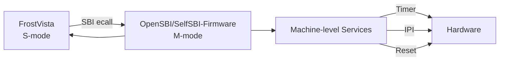

# SBI Interface

!!! abstract
    `FrostVista` 为`Boot=bare`提供了最基本的`SBI`调用接口和实现，即仅实现了**SBI调用能力**和`sbi_set_timer`和`sbi_shutdown`两个接口，`Boot=opensbi`则由`opensbi`进行处理。

`FrostVista`基于`RISC-V`特权架构，支持通过`Supervisor Binary Interface (SBI)`实现`S-mode`与`M-mode`之间的通信。

`SBI`是`RISC-V`定义的一组标准接口，用于为运行在`S-mode`的操作系统提供访问机器级资源的能力。

在不同启动模式下，`SBI`服务可以由不同的软件层提供：

- 在`opensbi`启动模式 下，`SBI`由运行在`M-mode`的`OpenSBI Firmware` 提供；
- 在`bare`启动模式 下，`SBI`由`FrostVista`自身实现的`M-mode Firmware`提供。



## SBI Call

`FrostVista`根据`RISC-V Supervisor Binary Interface Specification(riscv-sbi)`规定实现调用接口:

Entry:

- a7 : SBI Extension ID
- a6 : SBI Function ID
- a0-a5 : Function Arguments
  
Return:

- a0 : Error
- a1 : Value

通过在`S-mode`下执行`ecall`后，`CPU`从`S-mode`进入`SBI`的处理路径。`OpenSBI Firmware`或`M-mode Firmware`根据`Extension ID`和`Function ID`找到对应的`SBI`服务，完成操作后返回`S-mode`。

调用流程:

```
FrostVista S-mode
      │
      │ 设置 a0-a7
      ▼
    ecall
      │
      ▼
 SBI M-mode
      │
      │ Extension / Function
      ▼
 SBI Service
      │
      ▼
  返回结果
      │
      ▼
FrostVista S-mode
```

## SBI 与 Trap

`SBI` 调用本质上是一次从 `S-mode` 到 `M-mode` 的同步 `Trap`：

```
S-mode
  |
  | ecall
  |
  v
M-mode
  |
  | SBI Handler
  |
  v
S-mode
```

而普通设备中断：

```
Device
  |
  v
PLIC
  |
  v
S-mode Trap Handler
```

两者虽然都涉及 `Trap`，但方向不同：

| 类型  | 来源 | 目标 |
|---|---|---|
| SBI       | Call S-mode 主动请求  |	M-mode    |
| Device    | Interrupt 外部设备    |	S-mode    |
| Exception	| CPU执行异常           |	当前特权级 |

