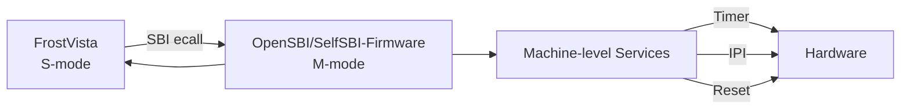

# SBI Interface

!!! abstract
    `FrostVista` 为 `Boot=bare` 提供了最小化的 `SBI` 实现，用于建立 `S-mode` 内核与 `M-mode firmware` 之间的标准调用接口。目前仅实现内核运行所需的基本 `SBI` 功能，包括 `Timer` 和 `System Reset`；在 `Boot=opensbi` 模式下，则由 `OpenSBI` 提供完整的 `SBI` 服务。

## overview

`FrostVista`基于`RISC-V`特权架构，支持通过`Supervisor Binary Interface (SBI)`实现`S-mode`与`M-mode`之间的通信。

`SBI`是`RISC-V`定义的一组标准接口，用于为运行在`S-mode`的操作系统提供访问机器级资源的能力。

在不同启动模式下，`SBI`服务可以由不同的软件层提供：

- 在`opensbi`启动模式 下，`SBI`由运行在`M-mode`的`OpenSBI Firmware` 提供；
- 在`bare`启动模式 下，`SBI`由`FrostVista`自身实现的`M-mode Firmware`提供。



## SBI Call

`FrostVista`根据`RISC-V Supervisor Binary Interface Specification(riscv-sbi)`规定实现调用接口:

Entry:

- a7 : SBI Extension ID
- a6 : SBI Function ID
- a0-a5 : Function Arguments
  
Return:

- a0 : Error
- a1 : Value

通过在`S-mode`下执行`ecall`后，`CPU`从`S-mode`进入`SBI`的处理路径。`OpenSBI Firmware`或`M-mode Firmware`根据`Extension ID`和`Function ID`找到对应的`SBI`服务，完成操作后返回`S-mode`。

调用流程:

```
FrostVista S-mode
      │
      │ 设置 a0-a7
      ▼
    ecall
      │
      ▼
 SBI M-mode
      │
      │ Extension / Function
      ▼
 SBI Service
      │
      ▼
  返回结果
      │
      ▼
FrostVista S-mode
```

## SBI Implement

!!! important "SBI 实现"
    当启动方式为`OpenSBI`时，**SBI调用**由`OpenSBI`接管，无需实现。

**SBI 调用实现**由`sbi.c`组装寄存器和`mtrap.c`接管实现组成。

```c
static inline long sbi_ecall(long eid, long fid, long a0, long a1, long a2,
			     long a3, long a4, long a5, long *out_val)
{
	register long _a0 asm("a0") = a0;
	register long _a1 asm("a1") = a1;
	register long _a2 asm("a2") = a2;
	register long _a3 asm("a3") = a3;
	register long _a4 asm("a4") = a4;
	register long _a5 asm("a5") = a5;
	register long _a6 asm("a6") = fid;
	register long _a7 asm("a7") = eid;
	asm volatile("ecall"
		     : "+r"(_a0), "+r"(_a1)
		     : "r"(_a2), "r"(_a3), "r"(_a4), "r"(_a5), "r"(_a6),
		       "r"(_a7)
		     : "memory");
	if (out_val)
		*out_val = _a1;
	return _a0; // error
}
```

对应的`sbi_set_timer`和`sbi_shutdown`是对`sbi_ecall`的封装实现。

`SBI调用实现`由系统在`S-mode`下使用`ecall`进行操作，在`mtrap.c`中判断为`异常(Exception 9)`后进行操作。

!!! warning
    `FrostVista` 在 `Boot=opensbi` 和 `Boot=bare` 模式下均通过 `SBI System Reset Extension` 提供 `shutdown` 能力，但两种启动模式下的实际执行路径不同。

     - Boot=`opensbi`：`FrostVista` 的 `S-mode` 内核通过 `SBI` 请求 `shutdown`，由运行在 `M-mode` 的 `OpenSBI` 接收并处理。`OpenSBI` 根据当前平台提供相应的 `reset/shutdown` 实现，因此在 `QEMU virt` 平台下可以直接完成系统退出。

    - Boot=`bare`：`FrostVista` 自身同时承担 `M-mode firmware` 的职责，因此 `SBI` 请求由 `FrostVista` 自己的 `SBI handler` 接收。由于 `FrostVista` 当前仅实现了最小 `SBI` 功能，尚未提供完整的平台 `reset backend`，因此在 `QEMU virt` 下，`shutdown` 最终通过直接访问 `sifive,test` 测试设备实现。


## SBI Trap Path

`FrostVista`在整个内核的调用链路当中

|调用时机|函数位置|调用函数|
|---|---|---|
|初始化timer|s_mode_start|sbi_set_timer|
|S-mode 设置timer|s_trap_handler 或 usertrap|sbi_set_timer|
|关机|U-mode exit|sbi_shutdown|

```
S-mode
  │
  │ ecall
  ▼
M-mode trap handler
  │
  ▼
SBI dispatcher
  │
  ├── Timer
  │     └── sbi_set_timer()
  │
  └── System Reset
        └── sbi_shutdown()
```

## SBI 与 Trap

`SBI` 调用本质上是一次从 `S-mode` 到 `M-mode` 的同步 `Trap`：

```
S-mode
  |
  | ecall
  |
  v
M-mode
  |
  | SBI Handler
  |
  v
S-mode
```

而普通设备中断：

```
Device
  |
  v
PLIC
  |
  v
S-mode Trap Handler
```

两者虽然都涉及 `Trap`，但方向不同：

| 类型  | 来源 | 目标 |
|---|---|---|
| SBI       | Call S-mode 主动请求  |	M-mode    |
| Device    | Interrupt 外部设备    |	S-mode    |
| Exception	| CPU执行异常           |	当前特权级 |

