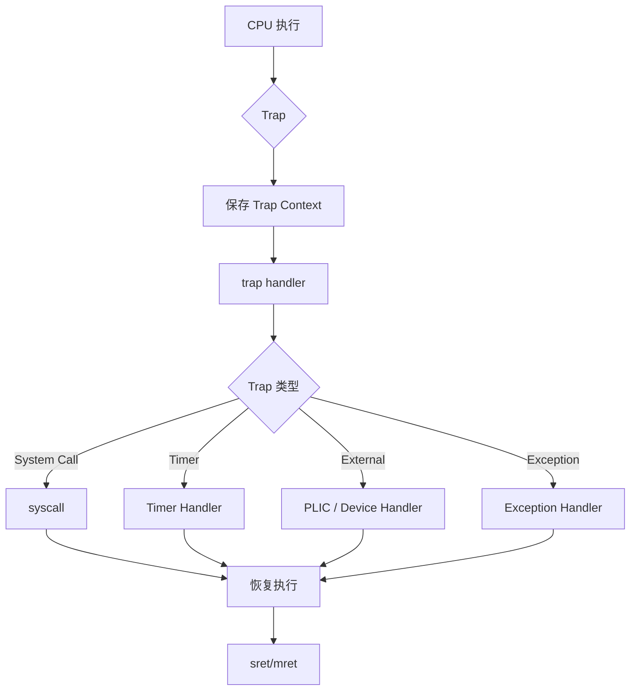

# Trap Handling

!!! abstract
    `FrostVista`的`Trap`机制负责处理来自`CPU`和外部设备的**异常Exception**与**中断Interrupt**。在`RISC-V`架构中`Trap`是`CPU`从当前执行流转移到内核处理路径的统一机制。

`FrostVista`当前主要处理以下几类`Trap`：

- 系统调用(System Call)
- 时钟中断(Timer Interrupt)
- 外部设备中断(External Interrupt)
- Page Fault
- 其他 CPU 异常



## Trap Entry

`FrostVista`在启动阶段初始化`Trap`处理机制，并设置`RISC-V`的`xtvec`寄存器，使`CPU`在发生`Trap`时能够进入内核提供的`Trap Entry`。

当使用`opensbi`时，`M-mode`下的`mtvec`由`opensbi`进行设置和管理。

!!! important "risc-v xtvec寄存器"
    `risc-v`架构中，提供了`xtvec`寄存器用来存放对应模式下的中断处理向量地址，其中`x`为对应的模式，在`M-mode`下为`mtvec`，在`S-mode`下为`stvec`

!!! important "xtvec xepc xip等"
    `risc-v`中，`x`代表对应的模式下存在的寄存器，比如`xtvec`就分为`mtvec`和`stvec`，`xepc`分为`mepc`和`sepc`等

Trap 发生后，CPU 会自动保存部分执行上下文，包括：

- sepc
- scause
- stval
- sstatus

```c
User / Kernel Execution
        │
        │ Trap
        ▼
      stvec
        │
        ▼
   Trap Entry
        │
        ▼
保存寄存器上下文
        │
        ▼
 trap handling
```

这里需要注意，`RISC-V`硬件并不会自动保存所有通用寄存器。因此`Trap Entry`还需要通过汇编代码保存当前执行上下文，形成内核使用的`Trap Frame`。

`FrostVista`通过使用`mtrapvec.S`, `kernelvec.S`, `Uservec.S`分别实现`M-mode`, `S-mode`, `U-mode`下的中断函数的上下文保存，调用及返回操作。

!!! important
    重要的一点，在`M-mode`下默认是不开启分页

## Trap Context

`FrostVista`使用`Trap Frame`保存`Trap`发生时的寄存器状态。

`Trap Frame`中保存的信息主要用于：

1. 保存被中断程序的执行状态；
2. 向系统调用处理程序传递参数；
3. 在`Trap`返回时恢复原来的执行环境；
4. 在用户态`Trap`和内核态`Trap`之间进行上下文切换。

在`trapframe`的设计中，会保存从`x1 - x31` 31个寄存器，同时额外保存一个`epc`。

额外保存的`epc`，专门方便在`trap handling`中设置`pc`进行返回使用。

## Trap Classification

`FrostVista` 在`Trap Handler`中首先根据 `scause` 判断` Trap`类型。

`RISC-V` 使用` scause`区分：

```
Interrupt
Exception
```

以及具体的`Trap`原因。

例如：

```
scause
  │
  ├── System Call
  ├── Timer Interrupt
  ├── External Interrupt
  ├── Page Fault
  ├── Illegal Instruction
  └── ...
```

因此 `Trap Handler` 本身主要负责识别和分发，而不是承担所有具体的处理逻辑。

---

## System Call

当用户程序通过`ecall` 请求内核服务时，会产生`Environment Call Trap`。

处理路径为：

```
User Program
     │
     │ ecall
     ▼
 Trap Entry
     │
     ▼
 System Call Handler
     │
     ▼
 syscall()
     │
     ▼
具体 System Call
```

处理完成后，内核修改`Trap Frame`中的返回值以及`sepc`，然后通过`sret`返回用户程序。

## Timer Interrupt

`Timer Interrupt`主要用于驱动内核的时间机制以及调度器。

处理路径：

```
Timer
  │
  ▼
Interrupt
  │
  ▼
Trap Handler
  │
  ▼
Timer Handler
  │
  ├── 更新时间
  │
  └── 触发调度
```

因此`Timer Interrupt`是`FrostVista`抢占式调度的重要基础。

## External Interrupt

外部设备产生的中断首先进入`PLIC`。

例如：

```
VirtIO Block Device
        │
        │ IRQ
        ▼
       PLIC
        │
        ▼
External Interrupt
        │
        ▼
   Trap Handler
        │
        ▼
   PLIC Claim
        │
        ▼
 Device Handler
```

`Trap Handler`判断这是`External Interrupt`后，由`PLIC`获取具体的`IRQ`编号，再交给对应设备驱动处理。

例如：

```
IRQ
 │
 ├── UART
 │
 ├── VirtIO
 │
 └── Other Devices
```

处理完成后需要向`PLIC`完成中断通知。

## Exception

与外部`Interrupt`不同，`Exception`通常是当前执行指令直接产生的。

例如：

```
Illegal Instruction
Page Fault
Instruction Fault
Load Fault
Store Fault
```

处理路径：

```
CPU
 │
 ▼
Exception
 │
 ▼
Trap Handler
 │
 ▼
scause / stval
 │
 ▼
Exception Classification
 │
 ├── 可恢复异常
 │
 └── 不可恢复异常
```

对于用户进程产生的异常，后续可以进一步转换为`Signal`。

```
User Process
     │
     ▼
   Fault
     │
     ▼
Trap Handler
     │
     ▼
Fault Classification
     │
     ▼
Signal
     │
     ▼
Signal Delivery
```

例如非法指令、用户态`Page Fault`等，可以最终产生对应的进程信号，而不是直接让整个`Kernel Panic`。

---

## Trap Return

`Trap`处理完成以后，`FrostVista`恢复`Trap Frame`中保存的执行上下文，并通过`RISC-V`的：`sret`

返回到`Trap`发生之前的执行环境。

```
Trap Handler
     │
     ▼
Restore Context
     │
     ▼
Update xepc / xstatus
     │
     ▼
    xret
     │
     ▼
Resume Execution
```

对于用户态进程，返回后继续执行用户代码；如果`Trap`期间发生了调度，则可能返回到另一个进程。
