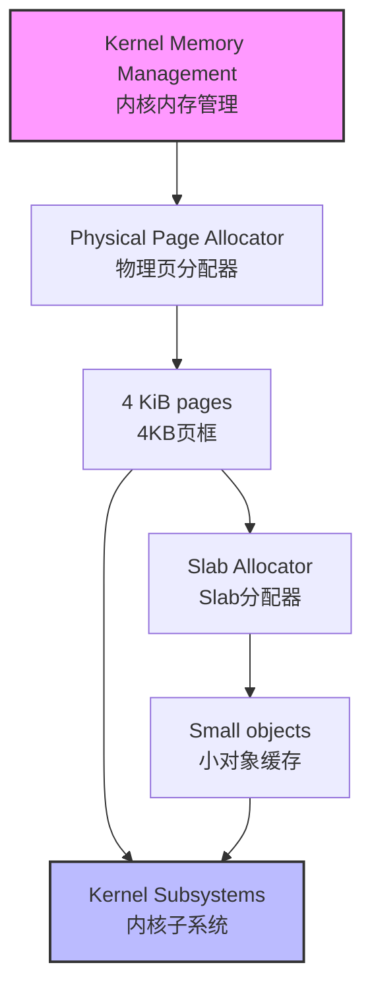

# Physical Page Allocator

!!! abstract
    `FrostVista` 当前使用基于 `4KB` 页面的基础物理分配器管理可用的物理内存，并为页表、内核堆等内核子系统提供底层页面分配能力。当前的实现以简单空闲页管理，暂未引入 `Buddy` 等更复杂的物理内存分配算法

## Overview

在启用分页前，内核启动的初期，内核需要内存空间建立地址映射开启分页。

在启用分页后，内核需要动态获取和释放物理页面。例如页表创建、用户地址空间建立以及部分内核数据结构都需要独立的物理页面。因此 `FrostVista` 在内存管理的底层提供 `Physical Page Allocator`，用于管理系统中的空闲物理页面。

在 `FrostVista` 中内核启动后，最终收集管理的内存为下面的标准：

```
Page Size: 4KB
Allocation Unit: 1 page
Address Type: Virtual Address
```

## Physical Memory Layout

```
0x80000000
    ↓
Kernel Image
    ↓
Early Address Mapping
    ↓
Free Physical Memory
```

`FrostVista` 在内存中划定了内核的占用空间，后续的剩余内存空间中，其中一部分被用来建立最初的**地址映射(Early Address Mapping)**，因为这部分空间属于内核，而且本就不应该被释放，所以在后续**开启分页后**，并不会再进行收集和管理。

## Allocation(Early)

`FrostVista` 在初期准备开启分页而占用空间时，会选择使用指针进行`4KB`空间的划分。

```c
char *ekalloc_ptr = (char *) _kernel_end;

void *ekalloc(void)
{
	if (((uint64) ekalloc_ptr % PGSIZE) != 0)
		panic("ekalloc panic");

	void *ret = ekalloc_ptr;
	// LOG_TRACE("ekalloc: %p", (void *)ret);
	ekalloc_ptr += PGSIZE;
	return (void *) VA2PA(ret);
}
```

在 `linker.ld` 中，`kernel_end` 被链接到了 `virt` 区域中，即高地址虚拟空间，即高地址虚拟空间，所以最终`ekalloc_ptr`指向的位置在高地址虚拟空间，在内核使用初期，分页未被建立时，需要使用的空间是低地址物理空间。

由于内核镜像以高半区虚拟地址链接，而早期分页尚未启用，`ekalloc()` 使用内核链接地址进行空间划分，并通过 `VA2PA()` 将其转换为实际的物理地址，从而为建立初始页表提供物理内存。

```
kernel_end
    │
    │ Kernel VA
    ▼
ekalloc_ptr
    │
    │ VA2PA()
    ▼
Physical Memory
```

在`ekalloc`的帮助下，内核得以建立初期的内核页表，开启分页。

此时的空间分部:

```
0x80000000
    ↓
Kernel Image
    ↓
Early Address Mapping
    ↓
Free Memory
```

开启分页后，会将后续剩余的所有内存空间收集管理。

## Page Representation

内核物理页管理数据结构:

```c
struct IdleMM {
	struct IdleMM *next;
};

struct freeMemory {
	struct IdleMM *freelist;
	uint64 size;
};
```

在逻辑上

```
freeMemory
    │
    ├── size
    └── freelist-->next-->next-->next-->...-->0
```

`freeMemory`管理整体链表，在划分内存空间时，`FrostVista` 不为每个物理页维护额外的 metadata，而是直接利用空闲页自身的起始空间存储 `free-list node`，在空闲页的开头使用`struct IdleMM`结构体，并使其指向下一个空闲页，使所有的空闲页串联起来，组成链表。

在实际的实现当中，会使用一个空结构体`head`放置到`freeMemory`中，使其变成带头节点的链表。

## Free Page Management

`freeMemory` 中 `head.next` 所指向的节点不为空，则证明还有空闲页，在需要内存空间时，将 `head.next` 指向的空闲页摘出，在释放内存时，则放入链表。

|分配函数|分配复杂度|
|---|---|
|kalloc|O(1)|
|kfree|O(1)|

## Allocation(Later)

`FrostVista` 提供了`kalloc()`和`kfree()`来进行获取和释放内存。

`FrostVista` 规定使用此函数进行释放和分配的内存空间，都是**虚拟地址空间(VA)**。

!!! warning
    `FrostVista` 的进程地址空间通过物理页引用计数实现了基础的 `Copy-on-Write(COW)`机制，因此 `kfree()` 不能简单地将传入页面立即归还空闲链表，而需要首先检查该页面的引用计数。

`kalloc` 会在链表中查找当前是否有空闲页，寻找到后会将当前页计入引用，并返回。

`kfree` 会在校验地址后，检查当前的引用次数，确认无误后会将空闲页放入 `freeMemory` 中。

## Initialization

`FrostVista` 使用 `kalloc_init()` 初始化链表，放入头节点，并调用 `freerange()` 将未被使用的空间(从 `ekalloc_ptr` 指向的位置以 `4KB` 对齐)，进行 `4KB` 的内存空间划分挂载进入 `struct freeMemory` 中。

```
Kernel End
    │
    ▼
ekalloc_ptr
    │
    │ reserved during Early Boot
    ▼
Free Memory Start
    │
    ▼
freerange()
    │
    ├── page
    ├── page
    ├── page
    └── ...
```

## Relationship with Slab

`Physical Page Allocator` 和 `Slab Allocator` 处于不同层次。前者以物理页面为基本分配单位，为页表等需要完整页面的对象提供内存；后者建立在页面分配能力之上，用于高效分配固定大小的小型内核对象。



`Slab Allocator` 没有直接获取内存空间的能力，在需要内存空间时，需要向 `Physical Page Allocator` 进行获取。
