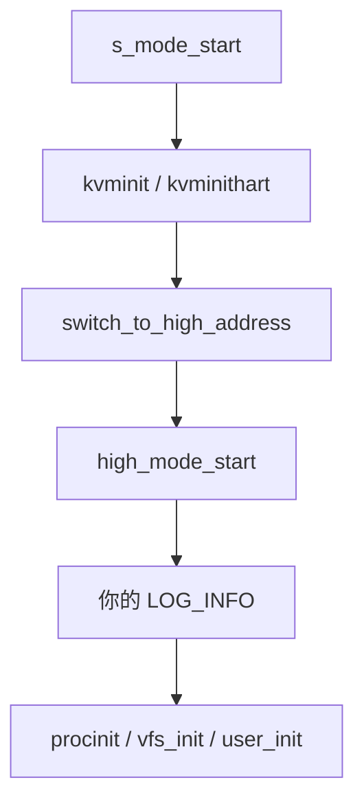

# Lab 1 参考答案

本页是 Lab 1 的参考答案和操作说明。

!!! warning "先完成实验记录"
    如果你还没自己做一遍，请先回到 [Lab 1 Hello Boot Log](lab1-hello-kernel.md)。直接看答案会让这个实验失去大半价值。

## Task 1 先跑通原始系统

推荐命令：

```bash
make qemu BOOT=opensbi ROOTFS=easyfs FS_LIST="easyfs devtmpfs" TEST=fvsh
```

如果系统正常启动，最后应该能进入 FrostVista shell：

```text
fvsh>
```

能看到 `fvsh>`，说明至少这些事情已经成功：

```text
构建 kernel.elf
  -> 生成 Easy-FS 镜像
  -> QEMU 启动
  -> 内核初始化
  -> 创建 /init
  -> 进入 fvsh
```

## Task 2 加入自己的启动日志

推荐修改位置：

```text
arch/riscv/boot/smode.c
```

推荐函数：

```c
high_mode_start()
```

可以把日志放在：

```c
LOG_INFO("Hello FrostVista OS!");
```

后面，例如：

```c
LOG_INFO("Hello from my boot lab!");
```

这里推荐 `high_mode_start()`，不是因为只有这里能输出，而是因为这里对新人最稳妥：系统已经进入 S mode，并且前面的 UART、分页和高地址切换都已经走过一部分。

## Task 3 输出参考

重新运行：

```bash
make qemu BOOT=opensbi ROOTFS=easyfs FS_LIST="easyfs devtmpfs" TEST=fvsh
```

输出中应该能看到类似：

```text
[   0.xxx] [ INFO] Hello FrostVista OS!
[   0.xxx] [ INFO] Hello from my boot lab!
```

如果没有看到，优先检查：

- 是否改的是 FrostVistaOS 仓库，而不是 Wiki 仓库；
- 是否保存了文件；
- 是否重新运行完整 `make qemu`；
- 是否把日志写成了不存在的宏；
- 当前日志级别是否允许 `INFO` 输出。

## Task 4 启动阶段定位参考

如果日志加在 `high_mode_start()` 中，那么参考答案可以写成：

```text
我的日志加在 arch/riscv/boot/smode.c 的 high_mode_start() 中。
它出现在 switch_to_high_address() 之后。
它出现在 procinit()、vfs_init()、user_init() 之前。
判断依据是 s_mode_start() 会调用 switch_to_high_address() 跳到 high_mode_start()，
而 high_mode_start() 里后面才开始初始化进程、文件系统和用户进程。
```

对应链路：



## Task 5 手册查表参考

不要照抄下面文字。实验记录里应该用你自己的话写。

| 关键词 | 参考解释 |
|--------|----------|
| `mstatus.MPP` | 记录从 M mode 执行 `mret` 时要返回到哪个 privilege mode。FrostVistaOS 在 `mstart()` 中把它设成 S。 |
| `mepc` | Machine Exception Program Counter。`mret` 后会跳到 `mepc` 保存的地址继续执行。 |
| `mret` | RISC-V 的 machine-mode return 指令，不是普通 C 函数返回。它会结合 `mstatus.MPP` 和 `mepc` 完成特权级返回和跳转。 |
| `PMP` | Physical Memory Protection，用于控制低权限模式能访问哪些物理内存区域以及访问权限。 |
| `pmpaddr0` | PMP entry 的地址范围相关寄存器。FrostVistaOS 用它设置一个较大的可访问范围。 |
| `pmpcfg0` | PMP entry 的配置寄存器，包含权限和地址匹配模式等信息。 |
| `mideleg` | Machine Interrupt Delegation。决定哪些 interrupt 交给 S mode 处理。 |
| `medeleg` | Machine Exception Delegation。决定哪些 exception 交给 S mode 处理。 |

## Task 6 思考题参考

### 为什么不一直运行在 M mode？

参考回答：

```text
M mode 是机器最高权限，适合做最底层机器控制。
FrostVistaOS 想实现 Unix-like 的内核/用户分层，所以主要内核逻辑应该运行在 S mode，用户程序运行在 U mode。
如果内核一直在 M mode，syscall、page fault、timer interrupt、OpenSBI 与内核职责这些边界都会变得不清楚。
```

### 为什么不建议第一次把日志加在 `_start` 或 `mstart()`？

参考回答：

```text
_start 还在最早的汇编阶段，C 运行环境还没完全准备好。
mstart 位于 M mode 交接阶段，UART/log/地址环境不如 high_mode_start 稳定。
第一次实验应该先选择能稳定输出的位置，确认自己能完成“改代码 -> 运行 -> 观察”的闭环。
```

### 日志出现说明启动至少走过哪些阶段？

如果日志在 `high_mode_start()`，它说明至少已经走过：

```text
_start
  -> s_mode_start 或 mstart 后进入 s_mode_start
  -> kvminit / kvminithart
  -> switch_to_high_address
  -> high_mode_start
```

## 进阶：tp 参考答案

### tp 在 RISC-V psABI 中是什么？

`tp` 是 RISC-V ABI 名称，对应寄存器 `x4`，通常叫 thread pointer。

在普通 ABI 语境下，它和 thread-local storage 有关。普通函数不应该随便破坏它，因为运行时或编译器生成的代码可能依赖它找到当前线程相关的数据。

### FrostVistaOS 为什么用 tp 保存 hart id？

FrostVistaOS 内核需要快速知道当前运行在哪个 hart / CPU 上。

它选择把当前 hart id 放进 `tp`，这样 `cpuid()` 可以快速读取：

```text
cpuid()
  -> hal_get_cpu_id()
  -> r_tp()
  -> tp
```

相关代码位置：

```text
kernel/core/proc.c
arch/riscv/include/asm/cpu.h
arch/riscv/include/asm/riscv.h
```

### OpenSBI 路径下 tp 从哪里来？

OpenSBI 路径中，`start.S` 有：

```asm
#ifdef OPEN_SBI_BOOT
    mv tp, a0
    call s_mode_start
```

也就是说，OpenSBI 把 hartid 放在入口参数 `a0` 中，FrostVistaOS 把它复制到 `tp`。

### bare 路径下 tp 从哪里来？

bare 路径中，`mstart()` 有：

```c
int id = (int) r_mhartid();
w_tp(id);
```

因为 bare 路径没有 OpenSBI 帮忙传 hartid，所以 FrostVistaOS 自己读 `mhartid`，再写入 `tp`。

### 为什么两条路径不同？

参考回答：

```text
BOOT=opensbi 时，OpenSBI 已经完成 M mode 层面的启动工作，并按约定把 hartid 传给 S mode kernel。
BOOT=bare 时，没有 OpenSBI 这个中间层，所以 mstart 需要自己读取 mhartid。
两条路径最后都把 hartid 放进 tp，是为了让后续 cpuid() 使用同一套读取方式。
```

## 常见错误分析

### 把答案写成“tp 就是 CPU id”

这个说法不够精确。

更准确是：

```text
tp 在 RISC-V psABI 中是 thread pointer。
FrostVistaOS 内核选择把 hart id 存到 tp 中，所以在 FrostVistaOS 内核语境下，cpuid() 可以通过 tp 读到当前 CPU id。
```

### 直接修改 tp 的值

不要这样做。

`tp` 关系到 `cpuid()`，进一步关系到 per-CPU 数据和调度相关逻辑。随便写 `w_tp(123)` 可能导致系统访问错误的 CPU 结构。

### 把 OpenSBI 路径和 bare 路径混在一起

两条路径都进入 `s_mode_start()`，但它们进入前的准备不同：

```text
BOOT=opensbi: OpenSBI 先运行，hartid 从 a0 传入
BOOT=bare: FrostVistaOS 自己从 M mode 开始准备，hartid 从 mhartid 读取
```

这就是 `tp` 来源不同的根本原因。
