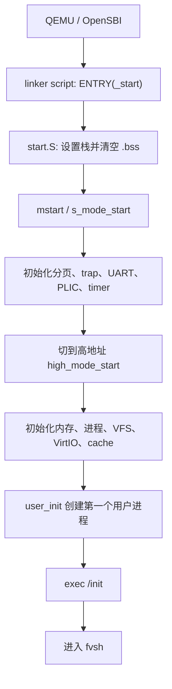

# 总览

本章对应的代码版本是：

[https://github.com/AuroBreeze/FrostVistaOS/tree/v1.0](https://github.com/AuroBreeze/FrostVistaOS/tree/v1.0)

v1.0 这个版本已经引入了最小的 `fvsh`、VFS、Easy-FS、devtmpfs，以及一批基础用户程序。也就是说，它已经不是一个只能跑单个测试的 kernel，而是有了一个简单 Unix-like 系统的样子。

不过，第一次打开一个 OS 项目时，其实很容易懵。

普通 C 程序还能从 `main()` 开始看，但内核不是普通程序。它没有 libc 帮我们准备运行环境，也没有一个天然的 `main()` 等在那里。

所以读 FrostVistaOS 的第一步，不是马上理解所有细节，而是先找到一条能走下去的线：

> QEMU 启动以后，第一条属于 FrostVistaOS 的代码在哪里？

这个问题会把我们带到 linker script。

!!! tip "先抓主线，不要死磕细节"
    第一次读总览时，不需要完全理解 linker script、ELF、页表、trap、VFS。
    你只需要先知道它们在系统启动链上分别出现在哪里。
    等后面读到对应章节时，再回来看这些名字，就会清楚很多。

---

## 从哪里开始看？

如果你已经有一些 C / OS / ELF 经验，可以直接从这几个文件开始：

```text
arch/riscv/linker.ld
arch/riscv/linker-sbi.ld
arch/riscv/boot/start.S
```

在 linker script 里，入口不是猜出来的，而是明确写出来的：

```ld
ENTRY(_start)
```

然后 `.text.entry` 会把最早执行的启动代码放到普通 `.text` 前面：

```ld
*(.text.entry)
```

顺着这个线索，就能找到真正的启动代码：

```text
arch/riscv/boot/start.S
```

如果你是第一次读 OS 项目，也不用急着把这些文件全部看懂。

我们先只抓三个点：

1. `ENTRY(_start)`：内核入口符号叫 `_start`；
2. `.text.entry`：最早执行的代码会被放在这里；
3. `start.S`：真正的第一段启动代码在这里。

至于什么是 ELF、为什么要有 `.text`、为什么要清空 `.bss`、为什么要设置栈，这些都可以先放一放。它们后面都会慢慢讲。

---

## 一条主线：从 `_start` 到 `fvsh`

`_start` 做的事情其实不多：设置栈，清空 `.bss`，然后根据启动方式进入下一阶段。

FrostVistaOS 支持两条启动路径：

- `BOOT=bare`：从 M-mode 进入，先走 `mstart()`；
- `BOOT=opensbi`：由 OpenSBI 帮忙进入 S-mode，直接走 `s_mode_start()`。

这里也不用一开始就完全理解 M-mode、S-mode、OpenSBI。先知道它们都只是为了把系统带到 S-mode 下继续初始化就行。



这条线就是本教程的主线。

它不是一堆模块的并列介绍，而是一个小系统从“CPU 开始执行第一条指令”到“用户在 shell 里敲命令”的过程。

---

## 目录不是拿来背的

看完整条启动线以后，再回头看目录就清楚多了。

```text
arch/riscv/        和机器相关：启动、分页、trap、SBI、UART、timer、PLIC
kernel/mm/         内存相关：物理页分配、mmap、用户地址空间辅助逻辑
kernel/core/       内核核心：进程、调度、exec、syscall、文件描述符、pipe
kernel/fs/         文件系统：VFS、Easy-FS、EXT4、devtmpfs、block cache、inode cache
kernel/driver/     设备驱动，目前重点是 VirtIO block
include/           内核公共头文件和共享常量
mk/                构建、链接、镜像、QEMU 参数都在这里拼起来
mkfs/              宿主机上的 Easy-FS 镜像构建工具
scripts/           自动化测试 runner 和辅助脚本
test/              用户态测试程序，每个 test/test_*.c 都可以成为 /init
user/              用户态 syscall wrapper 和小型运行时
user/bin/          用户程序，例如 fvsh、echo、cat、mkdir、rm
```

所以目录树不是阅读起点，而是你沿着启动线走过一遍之后，用来定位“我现在在哪一层”的地图。

---

## 从 shell 往回看内核

v1.0 里最值得看的地方，是系统已经能进入 `fvsh`。

这意味着 FrostVistaOS 已经形成了一个小闭环：

```text
启动内核
  -> 初始化内核子系统
  -> 创建第一个用户进程
  -> 加载 /init
  -> 进入 fvsh
  -> 用户通过 syscall 使用内核功能
```

从 `fvsh` 往回看，系统路径大概是这样的：


例如你在 shell 里运行一个外部命令，它大致会走：

```text
fvsh
  -> fork
  -> execv
  -> wait
```

这条路径会同时经过进程管理、文件描述符、VFS 路径查找、ELF loader、用户页表和 trap 返回用户态。

所以 `fvsh` 不是一个孤立的用户程序。它更像是一个窗口：透过它可以看到内核的很多能力是否真的连起来了。

---

## 现在不需要全部懂

本教程后面会遇到很多名字：linker script、ELF、Sv39、trap、syscall、VFS、inode、block cache、VirtIO。

第一次看到这些名字时，不需要马上完全理解。

更好的读法是：每次只问三个问题。

```text
这个模块解决了什么问题？
如果没有它，系统会卡在哪一步？
它把系统推进到了下一步的哪里？
```

比如：

- linker script 先帮我们找到入口；
- 分页让内核能切到高地址运行；
- trap 让用户态能进入内核；
- syscall 给用户程序提供内核服务；
- VFS 把不同文件系统统一到同一套接口；
- `fvsh` 把这些能力串成一个可以交互的环境。

这样看，后面的章节就不再是一堆孤立知识点，而是一条线：

```text
工具链
  -> Linker 与 ELF
  -> 启动
  -> 分页
  -> Trap
  -> 进程
  -> 系统调用
  -> Exec
  -> VFS
  -> Easy-FS / devtmpfs
  -> Pipe
  -> Shell
```

总览不是把所有知识讲完，而是先告诉你：这些知识后面会在哪里派上用场。
