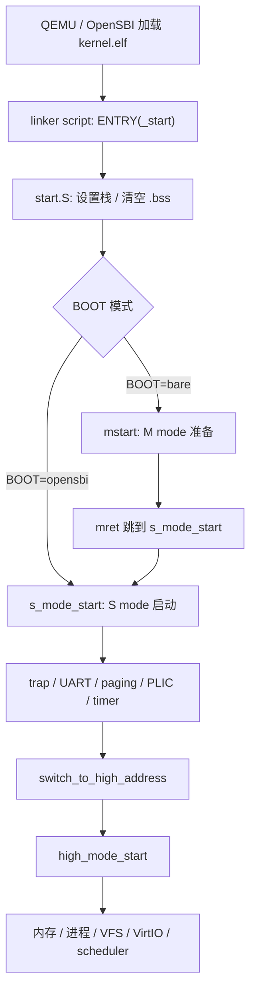
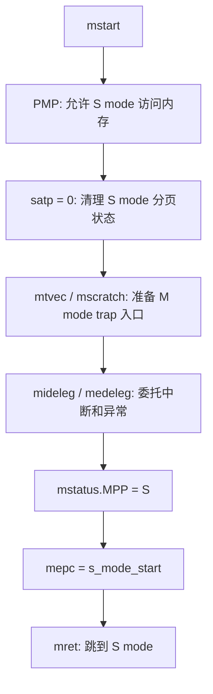
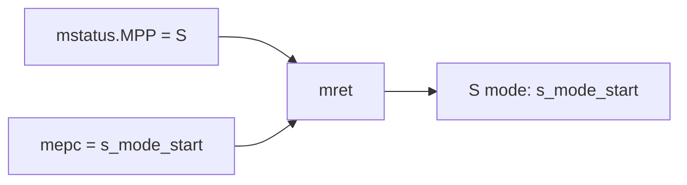
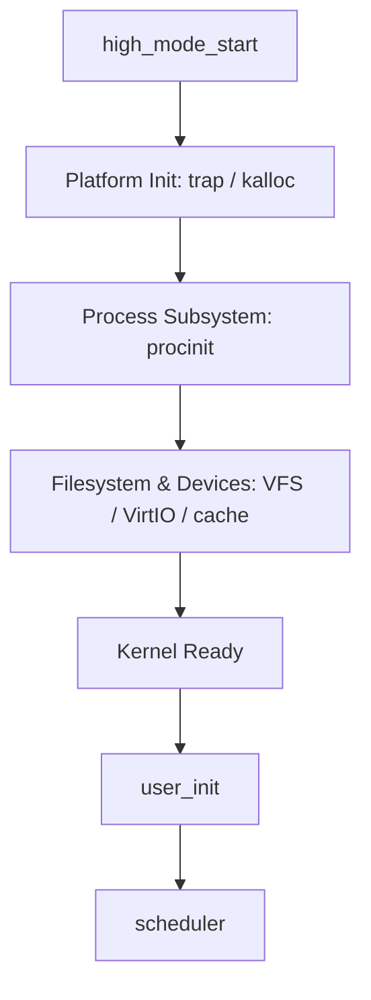

# 启动

如果你第一次打开 FrostVistaOS 的启动代码，大概率会先看到一堆不太友好的名字：`_start`、`.text.entry`、`mstart`、`s_mode_start`、`satp`、`mideleg`、`medeleg`、`mret`。

这些名字看起来像是突然从天上掉下来的。

但启动章节先不急着背概念。我们只抓住一个问题：

> QEMU 把 FrostVistaOS 加载起来以后，系统是怎么从第一条指令走到内核主初始化的？

!!! tip "本章的读法"
    第一次读时，只需要知道每一步“把系统推进到了哪里”。

!!! warning "必备 RISC-V 特权架构手册"
    **任何解释都不如自己去官方定义下查看**

    本章会频繁遇到 RISC-V privileged architecture 里的概念。建议先从[在线资源参考](../reference/online-resources.md#risc-v)下载或打开 **RISC-V Privileged Architecture**，不用通读，先会查关键词即可。

    读这一章时，可以重点在手册里搜索这些内容：

    - `Machine mode` / `Supervisor mode` / `User mode`：理解 M mode、S mode、U mode 的权限分工；
    - `mstatus`：理解 `MPP` 字段，以及 `mret` 会返回到哪个 privilege level；
    - `mepc`：理解 `mret` 后会跳到哪里继续执行；
    - `mret`：理解它为什么不是普通 C 函数的 `return`；
    - `mtvec`：理解 M mode trap 发生时跳到哪里；
    - `mscratch`：理解 M mode trap handler 为什么需要临时保存区；
    - `PMP` / `pmpaddr0` / `pmpcfg0`：理解物理内存保护和 S mode 访问权限；
    - `satp`：理解 S mode / U mode 的地址翻译状态；
    - `medeleg`：理解哪些 exception 可以委托给 S mode；
    - `mideleg`：理解哪些 interrupt 可以委托给 S mode；
    - `mcause` / `scause`：理解 trap cause code 怎么查。

    如果看到 code 不知道含义，可以配合查 [RISC-V Trap Codes](../reference/trap-codes.md)。

## 启动主线

先把整条线摊开：



这一章主要讲到 `high_mode_start()`。再往后的进程、系统调用、文件系统，会在后面的章节继续展开。

## 入口不是 main

普通 C 程序通常从 `main()` 开始。

内核不一样。

FrostVistaOS 没有一个由 libc 帮忙准备好的运行环境。QEMU / OpenSBI 只负责把内核加载起来，真正的入口要靠 linker script 指出来。

在两个 RISC-V linker script 中都能看到：

```ld
ENTRY(_start)
```

这表示内核入口符号叫 `_start`。

同时，linker script 会把 `.text.entry` 放在代码段最前面：

```ld
*(.text.entry)
```

所以我们顺着 `_start` 找到：

```text
arch/riscv/boot/start.S
```

!!! note "入口、地址和 QEMU 是一组问题"
    如果你还不熟悉 `ENTRY(_start)`、`.text.entry`、VMA/LMA，可以先看[Linker Script 与 ELF](../tools/linker-elf.md)。如果你想知道 QEMU 怎么加载内核，可以看[QEMU](../tools/qemu.md)。

## start.S 只做三件事

`start.S` 是 FrostVistaOS 最早执行的代码。

它很短，核心只有三件事。

第一件事：设置栈指针。

```asm
la sp, _stack_top
```

第二件事：清空 `.bss`。

```asm
la t0, _bss_start
la t1, _bss_end
1:
    bgeu t0, t1, 2f
    sd zero, 0(t0)
    addi t0, t0, 8
    j 1b
```

第三件事：根据启动方式进入下一阶段。

```asm
#ifdef OPEN_SBI_BOOT
    mv tp, a0
    call s_mode_start
#else
    call mstart
#endif
```

这里最关键的是：`start.S` 不试图把整个内核初始化完。它只是尽快把 C 语言运行环境准备好，然后进入 C 代码。

为什么要自己设置栈和清 `.bss`？

因为现在还没有普通程序里的运行时环境。没有 libc 帮我们设置 `sp`，也没有启动代码帮我们把未初始化全局变量清零。这些事情在 OS 里必须自己做。

!!! warning "不要在汇编里做太多"
    启动汇编越复杂，越难调试。FrostVistaOS 的策略是：汇编只做最低限度准备，尽快进入 C 世界。

## 两条启动路径

FrostVistaOS 支持两条启动路径：

| 启动方式 | 编译参数 | QEMU BIOS | 下一步 | 适合用来理解什么 |
|----------|----------|-----------|--------|------------------|
| bare | `BOOT=bare` | `-bios none` | `_start -> mstart -> s_mode_start` | 从 M mode 交接到 S mode |
| OpenSBI | `BOOT=opensbi` | `-bios default` | `_start -> s_mode_start` | 日常运行和调试 |

这个选择来自 `mk/arch-riscv.mk`：

```make
ifeq ($(BOOT), opensbi)
  BOOT_CFLAGS := -DOPEN_SBI_BOOT
  LINKER_SCRIPT := arch/$(ARCH)/linker-sbi.ld
  QEMU_BOOT_FLAGS := -bios default
else ifeq ($(BOOT), bare)
  BOOT_CFLAGS :=
  LINKER_SCRIPT := arch/$(ARCH)/linker.ld
  QEMU_BOOT_FLAGS := -bios none
endif
```

也就是说，`BOOT` 不只是影响 QEMU 参数。它还会影响：

- 是否定义 `OPEN_SBI_BOOT`；
- 使用哪个 linker script；
- `_start` 后面走 `mstart()` 还是 `s_mode_start()`；
- 内核被放到哪个物理地址附近。

!!! tip "推荐日常使用 OpenSBI"
    本 Wiki 的运行示例更推荐 `BOOT=opensbi`。但如果你想理解 RISC-V bare-metal 启动和 M mode 到 S mode 的交接，`BOOT=bare` 更适合拿来读。

## 特权模式先按分工理解

RISC-V 有不同的 privilege level。这里先只看三个：

| 模式 | 英文 | 直觉理解 | FrostVistaOS 中的角色 |
|------|------|----------|----------------------|
| M mode | Machine mode | 机器最高权限 | 做最底层机器级准备 |
| S mode | Supervisor mode | 内核权限 | 运行主要内核逻辑 |
| U mode | User mode | 用户权限 | 运行用户程序 |

第一次看到它们，不要急着背手册定义。

你可以先这样理解：

```text
M mode 负责“把机器交给内核”
S mode 负责“以内核身份管理系统”
U mode 负责“运行普通用户程序”
```

为什么不让 FrostVistaOS 一直运行在 M mode？

因为 M mode 权限太高。它适合做最底层的机器控制，比如配置 PMP、设置 trap 委托、准备 timer，然后把系统交给 S mode。

而我们平时说的 OS kernel，更接近 S mode 的角色：它管理进程、页表、系统调用、文件系统和设备抽象；用户程序则运行在 U mode。

如果内核一直常住 M mode，当然也可以把系统跑起来，但很多边界就不清楚了：

- 用户程序陷入内核时，到底是进入 OS，还是进入机器最高权限？
- page fault 应该由谁处理？
- timer interrupt 为什么能触发调度？
- OpenSBI 和内核之间的职责怎么区分？

所以 FrostVistaOS 在 `mstart()` 里做完机器级准备后，会通过 `mret` 跳到 `s_mode_start()`，让后续内核逻辑运行在 S mode。

## mstart 的任务不是启动完整内核

现在进入 `mstart()`。

它的目标可以用一句话概括：

> `mstart()` 在 M mode 做交接准备，然后通过 `mret` 进入 S mode 的 `s_mode_start()`。

它不是完整内核初始化。它更像一张交接清单。



下面逐个看。

## 给 S mode 打开内存访问权限

`mstart()` 首先配置 PMP：

```c
w_pmpaddr0(~0ULL);
w_pmpcfg0(0x0f);
```

PMP 是 Physical Memory Protection，也就是物理内存保护。

这个名字听起来很抽象。第一次读时，可以先把它理解成：

> M mode 给低权限模式发的一张物理内存通行证。

如果不配置 PMP，后面进入 S mode 后，S mode 内核访问物理内存时可能被硬件拦下来。

FrostVistaOS 这里先采用一个很直接的做法：放开一大段物理地址的 R/W/X 权限，让 S mode 后续初始化能继续走下去。

!!! note "现在不用完全掌握 PMP"
    这里先知道 PMP 解决的是“低权限模式能不能访问某段物理内存”。更细的规则可以之后再查 RISC-V privileged spec。

## 清理 S mode 的分页状态

接下来：

```c
w_satp(0);
sfence_vma();
```

`satp` 是 S mode 地址翻译相关的寄存器。分页开启后，S mode / U mode 的地址访问会经过页表翻译。

这里容易讲错：`mstart()` 当前运行在 M mode，而 M mode 本身并不是靠 S mode 的分页机制来访问内存的。即使后面 S mode 打开了分页，再次进入 M mode 时，也不能把它理解成“继续使用 S mode 页表”。

所以 `w_satp(0)` 更准确的理解不是“M mode 关闭自己的分页”，而是：在准备进入 S mode 前，先把 S mode 的地址翻译状态清成一个确定值，避免带着旧的页表状态进入后续启动流程。

这也解释了一个启动细节：如果从 S mode trap 回到 M mode，M mode 入口处使用的栈最好是物理低地址。因为 M mode 不能假设自己还能通过 S mode 的高地址映射访问内存。

后面在 `s_mode_start()` 里，FrostVistaOS 才会调用：

```c
kvminit();
kvminithart();
```

这时才开始正式建立和启用内核页表。

!!! tip "一句话记住"
    `mstart()` 里写 `satp = 0`，不是因为 M mode 依赖分页，而是为了让即将进入的 S mode 从一个干净的地址翻译状态开始。

## 准备 M mode trap 入口

然后：

```c
int hartid = (int) r_mhartid();
w_mscratch((uint64) &mscratch0[(int64) hartid * 32]);
w_mtvec((uint64) m_trap_handler);
```

这里出现了两个寄存器：

| 寄存器 | 直觉理解 |
|--------|----------|
| `mscratch` | M mode trap handler 临时保存上下文用的区域 |
| `mtvec` | M mode 遇到 trap 时跳到哪里 |

trap 这个词后面会专门讲。现在先把它理解成：CPU 遇到中断、异常、系统调用这类“正常流程之外的事情”时，需要跳到一个固定入口处理。

虽然 `mstart()` 马上要离开 M mode，但离开前仍然要给 M mode 留好“出事时跳到哪里”的入口。

## 委托中断和异常

接下来是很多新人最容易卡住的两行：

```c
w_mideleg((1 << 5) | (1 << 9));

w_medeleg((1 << 1) | (1 << 2) | (1 << 3) | (1 << 8) |
          (1 << 12) | (1 << 13) | (1 << 15));
```

先不用背这些数字。

`mideleg` 是 interrupt delegation，表示哪些中断交给 S mode 处理。  
`medeleg` 是 exception delegation，表示哪些异常交给 S mode 处理。

委托可以这样理解：

> M mode 说：“这些事情以后不要来找我，直接交给 S mode 内核处理。”

FrostVistaOS 委托的中断包括：

| Code | 含义 |
|------|------|
| 5 | Supervisor timer interrupt |
| 9 | Supervisor external interrupt |

委托的异常包括：

| Code | 含义 |
|------|------|
| 1 | Instruction access fault |
| 2 | Illegal instruction |
| 3 | Breakpoint |
| 8 | Environment call from U-mode |
| 12 | Instruction page fault |
| 13 | Load page fault |
| 15 | Store/AMO page fault |

这里最重要的是 `8`、`12`、`13`、`15`。

- `8` 后面会对应用户态通过 `ecall` 进入 syscall；
- `12/13/15` 后面会对应不同类型的 page fault。

!!! note "查表而不是背表"
    完整 code 表见 [RISC-V Trap Codes](../reference/trap-codes.md)。现在只要知道：这些委托决定了后面哪些事件由 S mode 内核处理。

## 用 mret 跳到 s_mode_start

最后，`mstart()` 准备真正进入 S mode：

```c
uint64 x = r_mstatus();
x &= ~MSTATUS_MPP_MASK;
x |= MSTATUS_MPP_S;
w_mstatus(x);

w_mepc((uint64) s_mode_start);

asm volatile("mret");
```

这几行要连起来看：

| 设置 | 含义 |
|------|------|
| `mstatus.MPP = S` | 下一次 `mret` 返回到 S mode |
| `mepc = s_mode_start` | `mret` 后跳到 `s_mode_start()` |
| `mret` | 执行特权级返回，真正切换到 S mode |



这里的 `mret` 不是普通 C 语言的 `return`。

普通 `return` 是函数返回；`mret` 是 RISC-V 的机器模式返回指令。它会根据 `mstatus.MPP` 决定返回到哪个 privilege level，再跳到 `mepc` 指向的位置。

到这里，`mstart()` 的任务就结束了。

## s_mode_start 进入真正的内核启动

无论是 `BOOT=opensbi` 还是 `BOOT=bare`，最后都会走到 `s_mode_start()`。

`s_mode_start()` 做的事情更多，但主线仍然很清楚：

```c
trapinit();
pre_uart_init();
uart_init();

kvminit();
kvminithart();

plic_init_uart();
display_banner();
timerinit();

switch_to_high_address(target, KERNEL_VIRT_OFFSET);
```

可以分成几组看：

| 步骤 | 做什么 | 后面章节 |
|------|--------|----------|
| `trapinit()` | 准备 S mode trap 入口 | Trap |
| `pre_uart_init()` / `uart_init()` | 初始化串口输出 | 调试 / 启动日志 |
| `kvminit()` / `kvminithart()` | 建立并启用内核分页 | 分页 |
| `plic_init_uart()` | 准备外部中断控制器 | Trap / 设备 |
| `timerinit()` | 准备 timer interrupt | Trap / 调度 |
| `switch_to_high_address()` | 切到高地址执行 | 分页 |

这里你可能会问：为什么还要“切到高地址”？

简单说，FrostVistaOS 的内核最终希望运行在高虚拟地址区域，而不是一直运行在 QEMU 加载它的低物理地址附近。这个问题会在[分页](02-paging.md)里继续讲。

## high_mode_start：系统开始长出内核形状

切到高地址后，进入：

```c
high_mode_start()
```

这里开始更像我们熟悉的“内核初始化”：

```c
trapinit();
kalloc_init();
clear_low_memory_mappings();

procinit();

vfs_init();
virtio_disk_init();
binit();
icache_init();

user_init();
scheduler();
```

它大致分成几段：



这也是为什么启动日志里会看到类似阶段：

```text
◆ Platform Init
◆ Process Subsystem
◆ Filesystem & Devices
◆ Kernel Ready
```

启动到这里，FrostVistaOS 已经不只是“能执行几条指令”了。它开始有内存分配、进程、文件系统、块设备和调度器。

## 本章先记住什么

这一章出现了很多概念，但第一次读不需要全懂。

你只要先记住这条线：

```text
linker script 找到 _start
  -> start.S 设置最小 C 环境
  -> bare 路径先经过 mstart
  -> mstart 从 M mode 交接到 S mode
  -> s_mode_start 建立 trap、串口、分页、中断和 timer
  -> 切到 high_mode_start
  -> 初始化内存、进程、文件系统、设备和调度器
```

再把几个概念先放到合适的位置：

| 概念 | 现在只需要知道 |
|------|----------------|
| linker script | 决定入口和内核布局 |
| `_start` | FrostVistaOS 第一段启动代码 |
| `.bss` | 未初始化全局变量区域，启动时要清零 |
| M mode | 机器最高权限，做交接准备 |
| S mode | 内核主要运行的权限级 |
| PMP | 控制低权限模式能否访问物理内存 |
| `satp` | 控制分页 |
| `mideleg` / `medeleg` | 把中断/异常交给 S mode |
| `mret` | 从 M mode 返回到指定权限级和地址 |
| `s_mode_start` | S mode 下的早期内核初始化 |
| `high_mode_start` | 高地址下的主要内核初始化 |

!!! success "启动章的核心"
    启动不是把所有模块讲完，而是把 CPU 从“刚开始执行内核”带到“内核子系统可以开始工作”。后面的分页、Trap、进程和文件系统，都是在这条启动线上继续长出来的。

## 下一步

接下来可以继续看：

- [分页](02-paging.md)：为什么要切到高地址、`satp` 和页表怎么工作；
- [Trap](03-trap.md)：中断、异常、syscall 如何进入内核；
- [RISC-V Trap Codes](../reference/trap-codes.md)：查 `mcause` / `scause` code；
- [QEMU](../tools/qemu.md)：理解 QEMU 如何加载并运行 FrostVistaOS；
- [Linker Script 与 ELF](../tools/linker-elf.md)：理解 `_start` 和内核布局从哪里来。
