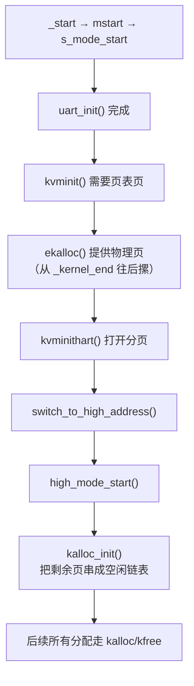

# 启动骨架

启动章讲完了 `_start` 到 `s_mode_start()`。

但 `s_mode_start()` 里还有几件事被一笔带过了：初始化串口、创建内核页表、切到高地址。它们听起来像普通初始化，实际却是后面所有模块能跑起来的前提。

这一章就补上这段空白。

在进入分页之前，FrostVistaOS 先要长出两个最基本的能力：**能说话**，也就是 UART 输出；**能要内存**，也就是早期物理页分配。没有这两个，后面的页表、trap、进程都只是空中楼阁。

```text
_start → mstart → s_mode_start
                      ├── trapinit()        → 下一章讲
                      ├── uart_init()       ← 本章讲
                      ├── kvminit()         → 分页章讲（但依赖本章的 ekalloc）
                      └── ...
```

!!! tip "本章的读法"
    这一章不追求完全理解 UART 16550 手册里的每一个位，也不要求立刻看懂锁的实现。先抓住两条线就够了：**寄存器读写怎样输出字符**，以及**空闲物理页怎样串成链表被分配出去**。

    UART 16550 的寄存器定义以 [TI PC16550D 手册](https://uart16550.readthedocs.io/_/downloads/en/latest/pdf/) 为准。更多硬件和协议资料见[在线资源参考](../reference/online-resources.md#硬件与设备)。

## 为什么先需要 UART 和内存分配

内核启动早期最难受的地方是：越早的代码越重要，但越早的代码越缺工具。

如果 UART 没有准备好，`LOG_INFO`、`LOG_ERROR`、panic 日志都打不出来。系统出了 bug，你只能靠 GDB 单步。

如果物理页分配器没有准备好，`kvminit()` 就没有地方放页表页。分页打不开，高地址内核也就切不过去。

所以这一章只处理两个问题：

```text
UART:   让内核能把信息打印出来
内存:   让分页代码能拿到物理页
```

这两个能力都很小，但它们是 FrostVistaOS 最早的启动骨架。

## UART：为什么需要自己写驱动

启动章的 `s_mode_start()` 里有这样一行：

```c
uart_init();
```

在这之前，内核其实已经能输出字符了。因为 QEMU 默认把 UART 放在一个可用状态，你往 `0x10000000` 写一个字节，它通常就能显示出来。

但这不算真正的驱动。

真正的驱动不能依赖 QEMU 的上电默认状态。它要自己初始化 UART，配置波特率和数据位，处理收发缓冲，并在写字符前确认硬件已经准备好。

### MMIO：用访问内存的方式操作硬件

那为什么 `*(volatile char *)0x10000000 = ch` 能让一个字符出现在屏幕上？因为 `0x10000000` 不是一个普通的内存地址——它是 QEMU 映射给 UART 16550 设备的寄存器空间。CPU 往这个地址写数据，硬件（不是内存控制器）会接管这个操作，把字节推进串口发送队列。

这叫 **MMIO**（Memory-Mapped I/O）：**硬件寄存器被映射到物理地址空间上，CPU 用普通的 load/store 指令就能操作设备。** 不需要特殊的 `inb`/`outb` 指令（那是 x86 的 port I/O），RISC-V 下所有设备交互都是 MMIO。

所以，完全不写驱动也能输出的最小代码大概是这样：

```c
// 最简输出：一行驱动都不写，直接往 MMIO 地址写字符
void bare_putchar(char ch) {
    *(volatile char *)0x10000000 = ch;
}

void bare_puts(const char *s) {
    while (*s) bare_putchar(*s++);
}

// _start 之后马上就能用
bare_puts("Hello from bare metal!\n");
```

这个版本没有初始化、没有状态检查、也没有缓冲。它能跑，是因为 QEMU 的 `-machine virt` 上电后 UART 恰好处于一个能接收数据的状态。

这只是一个"碰巧能用"的黑盒，不是可靠的驱动。

MMIO 驱动的几个关键约束：

| 约束 | 为什么 |
|------|--------|
| 必须 `volatile` | 编译器不知道这个地址背后是硬件。不加 `volatile`，编译器可能会把连续两次读同一地址优化成只读一次——但硬件状态可能在你两次读之间变了。 |
| 不能缓存 | MMIO 地址在页表里不做 cacheable 映射。CPU 每次读必须穿透缓存直连硬件——读到的值是硬件此刻的真实状态，不是上次缓存的值。 |
| 顺序敏感 | 对硬件的读写顺序不能乱。比如必须先检查状态寄存器、再写数据寄存器。编译器或 CPU 的乱序执行可能会打乱这个顺序——RISC-V 下用 `fence` 或依赖 `volatile` 的副作用来保证。 |
| 没有"变量"的概念 | 读 MMIO 地址每次得到的值都可能不同——它不是内存里的变量，它是硬件状态寄存器的实时值。循环读 LSR 等 TX_IDLE，每次循环拿到的都是硬件此刻的真实状态。 |

把这件事分清楚很重要：

```text
QEMU 默认状态下 UART 能输出                 ← MMIO + QEMU 上电默认态
bare_putchar 直接利用这个状态               ← 能用，但不是驱动
uart_init() 正确初始化后 UART 能正常工作     ← 可靠的最小驱动
```

## 轮询 UART：没有中断之前怎么说话

FrostVistaOS 的 UART 驱动基于 16550 标准。在 `arch/riscv/include/platform/uart.h` 里定义了寄存器偏移：

```c
#define UART0_BASE 0x10000000UL     // QEMU virt 平台 UART 基地址

#define RHR_adr 0   // Receiver Holding Register (读数据)
#define THR_adr 0   // Transmitter Holding Register (写数据)
#define IER_adr 1   // Interrupt Enable Register
#define FCR_adr 2   // FIFO Control Register
#define LCR_adr 3   // Line Control Register
#define LSR_adr 5   // Line Status Register
```

和硬件交互就三步：算出寄存器地址，写入配置，读写数据。用的还是上面讲过的 MMIO。

FrostVistaOS 用宏封装了寄存器访问：

```c
#define Reg(reg)     ((volatile unsigned char *)(uart_base_ptr + (reg)))
#define ReadReg(reg) (*(Reg(reg)))
#define WriteReg(reg, data) (*(Reg(reg)) = (data))
```

`uart_base_ptr` 初始指向 `UART0_BASE`（物理地址 `0x10000000`），切到高地址后被替换为 `PA2VA(UART0_BASE)`。

### 初始化

```c
void uart_init()
{
    WriteReg(LCR_adr, LCR_BAUD_LATCH);   // 打开除数锁存器，准备设波特率
    WriteReg(1, 0x00);                    // 除数高位
    WriteReg(0, 0x03);                    // 除数低位 → 波特率约为 38.4k

    WriteReg(LCR_adr, LCR_WIDTH_C);       // 关除数锁存器，8 位数据、无校验、1 停止位
    WriteReg(FCR_adr, FCR_FIFO_ENABLE | FCR_RX_CLEAR | FCR_TX_CLEAR);  // 开 FIFO，清空收发缓冲
    WriteReg(IER_adr, IER_RX_ENABLE);     // 开启接收中断
}
```

!!! note "波特率怎么算"
    16550 的波特率 = 输入时钟 / (16 × 除数)。QEMU virt 的 UART 输入时钟通常是 1.8432 MHz，除数 `0x0003` = 3，所以波特率 = 1.8432M / (16 × 3) = 38400。这个值足够调试用。

### 发送一个字符（轮询版）

```c
void uart_putc(char c)
{
    while (!(ReadReg(LSR_adr) & LSR_TX_IDLE))  // 等发送器空闲
        ;
    WriteReg(THR_adr, c);                       // 把字符写进发送寄存器
}
```

`LSR_TX_IDLE` 是 Line Status Register 的第 5 位。它为 1 时，表示 Transmitter Holding Register 为空，可以写入下一个字符。如果没检查就直接写，上一个字符还没发完，新字符就可能覆盖旧字符。

这就是轮询的本质：**CPU 不停查硬件状态，直到条件满足。** 好处是实现极简单，坏处是 CPU 全浪费在等上面。但在启动早期，没有中断、没有调度，轮询是唯一选择。

### UART 16550 的几个坑

第一次写 UART 驱动时，有几个坑很容易踩：

**1. 除数锁存器会复用 RHR/THR 的偏移地址**

当 `LCR` 的 bit 7（`DLAB`）设为 1 时，偏移 0 不再是 `RHR`/`THR`，而是除数锁存器的低字节（DLL），偏移 1 是高字节（DLM）。设完波特率之后必须把 `DLAB` 清零，否则后续读写 `THR` 时会写到除数锁存器上——字符发不出去。

```c
WriteReg(LCR_adr, LCR_BAUD_LATCH);   // DLAB=1 → 偏移 0/1 = 除数锁存器
WriteReg(1, 0x00);                    // 写 DLM
WriteReg(0, 0x03);                    // 写 DLL
WriteReg(LCR_adr, LCR_WIDTH_C);       // DLAB=0 → 偏移 0/1 = RHR/THR 恢复
```

**2. 写除数必须先高后低**

手册明确要求：**先写 MSB（DLM），再写 LSB（DLL）。** 因为写入 LSB 的瞬间，内部波特率计数器开始工作。如果先写 LSB 再写 MSB，计数器可能在错误的除数下跑了一个窗口。

**3. 发送前必须检查 LSR**

不能直接往 `THR` 写数据。如果上一个字符还在发送中，`THR` 不为空，新写的数据会覆盖掉还没发完的字符——造成丢数据。必须先读 `LSR` 确认 `TX_IDLE`。

**4. RHR 和 THR 是同一个偏移**

偏移 0 读是 `RHR`（接收），写是 `THR`（发送）。硬件根据操作方向路由到不同的寄存器——不要以为它们是两个独立的地址。

**5. FIFO 默认可能是关的**

16550 手册里说 FIFO 默认启用，但 QEMU 的 `ns16550` 实现可能不是。`FCR_FIFO_ENABLE` 显式开 FIFO + `FCR_RX_CLEAR | FCR_TX_CLEAR` 清空缓冲——不做这一步，残留的垃圾数据可能被当成输入。

!!! note "本章只讲最小轮询版本"
    FrostVistaOS 实际的 `uart.c` 用的是中断驱动 + 收发环形缓冲的方案，比上面复杂。本章展示的是**最小可用轮询版本**，目的是先看清楚"驱动到底在干什么"，不被中断和锁淹没。后面的 UART 细节会在调试章节和设备驱动部分继续展开。

## 早期内存：ekalloc 和 kalloc

UART 解决的是"能不能看见内核在干什么"。

接下来还有另一个问题：`kvminit()` 创建内核页表时，需要分配物理页来存放页表本身。但这时候 `kalloc_init()` 还没跑，分页也才刚开始建。

怎么办？

答案是分两步走：先用最简单的 bump allocator（`ekalloc`）撑过页表创建的阶段，分页建好之后再切换到完整的空闲链表分配器（`kalloc` / `kfree`）。

### ekalloc：摞砖头式分配

```c
// kernel/mm/kalloc.c
char *ekalloc_ptr = (char *) _kernel_end;

void *ekalloc(void)
{
    if (((uint64)ekalloc_ptr % PGSIZE) != 0)
        panic("ekalloc panic");

    void *ret = ekalloc_ptr;
    ekalloc_ptr += PGSIZE;
    return (void *)VA2PA(ret);
}
```

`ekalloc` 的思路极其简单：`_kernel_end` 是 linker script 中内核镜像结束的位置。从这个位置开始，每次要一页就往后挪 4096 字节。不记录，也不释放，就是一条直线往前摞。

```text
0x80000000                         _kernel_end                        PHYSTOP
    |--- 内核镜像(.text/data/bss/stack) ---|--- ekalloc 区 ---|--- 未来 kalloc 区 ---|
                                            ↑
                                        ekalloc_ptr
```

`ekalloc` 只在 `kvmmake()` 里被调用，用来分配根页表和中间级页表。这几个页**永远不会释放**，因为页表本身一直在用。所以，"只分配不释放"的 bump allocator 在这里刚好够用。

### kalloc / kfree：空闲链表分配器

分页建好、切到高地址之后，`high_mode_start()` 会调用 `kalloc_init()`。这时候，内核可以把剩下所有未使用的物理页串成一个空闲链表：

```c
// include/kernel/kalloc.h
struct IdleMM {
    struct IdleMM *next;     // 链表指针嵌在空闲页本身里面
};

struct freeMemory {
    struct IdleMM *freelist; // 链表头
    uint64 size;             // 剩余空闲页数
};
```

`kalloc_init()` 初始化锁，然后调用 `freerange()` 把 `_kernel_end` 之后的全部物理页加入链表：

```c
void kalloc_init()
{
    initlock(&mem_lock, "&mem_lock");
    FMM.freelist = &head;
    head.next = FMM.freelist;

    freerange((void *)((uint64)ekalloc_ptr), (void *)PHYSTOP_HIGH);
    //         ↑ 从 ekalloc 用完之后的位置开始
    //                                   ↑ 到物理内存末尾
}
```

`freerange()` 对范围内的每一页调用 `kfree()`：

```c
static void freerange(void *pa_start, void *pa_end)
{
    char *ps = (char *)pa_start;
    char *pe = (char *)pa_end;
    for (; ps + PGSIZE <= pe; ps += PGSIZE) {
        kfree((void *)ps);
    }
}
```

`kfree()` 把释放的页插入链表头部：

```c
void kfree(void *va)
{
    // 检查地址合法性：对齐、范围、不是内核镜像内部
    if ((p % PGSIZE != 0) || (p > PHYSTOP_HIGH) || (p < (uint64)_kernel_end))
        panic("kfree encounter an error");

    memset((void *)kva, 0, PGSIZE);   // 清零

    acquire(&mem_lock);
    M = (struct IdleMM *)kva;
    M->next = head.next;
    head.next = M;                     // 插入链表头部
    FMM.size++;
    release(&mem_lock);
}
```

`kalloc()` 从链表头部取一页：

```c
void *kalloc()
{
    acquire(&mem_lock);
    if (head.next == &head) return 0;  // 没空闲页了

    struct IdleMM *temp = head.next;
    head.next = temp->next;
    FMM.size--;
    release(&mem_lock);

    memset(temp, 0, PGSIZE);
    return (void *)temp;
}
```

!!! note "这里为什么有锁"
    `kalloc()` / `kfree()` 用了 `spinlock`（`mem_lock`），说明正式分配器已经要考虑并发访问。锁的细节后面再展开。现在只需要知道：`acquire()` 和 `release()` 保护了空闲链表，避免多个执行流同时改链表。

### 两条时间线



这里有一条很清楚的分界线：`switch_to_high_address()` 之前用 `ekalloc()`，之后用 `kalloc()`。

为什么要分两段？因为 `ekalloc()` 返回的是物理低地址，而 `kalloc()` 在 `kalloc_init()` 之后返回的是虚拟高地址。分页建好之前，CPU 只能认识物理地址；分页建好并切到高地址之后，内核应该用虚拟地址访问一切。

`kalloc_init()` 里的 `freerange()` 收到的范围参数也是高地址，因为它已经运行在 `high_mode_start()` 的上下文里了。

## 本章先记住什么

这章没有引入新的主线概念。它只是把启动章里一笔带过的两个局部展开了。

你只需要记住三条线：

```text
UART:   QEMU 基地址 0x10000000 → LSR 查状态 → THR 写数据
ekalloc: _kernel_end 开始 → 每次 +4096 → 只给页表用
kalloc:  空闲页串成链表 → kalloc 取、kfree 还 → 锁保护
```

然后记住一件事：**没有这两样，分页章根本写不了**。页表需要 `ekalloc()` 分配物理页，`LOG_*` 需要 UART 输出。它们就是内核最早的"骨架"。

## 下一步

- [分页](03-paging.md)：用 `ekalloc` 分配页表、用 Sv39 建立映射；
- [Trap](04-trap.md)：中断和异常怎么进入内核；
- [Linker Script 与 ELF](../tools/linker-elf.md)：`_kernel_end` 是怎么定义出来的。
