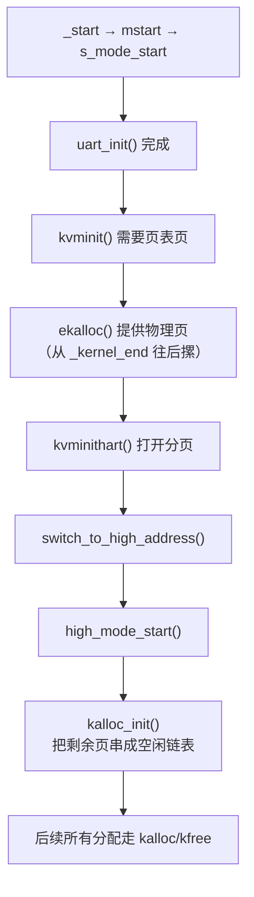

# 初始

启动章讲完了 `_start` 到 `s_mode_start()`。但 `s_mode_start()` 里有一些东西被一笔带过了——"初始化串口"、"分配页表"——它们是怎么工作的？

这一章就填这个空。

在进入分页之前，FrostVistaOS 首先要长出两个最基本的能力：能说话（UART 输出）和能要内存（物理页分配）。没有这两个，后面的页表、trap、进程都是空中楼阁。

```text
_start → mstart → s_mode_start
                      ├── trapinit()        → 下一章讲
                      ├── uart_init()       ← 本章讲
                      ├── kvminit()         → 分页章讲（但依赖本章的 ekalloc）
                      └── ...
```

!!! tip "本章的读法"
    这一章不追求完全理解 UART 16550 手册的每一个位，也不要求立刻看懂锁的实现。你只需要抓住两条线：**寄存器读写怎么输出字符**，和**空闲物理页怎么串成链表被分配出去**。

    UART 16550 的寄存器定义以 [TI PC16550D 手册](https://uart16550.readthedocs.io/_/downloads/en/latest/pdf/) 为准。更多硬件和协议资料见[在线资源参考](../reference/online-resources.md#硬件与设备)。

## 开不了口：为什么需要自己写驱动

启动章的 `s_mode_start()` 里有这样一行：

```c
uart_init();
```

在这之前，内核其实已经能输出字符了——因为 QEMU 默认把 UART 配置好，你往 `0x10000000` 写一个字节它就能显示。但这不算"驱动"。真正的驱动要自己初始化 UART、配置波特率和数据位、处理收发缓冲。

```text
QEMU 默认状态下 UART 能输出              ← 够做早期调试
自己写完 uart_init() 之后 UART 能正常工作  ← 后面 LOG_* 宏依赖它
```

如果 `uart_init()` 没写对，后面所有的 `LOG_INFO`、`LOG_ERROR`、panic 日志全都看不到——系统变成了哑巴，出了 bug 你只能靠 GDB 单步。

## 轮询 UART：没有中断之前怎么说话

FrostVistaOS 的 UART 驱动基于 16550 标准。在 `arch/riscv/include/platform/uart.h` 里定义了寄存器偏移：

```c
#define UART0_BASE 0x10000000UL     // QEMU virt 平台 UART 基地址

#define RHR_adr 0   // Receiver Holding Register (读数据)
#define THR_adr 0   // Transmitter Holding Register (写数据)
#define IER_adr 1   // Interrupt Enable Register
#define FCR_adr 2   // FIFO Control Register
#define LCR_adr 3   // Line Control Register
#define LSR_adr 5   // Line Status Register
```

和硬件交互就三步：算出寄存器地址 → 写入配置 → 读写数据。

### 初始化

```c
void uart_init()
{
    WriteReg(LCR_adr, LCR_BAUD_LATCH);   // 打开除数锁存器，准备设波特率
    WriteReg(0, 0x03);                    // 除数低位
    WriteReg(1, 0x00);                    // 除数高位 → 波特率 = 115200 / 3 ≈ 38.4k

    WriteReg(LCR_adr, LCR_WIDTH_C);       // 关除数锁存器，8 位数据、无校验、1 停止位
    WriteReg(FCR_adr, FCR_FIFO_ENABLE | FCR_RX_CLEAR | FCR_TX_CLEAR);  // 开 FIFO，清空收发缓冲
    WriteReg(IER_adr, IER_RX_ENABLE);     // 开启接收中断
}
```

!!! note "波特率怎么算"
    16550 的波特率 = 输入时钟 / (16 × 除数)。QEMU virt 的 UART 输入时钟通常是 1.8432 MHz，除数 `0x0003` = 3，所以波特率 = 1.8432M / (16 × 3) = 38400。这个值足够调试用。

### 发送一个字符（轮询版）

```c
void uart_putc(char c)
{
    while (!(ReadReg(LSR_adr) & LSR_TX_IDLE))  // 等发送器空闲
        ;
    WriteReg(THR_adr, c);                       // 把字符写进发送寄存器
}
```

`LSR_TX_IDLE` 是 Line Status Register 的第 5 位，为 1 时表示 Transmitter Holding Register 为空——可以写入下一个字符。如果没检查就直接写，上一个字符还没发完就被覆盖了。

这就是轮询的本质：**CPU 不停查硬件状态，直到条件满足。** 好处是实现极简单，坏处是 CPU 全浪费在等上面。但在启动早期，没有中断、没有调度，轮询是唯一选择。

> ⚠️ 注意：FrostVistaOS 实际的 `uart.c` 用的是中断驱动 + 收发环形缓冲的方案，比上面复杂。本章展示的是**最小可用轮询版本**——帮助理解"驱动到底在干什么"而不被中断和锁淹没。后面的 uart 细节在[调试章节](../debugging/)和设备驱动部分再展开。

## 早期内存：ekalloc 和 kalloc

`kvminit()` 创建内核页表时需要分配物理页来存放页表本身。但这时候 `kalloc_init()` 还没跑——分页才刚开始建。怎么办？

答案是分两步走：先用最简单的 bump allocator（`ekalloc`）撑过页表创建的阶段，分页建好之后再切换到完整的空闲链表分配器（`kalloc` / `kfree`）。

### ekalloc：摞砖头式分配

```c
// kernel/mm/kalloc.c
char *ekalloc_ptr = (char *) _kernel_end;

void *ekalloc(void)
{
    if (((uint64)ekalloc_ptr % PGSIZE) != 0)
        panic("ekalloc panic");

    void *ret = ekalloc_ptr;
    ekalloc_ptr += PGSIZE;
    return (void *)VA2PA(ret);
}
```

`ekalloc` 的思路极其简单：`_kernel_end` 是 linker script 中内核镜像结束的位置。从这个位置开始，每次要一页就往后挪 4096 字节。不记录、不释放——就是一条直线往前摞。

```text
0x80000000                         _kernel_end                        PHYSTOP
    |--- 内核镜像(.text/data/bss/stack) ---|--- ekalloc 区 ---|--- 未来 kalloc 区 ---|
                                            ↑
                                        ekalloc_ptr
```

`ekalloc` 只在 `kvmmake()` 里被调用——用来分配根页表和中间级页表。这几个页**永远不释放**（页表本身一直在用），所以"只分配不释放"的 bump allocator 够用了。

### kalloc / kfree：空闲链表分配器

分页建好、切到高地址之后，`high_mode_start()` 调用了 `kalloc_init()`。这时候把剩下所有未使用的物理页串成一个空闲链表：

```c
// include/kernel/kalloc.h
struct IdleMM {
    struct IdleMM *next;     // 链表指针嵌在空闲页本身里面
};

struct freeMemory {
    struct IdleMM *freelist; // 链表头
    uint64 size;             // 剩余空闲页数
};
```

`kalloc_init()` 初始化锁，然后调用 `freerange()` 把 `_kernel_end` 之后的全部物理页加入链表：

```c
void kalloc_init()
{
    initlock(&mem_lock, "&mem_lock");
    FMM.freelist = &head;
    head.next = FMM.freelist;

    freerange((void *)((uint64)ekalloc_ptr), (void *)PHYSTOP_HIGH);
    //         ↑ 从 ekalloc 用完之后的位置开始
    //                                   ↑ 到物理内存末尾
}
```

`freerange` 对范围内的每一页调用 `kfree`：

```c
static void freerange(void *pa_start, void *pa_end)
{
    char *ps = (char *)pa_start;
    char *pe = (char *)pa_end;
    for (; ps + PGSIZE <= pe; ps += PGSIZE) {
        kfree((void *)ps);
    }
}
```

`kfree` 把释放的页插入链表头部：

```c
void kfree(void *va)
{
    // 检查地址合法性：对齐、范围、不是内核镜像内部
    if ((p % PGSIZE != 0) || (p > PHYSTOP_HIGH) || (p < (uint64)_kernel_end))
        panic("kfree encounter an error");

    memset((void *)kva, 0, PGSIZE);   // 清零

    acquire(&mem_lock);
    M = (struct IdleMM *)kva;
    M->next = head.next;
    head.next = M;                     // 插入链表头部
    FMM.size++;
    release(&mem_lock);
}
```

`kalloc` 从链表头部取一页：

```c
void *kalloc()
{
    acquire(&mem_lock);
    if (head.next == &head) return 0;  // 没空闲页了

    struct IdleMM *temp = head.next;
    head.next = temp->next;
    FMM.size--;
    release(&mem_lock);

    memset(temp, 0, PGSIZE);
    return (void *)temp;
}
```

> ⚠️ 注意这里用了 `spinlock`（`mem_lock`）——这意味着 `kalloc` / `kfree` 依赖锁机制。锁的实现在启动章里已经完成（`initlock` 在 `start.S` 之后的初始化阶段就行）。如果你还没看锁的实现，先知道 `acquire` 和 `release` 保护了链表操作就行。

### 两条时间线



一条分界线：`switch_to_high_address()` 之前用 `ekalloc`，之后用 `kalloc`。

为什么分两段？因为 `ekalloc` 返回的是物理低地址，而 `kalloc`（在 `kalloc_init` 之后）返回的是虚拟高地址。分页建好之前，CPU 只能认识物理地址；分页建好且切到高地址之后，内核应该用虚拟地址访问一切。`kalloc_init` 里的 `freerange` 收到的范围参数也是高地址——它已经在 `high_mode_start` 的上下文里了。

## 本章先记住什么

这章没有引入新概念。它只是把启动章里一笔带过的局部展开了。

你只需要记住三条线：

```text
UART:   QEMU 基地址 0x10000000 → LSR 查状态 → THR 写数据
ekalloc: _kernel_end 开始 → 每次 +4096 → 只给页表用
kalloc:  空闲页串成链表 → kalloc 取、kfree 还 → 锁保护
```

然后知道一件事：**没有这两样，分页章根本写不了**——页表需要 `ekalloc` 分配物理页，`LOG_*` 需要 UART 输出。它们就是内核最早的"骨架"。

## 下一步

- [分页](03-paging.md)：用 `ekalloc` 分配页表、用 Sv39 建立映射；
- [Trap](04-trap.md)：中断和异常怎么进入内核；
- [Linker Script 与 ELF](../tools/linker-elf.md)：`_kernel_end` 是怎么定义出来的。
