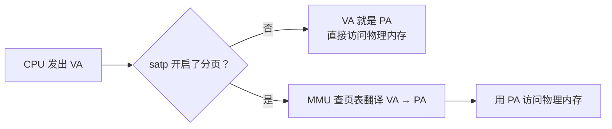
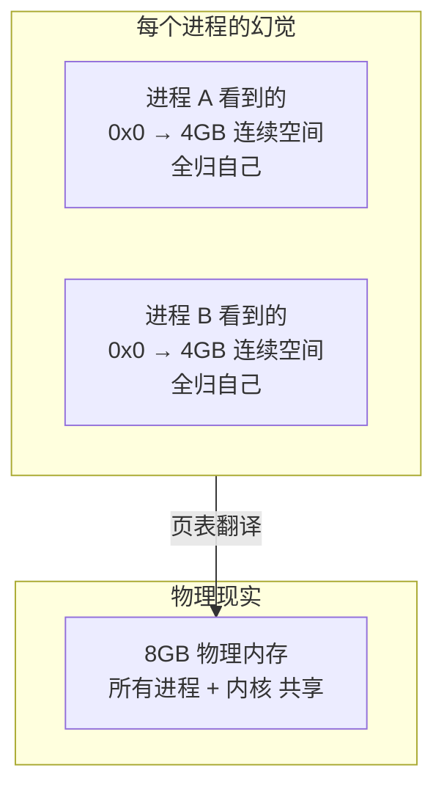
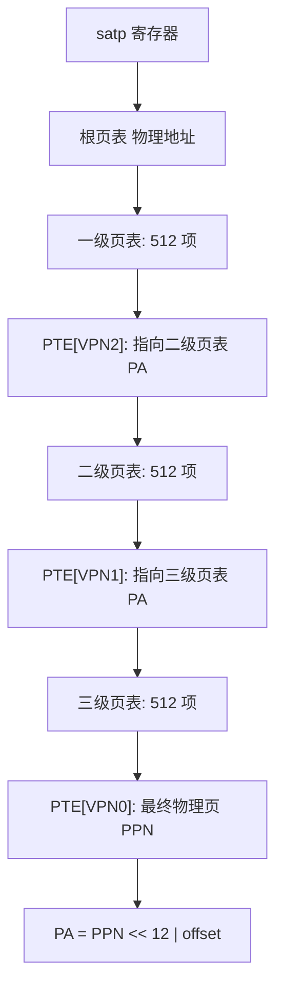
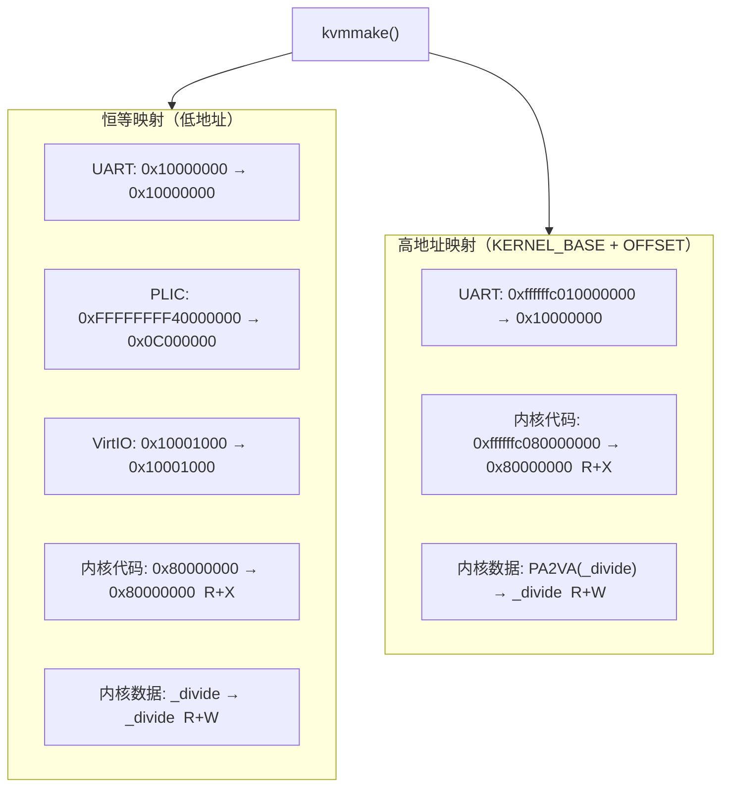

# 分页

启动章节最后停在了一行看起来很奇怪的话：

```c
switch_to_high_address(target, KERNEL_VIRT_OFFSET);
```

什么意思？为什么一个操作系统启动到一半，要"切到高地址"？

这章就回答这个问题。它也是分页这一章的入口。

!!! tip "本章的读法"
    分页是 OS 里概念最密集的章节之一。第一次读建议分两遍：

    第一遍，先理解"虚拟地址怎么变成物理地址"这条翻译链条，知道 satp 和 PTE 在干什么。
    第二遍，再回来看 FrostVistaOS 怎么把这条链条用在自己的内核页表上。

!!! warning "必备 RISC-V 特权架构手册"
    本章会大量涉及 `satp`、PTE 字段、Sv39 地址翻译。建议从[在线资源参考](../reference/online-resources.md#risc-v)打开 **RISC-V Privileged Architecture**，搜索 `Sv39`、`satp`、`PTE`。

    本章不要求你第一次就读懂每一条 PTE flag，但你要知道去哪查。

## 为什么启动以后马上要搞分页

启动章讲过，FrostVistaOS 最终运行在这样一个高地址区间：

```text
KERNEL_BASE_HIGH = 0xffffffc080000000  (bare)
KERNEL_BASE_HIGH = 0xffffffc080200000  (opensbi)
```

但 QEMU 把内核加载到的是物理低地址 `0x80000000`。

这就产生了一个矛盾：linker script 把代码、数据、栈都链接在高地址，但内核此刻实际上还跑在低地址上。

怎么从"代码以为自己在高地址、但 CPU 现在访问的还是低地址"，变成"代码以为自己在高地址、CPU 访问的也确实是高地址"？

答案就是分页。

## 虚拟地址和物理地址

先忘掉页表、PTE、satp。只看一个问题：CPU 执行指令时，它拿到的地址到底是什么？

```text
CPU 执行:  ld t0, 0xffffffc080010000

这个 0xffffffc080010000 不是真正写死在芯片上的物理位置。
```

实际上，CPU 生成的每一个地址都是**虚拟地址** (Virtual Address, VA)。它不直接等于内存芯片上的物理地址 (Physical Address, PA)。

两者的关系取决于 CPU 当前是否打开了分页：



> ⚠️ 重要的直觉：**不打开分页时，VA = PA。打开分页后，VA 不再等于 PA，CPU 内部的 MMU 会先把 VA 翻译成 PA，再用 PA 去访存。** 分页的本质就是在这个翻译过程中加了一张由 OS 维护的转换表。

### 为什么不能直接用物理地址

你可能会问：既然物理地址才是真正存在于内存芯片上的位置，那大家都直接用物理地址不行吗？为什么要多此一举加一层虚拟地址？

想象一下，如果你的电脑有 8GB 物理内存。现在你打开了三个程序：编辑器、浏览器、终端。每个程序都是编译好的 ELF 文件，里面的指令、数据、栈都假定自己从某个地址开始（比如 `0x10000`）。

```text
编辑器 ELF：  代码在 0x10000, 数据在 0x20000
浏览器 ELF：  代码在 0x10000, 数据在 0x20000    ← 和编辑器冲突了！
终端 ELF：    代码在 0x10000, 数据在 0x20000    ← 三个程序都要同一块物理地址
```

三个程序都想用 `0x10000`。如果不做任何处理，后加载的程序会直接把前面的覆盖掉。

但你从来没有在操作系统里遇到过这个问题。为什么？因为你看到的"地址"从来不是物理地址。**每个程序都被操作系统骗了——它以为整个物理机都是自己的。**



这张图就是分页最核心的价值：**每个进程拥有一个独立、连续、从 0 开始的虚拟地址空间，仿佛整台机器只有它一个程序在跑。** 至于它的 `0x10000` 到底对应物理内存的哪个位置——那是页表的事，进程不需要知道。

> ⚠️ 这层"欺骗"是 OS 能做进程隔离、按需加载、写时复制、mmap 等等一切高级内存管理功能的根基。没有它，OS 就退化成一个简单的物理内存分配器——每个程序加载时 OS 只能把它的地址硬搬到不冲突的物理位置，而程序自己必须知道要搬到哪。

## 分页解决什么问题

### 进程隔离：为什么没有分页就无法隔离

假设没有分页，所有程序直接用物理地址：

```text
进程 A 的代码: ld t0, 0x1000   → 读物理地址 0x1000
进程 B 的代码: sd t1, 0x1000   → 写物理地址 0x1000
```

这里 `0x1000` 对两个进程来说，指的是**同一块物理内存**。进程 B 可以随意读写进程 A 的数据，甚至改写进程 A 的代码。

那能不能靠"约定"来解决？比如"进程 A 只准用 `0x1000` 到 `0x2000`，进程 B 只准用 `0x3000` 到 `0x4000"？

不能。因为 CPU 本身没有任何机制去检查"这个地址这个进程能不能用"。`ld` 和 `sd` 指令不会问你"你是进程 A 还是进程 B"。**硬件不参与权限检查 = 靠软件约定隔离 = 任何一个 bug 或恶意程序都能绕过。**

分页的改变在于：**每个进程有自己的一张页表**。进程 A 看到 `0x1000`，进程 B 也看到 `0x1000`，但两张页表把这个相同的虚拟地址映射到了不同的物理页：

```text
进程 A 的页表: VA 0x1000 → PA 0x810000
进程 B 的页表: VA 0x1000 → PA 0x820000
```

切换到进程 A 时，CPU 加载进程 A 的页表（写 satp）。此后 CPU 访问 `0x1000`，MMU 查到的是 `0x810000`。切换到进程 B 时页表换了，同一个 `0x1000` 查到的是 `0x820000`。

> ⚠️ 一个常见的误解："分页让每个进程有独立的地址空间"——实际上隔离来自于**每个进程使用不同的页表**，而不是分页本身。分页是页表生效的机制，页表是隔离的载体。两者配合才能隔离。

### 高地址内核：让内核住在高地址

如果内核链接在 `0xffffffc080000000` 但物理 DRAM 只到 `0x88000000`，没有分页时 CPU 会直接拿 `0xffffffc080000000` 去访存——这个物理地址根本不存在。分页把高虚拟地址映射到低物理地址，解决了这个矛盾。

### 其他能力

分页还支撑一系列后续功能：需求分页（用到再分配物理页）、写时复制（fork 时父子共享物理页直到有一方写）、mmap（把文件映射到虚拟地址空间）。这些都需要"先有一个虚拟地址，再按需映射物理页"的能力。

对于 FrostVistaOS 来说，分页章最紧迫的问题不是隔离进程（这是后面进程章的事），而是：

> **让内核真正运行在高地址上。**

## Sv39 地址翻译：三条 VPN 找一张物理页

RISC-V 有几种分页模式，FrostVistaOS 使用 **Sv39**。

Sv39 的意思是：虚拟地址 39 位，物理地址最多 56 位。

### VPN 是什么

VPN (Virtual Page Number) 是**虚拟页号**。一个虚拟地址可以理解为两部分：

```text
VA = VPN × 4096 + offset
```

把 VA 右移 12 位（即除以 4096），剩下的就是 VPN。它表示"这是虚拟地址空间里的第几页"。VA 的低 12 位是 offset，表示"在这一页内部的哪个字节"。

Sv39 之所以把 39 位的 VA 进一步切成 VPN[2]、VPN[1]、VPN[0] 三段，是因为它使用**三级层级页表**。每一级页表是一个 512 项的数组，用 9 位来索引（2^9 = 512）。三级就是 27 位，正好覆盖了 VPN 的全部。

```text
VA >> 12 = VPN (27 bits)
VPN = VPN[2] × 2^18 + VPN[1] × 2^9 + VPN[0]
```

一个 39 位的虚拟地址最终被切成四段：

```text
38        30 29        21 20        12 11         0
+-----------+-----------+-----------+------------+
|  VPN[2]   |  VPN[1]   |  VPN[0]   |   offset   |
+-----------+-----------+-----------+------------+
   9 bits      9 bits      9 bits      12 bits
```

- **offset**：页内偏移。12 位，一页 4096 字节。
- **VPN[2]**：一级页表索引（最高级）。
- **VPN[1]**：二级页表索引。
- **VPN[0]**：三级页表索引（最低级）。

翻译过程是：



每一步都是：从当前页表里取出 VPN[i] 号 PTE，把 PTE 里的 PPN 当做下一级页表的物理基地址。三级走完，最后一级 PTE 里的 PPN 就是目标物理页号，拼上 offset 就是物理地址。

> ⚠️ 查页表的过程完全由硬件 MMU 完成。OS 只负责建页表、更新页表、设置 satp。翻译本身对 CPU 执行指令是透明的。

### VA → PA：一个完整的翻译实例

用一个具体例子把这几个公式串起来。假设内核在 `0xffffffc080001000` 这个 VA 上访问：

```text
VA = 0xffffffc080001000

第 1 步：拆出 offset 和 VPN
  offset = VA & 0xfff                   = 0x000
  VPN    = VA >> 12                     = 0xffffffc080001

第 2 步：拆出三级 VPN
  VPN[2] = (VPN >> 18) & 0x1ff          = (0xffffffc080001 >> 18) & 0x1ff = 0x1ff → 511
  VPN[1] = (VPN >>  9) & 0x1ff          = (0xffffffc080001 >>  9) & 0x1ff = 0x100 → 256
  VPN[0] =  VPN        & 0x1ff          =  0xffffffc080001        & 0x1ff = 0x001 →   1

第 3 步：查一级页表
  PTE_L1 = satp.PPN × 4096              // 根页表物理基地址
  PTE_L1 = &PTE_L1[VPN[2]]              // 取第 511 项
  PPN_L2 = PTE_L1 >> 10                  // 提取二级页表物理页号

第 4 步：查二级页表
  PTE_L2 = PPN_L2 × 4096                // 二级页表物理基地址
  PTE_L2 = &PTE_L2[VPN[1]]              // 取第 256 项
  PPN_L3 = PTE_L2 >> 10

第 5 步：查三级页表
  PTE_L3 = PPN_L3 × 4096                // 三级页表物理基地址
  PTE_L3 = &PTE_L3[VPN[0]]              // 取第 1 项
  PPN_final = PTE_L3 >> 10               // 最终物理页号

第 6 步：拼出物理地址
  PA = (PPN_final × 4096) | offset      // PA = PPN << 12 | offset
```

反过来也一样。从 PTE 里提取 PPN 只要右移 10 位，往 PTE 里写入 PPN 要左移 10 位：

```text
从 PTE 提取 PPN:  PPN = PTE >> 10
把 PPN 填入 PTE:  PTE = (PPN << 10) | flags
```

!!! note "为什么是右移 10 位"
    PTE 的低 10 位是 flags（V/R/W/X/U/G/A/D 等），PPN 从第 10 位开始。所以 `PTE >> 10` 去掉 flags，`PPN << 10` 把 PPN 放到正确位置再拼 flags。FrostVistaOS 的宏实现是完全对应的：

    ```c
    #define PTE2PA(pte)  (((pte) >> 10) << 12)     // PTE → 物理地址
    #define PA2PTE(pa)   (((uint64)(pa) >> 12) << 10) // 物理地址 → PTE 的 PPN 部分
    #define VPN_GET(va, i) (((uint64)(va) >> (12 + 9 * (i))) & 0x1ff) // VA → VPN[i]
    ```

    注意 `PTE2PA` 是右移 10 再左移 12：`>> 10` 去掉 flags 拿到 PPN，`<< 12` 把页号恢复成带页偏移的完整物理地址（低 12 位置零）。类似地 `PA2PTE` 是右移 12 再左移 10：`>> 12` 去掉页内偏移拿到 PPN，`<< 10` 放到 PTE 中 PPN 的正确位置（低 10 位留给 flags）。

### VA / PA / VPN / PPN 关系速查

```text
VA = VPN × 4096 + offset
PA = PPN × 4096 + offset

VPN = VA >> 12                      // VA 去掉页内偏移
PPN = PTE >> 10                     // PTE 去掉 flags，得到物理页号
PPN = PA >> 12                      // PA 去掉页内偏移

offset = VA & 0xfff                 // 低 12 位
offset = PA & 0xfff                 // 同一页内，offset 相同

VPN[2] = (VPN >> 18) & 0x1ff       // 高 9 位
VPN[1] = (VPN >>  9) & 0x1ff       // 中 9 位
VPN[0] =  VPN        & 0x1ff       // 低 9 位
```

> ⚠️ VA 和 PA 的 offset 一定相同——页的大小没变。**翻译换的是页号，不是页内偏移。** 如果你发现 CPU 访问的 PA 和预期对不上，先检查 offset，再往前查 VPN → PPN 转换。

## PTE 里面放了什么

每一级页表是一个 4KB 的数组，包含 512 个 8 字节的 **PTE** (Page Table Entry)。

一个 Sv39 PTE 的结构：

```text
63      54 53                    10  9          0
+---------+-----------------------+-------------+
| reserved|       PPN[2:0]        |    flags    |
+---------+-----------------------+-------------+
  10 bits        44 bits              10 bits
```

PPN（Physical Page Number）指向下一级页表或最终物理页。flags 决定了这个 PTE 的含义和权限：

| Bit | 名字 | 含义 |
|-----|------|------|
| 0 | V (Valid) | PTE 是否有效。为 0 时访问触发 page fault |
| 1 | R (Read) | 可读 |
| 2 | W (Write) | 可写 |
| 3 | X (Execute) | 可执行 |
| 4 | U (User) | U mode 是否可访问。不置位则只有 S mode 能访问 |
| 5 | G (Global) | 全局映射，所有地址空间共享 |
| 6 | A (Accessed) | 该页被访问过（硬件自动置位） |
| 7 | D (Dirty) | 该页被写过（硬件自动置位） |

FrostVistaOS 在 `arch/riscv/include/asm/mm.h` 里定义了这些 flag：

```c
#define PTE_V (1 << 0)
#define PTE_R (1 << 1)
#define PTE_W (1 << 2)
#define PTE_X (1 << 3)
#define PTE_U (1 << 4)
#define PTE_G (1 << 5)
#define PTE_A (1 << 6)
#define PTE_D (1 << 7)
```

> ⚠️ RISC-V 要求一条 PTE 的 R、W、X 不能乱组合。比如 R=0 但 W=1 是非法状态（只写不可读没有意义）。具体合法组合在 Privileged Architecture 手册里有一张表，第一次读可以跳过。

### 非叶 PTE vs 叶 PTE

三级页表中，一级和二级 PTE 的 PPN 指向下一级页表的物理地址。只有三级 PTE（或者被标记为非叶的大页）的 PPN 才指向最终物理页。

怎么区分？如果一个 PTE 的 R、W、X 全是 0，那它是非叶 PTE，指向下一级页表。如果 R、W、X 中至少有一个是 1，它就是叶 PTE，PPN 指向最终物理页。

## satp：页表的开关

`sapt` 是 RISC-V Supervisor mode 下的一个 CSR。它告诉 CPU：

1. 我的根页表在哪；
2. 我用什么分页模式。

```text
63  60 59                   44 43           0
+------+---------------------+----------------+
| MODE |        ASID         |      PPN       |
+------+---------------------+----------------+
  4 bits      16 bits              44 bits
```

- **MODE**：分页模式。`8` = Sv39，`0` = 不分页。
- **ASID**：地址空间 ID。进程切换时用，避免每次都 flush TLB。FrostVistaOS 目前 ASID = 0。
- **PPN**：根页表的物理页号（物理地址 >> 12）。

在 FrostVistaOS 里，写 satp 是这样的：

```c
// arch/riscv/include/asm/mm.h
#define MAKE_SATP(pagetable) ((8L << 60) | ((uint64)(pagetable) >> 12))

// arch/riscv/mm/vm.c
w_satp(MAKE_SATP(kernel_table));
```

`(8L << 60)` 把 MODE 设为 Sv39。`(pagetable >> 12)` 取出根页表的 PPN。写完 satp 之后，CPU 立刻开始通过页表翻译每一个虚拟地址。

`sfence_vma` 的作用是刷新 TLB（页表缓存）。在写 satp 前后各执行一次，确保旧的翻译缓存被清空：

```c
sfence_vma();
w_satp(MAKE_SATP(kernel_table));
sfence_vma();
```

!!! note "TLB"
    TLB (Translation Lookaside Buffer) 是 CPU 内部对页表的硬件缓存。改页表内容之后，如果不刷新 TLB，CPU 可能还在用旧的翻译结果。换页表（写 satp）也必须刷新。

## 回到 FrostVistaOS：linker script 已经铺好了路

在开始看代码之前，先看一眼 linker script 做了什么。

```ld
/* arch/riscv/linker.ld */
BASE_ADDRESS = 0xffffffc080000000;   /* VMA: 高地址 */

MEMORY
{
  VIRT (rwx) : ORIGIN = 0xffffffc080000000, LENGTH = 128M
  PHYSMEM (rwx) : ORIGIN = 0x80000000, LENGTH = 128M
}

SECTIONS
{
  . = BASE_ADDRESS;

  .text :
  {
    *(.text.entry)
    *(.text .text.*)
    *(.rodata .rodata.*)
    . = ALIGN(0x1000);
    _divide = .;
  } > VIRT AT> PHYSMEM
```

这里 `> VIRT AT> PHYSMEM` 是核心魔法：

- `> VIRT`：这段代码的 VMA 在高地址。`ld` 指令、跳转地址、全局变量引用，全部用高地址。
- `AT> PHYSMEM`：LMA 在低地址。QEMU 把内核加载到 `0x80000000`，物理上它确实就在那里。

所以矛盾是这样的：

```text
linker 视角：_start 在 0xffffffc080000000
物理现实：_start 的字节实际在 0x80000000
```

QEMU 不管你的 VMA 是多少。它只根据 ELF 的 program header 把段加载到 LMA。对 `bare` 模式，就是 `0x80000000`。

所以内核刚启动时，它运行在一种"分裂"的状态：

- 代码链接在高地址；
- PC 实际在低地址（因为 QEMU 跳到的是物理地址 `0x80000000`）。

那为什么不会 crash？

因为在 `start.S` 到 `kvminithart()` 之前，CPU 的 satp 还是 0（没开分页），所以 VA = PA。`0xffffffc080000000` 的引用会被 CPU 直接用做物理地址——如果访问的话会 crash。但实际上早期代码（`start.S`、`mstart`）都是位置无关或只用相对跳转，不会真正用高地址去访存。

> ⚠️ 这其实是一段很脆弱的状态：**如果早期启动代码里不小心有一个绝对地址引用指向高地址，而又没开分页，系统就会直接崩溃。** 所以 `start.S` 和 `mstart()` 里的代码非常小、非常谨慎。

## kvminit：创建内核页表

`s_mode_start()` 里的这一段是本章的主角：

```c
kvminit();         // 创建内核页表
kvminithart();     // 打开分页
```

`kvminit()` 很简单：

```c
void kvminit()
{
    kernel_table = kvmmake();
}
```

`kvmmake()` 是整个内核页表的构建函数。它做两件事：

1. 分配根页表（用 `ekalloc()`，早期分配器，直接返回物理地址）；
2. 往这张页表里加一系列映射。

### 什么是恒等映射 (identity mapping)

恒等映射的意思是：**VA = PA**。把物理地址直接映射到同值的虚拟地址。

为什么需要恒等映射？因为打开分页的瞬间，PC 还在低地址（比如 `0x80000xxx`），SP 还在低地址的栈上。如果页表里没有低地址的映射，打开分页的下一条指令就 page fault 了。

所以 `kvmmake()` 的第一组映射是：

```text
恒等映射（低地址）：
  0x10000000 (UART)       → 0x10000000
  0xffffffff40000000 (PLIC) → 0x0c000000    // 注意：PLIC 自己的虚拟地址和物理地址不同
  0x10001000 (VirtIO)     → 0x10001000
  KERNEL_BASE_LOW         → KERNEL_BASE_LOW  (内核代码，R+X)
  _divide                 → _divide           (内核数据，R+W)
```

> ⚠️ PLIC 的虚拟地址 `0xFFFFFFFF40000000` 并不是 `PLIC_PHY_BASE + KERNEL_VIRT_OFFSET`。它是直接定义的常量，属于高地址区间但不在内核的 KERNEL_BASE_HIGH 范围内。这些都可以先放一放，后面讲到设备时再细看。

再看实际的代码：

```c
// arch/riscv/mm/vm.c — kvmmake() 中恒等映射部分
kvmmap(pagetable, UART0_BASE, UART0_BASE, PGSIZE, PTE_R | PTE_W);
kvmmap(pagetable, VIRTIO_MMIO_VIRT_BASE, VIRTIO_MMIO_PHY_BASE, PGSIZE,
       PTE_R | PTE_W | PTE_X);
kvmmap(pagetable, PLIC_VIRT_BASE, PLIC_PHY_BASE, PLIC_MM_SIZE,
       PTE_R | PTE_W | PTE_X);

// 内核代码段：R+X
kvmmap(pagetable, KERNEL_BASE_LOW, KERNEL_BASE_LOW,
       (uint64)_divide - KERNEL_BASE_LOW, PTE_R | PTE_X);

// 内核数据段：R+W
kvmmap(pagetable, (uint64)_divide, (uint64)_divide,
       PHYSTOP_LOW - (uint64)_divide, PTE_R | PTE_W);
```

这里有两点值得注意：

1. 代码段（`_start` 到 `_divide`）只给了 `PTE_R | PTE_X`，没有 W。这防止内核代码被意外改写。
2. 数据段（`_divide` 到 `PHYSTOP_LOW`）给了 `PTE_R | PTE_W`，没有 X。这样即使数据区被恶意放入代码也无法执行。

### 高地址映射 (high-half mapping)

恒等映射只能在"还没切到高地址之前"支撑系统。一旦 `switch_to_high_address` 完成，内核应该只用高地址访问一切。

所以还需要第二组映射：

```text
高地址映射：
  PA2VA(UART0_BASE)       → UART0_BASE
  PA2VA(QEMU_TEST_BASE)   → QEMU_TEST_BASE
  KERNEL_BASE_HIGH        → KERNEL_BASE_LOW  (内核代码)
  PA2VA(_divide)          → _divide           (内核数据)
```

对应的代码：

```c
kvmmap(pagetable, PA2VA(UART0_BASE), UART0_BASE, PGSIZE, PTE_R | PTE_W);
kvmmap(pagetable, PA2VA(QEMU_TEST_BASE), QEMU_TEST_BASE, PGSIZE,
       PTE_R | PTE_W);
kvmmap(pagetable, KERNEL_BASE_HIGH, KERNEL_BASE_LOW,
       PA2VA((uint64)_divide) - KERNEL_BASE_HIGH, PTE_R | PTE_X);
kvmmap(pagetable, PA2VA((uint64)_divide), (uint64)_divide,
       PHYSTOP_HIGH - PA2VA((uint64)_divide), PTE_R | PTE_W);
```

可以看到规律：**高地址映射就是把恒等映射的 VA 加上 `KERNEL_VIRT_OFFSET`，PA 保持不变**。

```text
每个设备/区域有两条映射：
  VA_low  → PA    （恒等映射，打开分页初期过渡用）
  VA_high → PA    （高地址映射，切到高地址后正式使用）
```

`PA2VA()` 和 `VA2PA()` 就是加/减 `KERNEL_VIRT_OFFSET` 的宏：

```c
#define PA2VA(adr)  ((uint64)(adr) + (uint64)(KERNEL_VIRT_OFFSET))
#define VA2PA(adr)  ((uint64)(adr) - (uint64)(KERNEL_VIRT_OFFSET))
```

`KERNEL_VIRT_OFFSET` 的值是：

```c
#define KERNEL_VIRT_OFFSET 0xFFFFFFC000000000UL
```

### 为什么没有 U mode 权限

你可能会发现上面所有的 `kvmmap` 都没有 `PTE_U`。

这是故意的。**内核页表里的所有映射都不给 U mode 访问权限。** 用户进程有自己的页表，通过 `uvmcreate()` 单独创建，里面只有用户地址空间的映射才会有 `PTE_U`。这样当 CPU 在 U mode 下执行时，如果试图访问内核地址，MMU 会直接触发 page fault。

### 一张图总结 kvmmake 的两组映射



## kvminithart：打开分页

建完页表，下一步是让 CPU 开始使用它：

```c
void kvminithart()
{
    sfence_vma();
    if (kernel_table == 0) {
        panic("kernel_table is null");
    }
    w_satp(MAKE_SATP(kernel_table));
    sfence_vma();

    LOG_INFO("Paging enable successfully");
}
```

写完 satp 之后，CPU 的每一次访存都会经过页表翻译。

但现在系统还能正常运行吗？

能。因为恒等映射还在——CPU 的 PC 在低地址、SP 在低地址栈上，低地址的恒等映射让这些访问仍然能找到正确的物理页。**打开分页不等于切到了高地址。** 打开分页只是让翻译机制生效，但恒等映射让低地址访问仍然是合法的。

分页打开后，系统的运行方式变了，但地址身份还没变：

```text
打开分页前：CPU 的 VA 直接被当成 PA
打开分页后：CPU 的 VA 先查页表，再得到 PA
           但因为恒等映射，低地址 VA 查出来的 PA 就是同样的值
```

## switch_to_high_address：信仰之跃

`kvminithart()` 之后，`s_mode_start()` 做了两个关键动作：

```c
early_mode = 0;

// 内核页表指针本身也要变成高地址
kernel_table = (pagetable_t) PA2VA((uint64) kernel_table);

uint64 target = (uint64) high_mode_start + KERNEL_VIRT_OFFSET;
switch_to_high_address(target, KERNEL_VIRT_OFFSET);
```

`early_mode` 是一个全局变量，初值为 1。它标记系统是否还在"早期模式"——即 CPU 还在用低地址运行，`walk()` 里也不能用 `PA2VA()` 去转换页表指针。

`early_mode = 0` 之后，`walk()` 知道了：我现在运行在高地址，每次取出 PTE 的 PPN 后，需要用 `PA2VA()` 转成高地址才能访问下一级页表。

然后是 `switch_to_high_address`：

```c
static inline void switch_to_high_address(uint64 high_target,
                                          uint64 virt_offset)
{
    asm volatile("sfence.vma\n\t"
                 "add sp, sp, %1\n\t"    // SP += KERNEL_VIRT_OFFSET
                 "jr %0\n\t"              // 跳到 high_target
                 :
                 : "r"(high_target), "r"(virt_offset)
                 : "memory");
}
```

就两条指令：

1. `add sp, sp, virt_offset`：把 SP 从低地址抬到高地址。原先 SP 比如 `0x8000b000`，加完变成 `0xffffffc08000b000`——这个高地址有高地址映射，所以后续 push/pop 不会 page fault。
2. `jr high_target`：跳到 `high_mode_start` 的高地址版本。此后 PC 也在高地址区间了。

这就是"信仰之跃"。跳完之后：

```text
PC = 高地址
SP = 高地址
所有内存引用 = 高地址
```

进入了 `high_mode_start()`，系统正式以高地址身份运行。

## clear_low_memory_mappings：告别低地址

切到高地址之后，恒等映射就没有用了，而且是个安全隐患——万一某段代码不小心用低地址访问了内核区域，等于绕过了高地址的保护语义。

所以 `high_mode_start()` 做的第一件事就是清除低地址映射：

```c
void clear_low_memory_mappings()
{
    for (int i = 0; i < 3; i++) {
        kernel_table[i] = 0;
    }
    sfence_vma();
}
```

为什么只清 `kernel_table[0..2]`？

Sv39 的根页表有 512 项，每项覆盖 1GB 的虚拟地址空间。前三个 PTE 覆盖的是 `0x0` 到 `0x3FFFFFFF`，恰好是内核低地址恒等映射所在的区域。

清掉这三项 = 低 3GB 的虚拟地址不再有效。此后任何对低地址的访问（包括用户态）都会触发 page fault。

> ⚠️ 实际上 FrostVistaOS 后来给用户进程分配的用户地址就是从低地址开始的（比如 `0x0`），用户页表里有自己的映射。这里清的是内核页表的低地址项，和后面创建的用户页表是两张不同的表。

## walk 和 mappages：页表怎么搭起来的

理解了"为什么要建页表"之后，再看"怎么建页表"就简单了。

### walk：在三级页表里寻找 PTE

`walk()` 是页表操作的基石。给定一个页表根地址和一个 VA，它沿着三级结构找到对应的 PTE。

```c
pte_t *walk(pagetable_t pagetable, uint64 va, int alloc)
{
    for (int i = 3 - 1; i > 0; i--) {   // i = 2, 1
        pte_t *pte = &pagetable[VPN_GET(va, i)];
        if (*pte & PTE_V) {
            uint64 pa = PTE2PA(*pte);
            pagetable = early_mode ? (pagetable_t) pa
                                   : (pagetable_t) PA2VA(pa);
        } else {
            if (!alloc || (pagetable = (pte_t *) pt_alloc_page_pa()) == 0)
                return 0;
            memset(pagetable, 0, PGSIZE);
            if (early_mode)
                *pte = PA2PTE(pagetable) | PTE_V;
            else
                *pte = PA2PTE(VA2PA(pagetable)) | PTE_V;
        }
    }
    return &pagetable[VPN_GET(va, 0)];   // i = 0，最后一级
}
```

逐句读：

- `VPN_GET(va, i)`：从 VA 里切出第 i 级的 9-bit VPN。
- 查找：`pagetable[VPN]` 就是对应 PTE。
- 如果 PTE 有效 ：取出 PPN（即下一级页表的物理地址），`early_mode` 下直接用 PA，否则 `PA2VA()` 转成高地址才能访问。
- 如果 PTE 无效且 alloc=1：分配新页表，把它的 PPN 填进当前 PTE。
- 循环两次后，返回三级 PTE 的指针。

`early_mode` 这个分支是很多新手困惑的地方。本质上它只是一个开关：**在系统还在低地址运行时，页表指针就是物理地址；切到高地址之后，页表指针必须转成高地址才能访问。**

### mappages：逐页建立映射

`mappages` 是 `walk` 的上层：

```c
int mappages(pagetable_t pagetable, uint64 va, uint64 pa,
             int size, int perm)
{
    uint64 a = va;
    uint64 last = va + size - PGSIZE;
    for (;;) {
        pte_t *pte = walk(pagetable, a, 1);
        if (*pte & PTE_V)
            panic("mappages: remap");    // 不允许重复映射
        *pte = PA2PTE(pa) | perm | PTE_V;
        if (a == last) break;
        a += PGSIZE;
        pa += PGSIZE;
    }
    return 0;
}
```

对每一页：`walk` 找到 PTE，把 PA 和权限拼成 PTE 写进去。

`kvmmap` 就是 `mappages` 的别名：

```c
int kvmmap(pagetable_t pagetable, uint64 va, uint64 pa,
           int size, int perm)
{
    return mappages(pagetable, va, pa, size, perm);
}
```

到这里，整个内核页表的建立路径就完整了：

```text
kvminit()
  → kvmmake()
    → ekalloc()           // 分配根页表
    → kvmmap() × 9        // 恒等 + 高地址两组映射
      → mappages()
        → walk()          // 逐级查找/分配页表
          → pt_alloc_page_pa()  // 按需分配新一级页表
  → kernel_table 赋值

kvminithart()
  → w_satp(MAKE_SATP(kernel_table))  // 告诉 CPU 开始用页表

switch_to_high_address(target, offset)   // 跳入高地址运行
  → early_mode = 0                       // 标记地址身份切换

high_mode_start()
  → clear_low_memory_mappings()          // 清理恒等映射
```

## 补充：用户页表怎么来的

虽然本章主线是内核页表，但了解用户页表的雏形有助于理解"分页不是内核独占的概念"。

`uvmcreate()` 创建一个用户页表，但把内核页表的高地址映射直接复制过来：

```c
pagetable_t uvmcreate()
{
    pagetable_t user_pagetable = (pagetable_t) kalloc();
    // 把内核页表的高地址项复制到用户页表
    for (int i = 0; i < 512; i++) {
        user_pagetable[i] = kernel_table[i];
    }
    return user_pagetable;
}
```

这意味着每个用户进程的页表里都**包含了内核的高地址映射**。好处是：当用户进程通过 syscall 陷入内核时，不需要切换页表——用户页表里已经有内核映射了，CPU 在 S mode 下可以直接访问内核地址。

用户进程的私有映射（代码、数据、栈）则用 `uvmalloc()` 创建，映射在低地址区间，带 `PTE_U` 标志。这些会在进程章展开。

## 小结

分页这一章本质上是一条"地址身份变化"的故事：

```text
VA = PA（没开分页）
  → VA ≠ PA（打开分页，但还在低地址，靠恒等映射活）
  → VA ≠ PA，且内核只用高地址 VA（切到高地址，删除恒等映射）
```

你不需要记住所有 PTE flag、不需要背 Sv39 编码格式。但下面这条链条应该可以说出来：

```text
虚拟地址不是物理地址
  → 分页让 CPU 自动翻译
  → Sv39 三级页表是翻译结构
  → satp 告诉 CPU 根页表在哪
  → PTE 里存放 PPN 和权限
  → kvminit 建表、kvminithart 开表、switch_to_high_address 切地址
  → walk 和 mappages 是建页表的基本动作
```

!!! success "分页章的核心"
    分页不是只给用户进程用的。内核自己也需要分页——不是用来隔离，而是用来"搬地址"。FrostVistaOS 用它把自己从 QEMU 加载的物理低地址，搬到了 linker 期望的高地址。

## 下一步

- [Trap](04-trap.md)：中断、异常、系统调用如何进入内核，陷阱向量和上下文保存；
- [进程](05-process.md)：用户进程如何创建、用户页表怎么用、fork 和 exec 的页表操作；
- [RISC-V Trap Codes](../reference/trap-codes.md)：查 `mcause` / `scause` code；
- [Linker Script 与 ELF](../tools/linker-elf.md)：理解 VMA/LMA 和 `> VIRT AT> PHYSMEM`。
