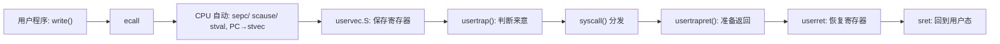
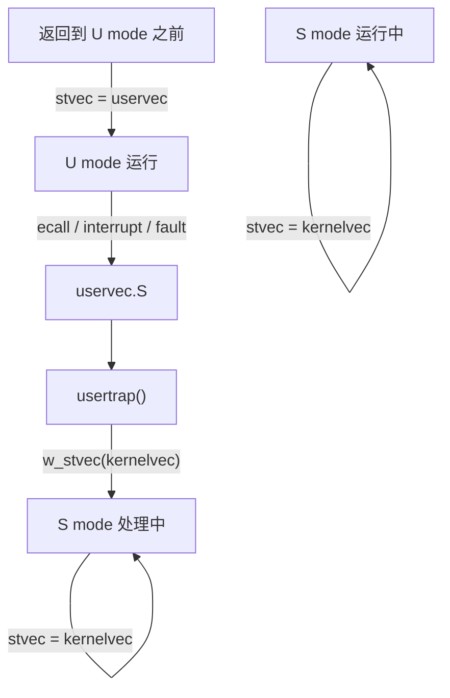
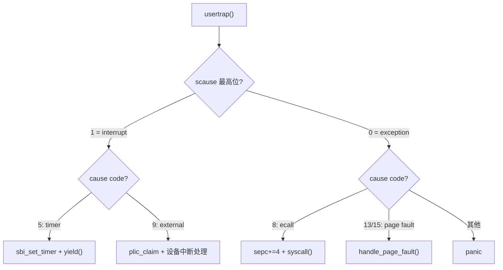
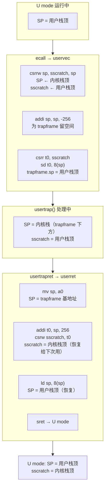
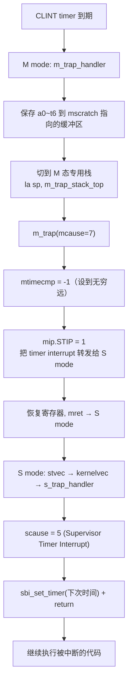
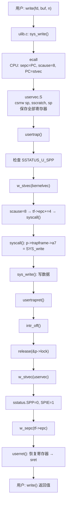

# Trap

分页章结束时，内核已经有了页表、跑在高地址、能用 `kalloc` 分配内存。但有一个问题还没解决：

> **用户程序怎么办？**

用户程序运行在 U mode 下。它不能直接调内核函数——权限不够，页表也不对。但用户在 `fvsh` 里敲了 `echo hello`，这个字符串就必须进入内核、申请缓冲区、找到文件描述符、把字节推进 UART。

怎么进去的？

答案是：**trap**。

## 中断、异常和 Trap

在继续之前，先把三个词说清楚。它们经常被混用，但意思不同。

### 中断 (Interrupt)

中断是**硬件发给 CPU 的信号**，告诉 CPU "有事情需要你处理"。

它和当前正在执行的指令**没有关系**。你在算加法，timer 到时间了——中断来了。你在写文件，网卡收到数据了——中断又来了。中断是**异步的**：你不知道它什么时候来，你只知道自己必须处理它。

RISC-V 上常见的中断：

| 中断 | 来源 | 干什么用 |
|------|------|----------|
| Timer Interrupt | CLINT 定时器 | 告诉 OS "时间片用完了，该调度了" |
| External Interrupt | PLIC（UART、VirtIO 等） | 告诉 OS "设备有数据/操作完成了" |
| Software Interrupt | 软件写入 `sip` | CPU 间通信（多核） |

如果没有中断，OS 就只能靠**轮询**——每隔一段时间主动去问设备"你有没有新数据？"大部分时候回答是"没有"，CPU 全白跑了。

### 异常 (Exception)

异常是**当前指令本身出了问题**，CPU 无法继续执行。

它是**同步的**：就是这一条指令触发的，和外部硬件无关。RISC-V 上常见的异常：

| 异常 | cause | 触发场景 |
|------|-------|----------|
| Environment call from U-mode | 8 | `ecall` 指令——用户主动请求内核服务 |
| Instruction page fault | 12 | 取指时虚拟地址没有有效映射 |
| Load page fault | 13 | `ld` 指令访问了没映射的 VA |
| Store/AMO page fault | 15 | `sd` 指令访问了没映射的 VA |
| Illegal instruction | 2 | 执行了 CPU 不认识的指令 |
| Breakpoint | 3 | `ebreak`——给调试器用的 |

如果没有异常处理，一个 page fault 就会直接让整个系统停掉——甚至连"告诉用户哪里出错了"的机会都没有。

### Trap

**Trap 是中断和异常的总称。** 在 RISC-V 里，中断和异常用同一套硬件机制处理：都通过 `stvec` 跳转、都用 `scause` 报告原因、都用 `sepc` 记录返回地址、都走同一条 `uservec → usertrap` 路径。

区分它们的唯一方式是看 **`scause` 的最高位**：

```text
scause bit 63 = 1 → interrupt（中断）
scause bit 63 = 0 → exception（异常）
```

只用低 63 位的值查表：比如低 63 位 = 5，如果是 interrupt（最高位=1）就是 Supervisor Timer Interrupt，如果是 exception（最高位=0）就是 Load Access Fault——完全不同的两件事。具体对照表在 [RISC-V Trap Codes](../reference/trap-codes.md)。

> ⚠️ 这个区分是整个 trap 处理的第一道关卡。如果你不检查 `scause` 最高位，就会把所有 interrupt 当成 exception 处理——然后把 timer interrupt 当成 load access fault 去排查，几个小时都找不到问题出在哪。这也是[调试故事：ecall 之后一直触发 cause 5](../debugging/story-1-timer-not-exception.md) 的真实经历。

### 为什么 OS 需要这些东西

interrupt 让 OS 不用轮询就能响应设备。exception 让 OS 能安全地拒绝越权操作（而不是直接崩溃）。`ecall` 给了用户态一个受控的入口进入内核。

三者合在一起，OS 才能真正扮演一个"管理者"的角色——不是所有的代码都有资格直接操作硬件，不是所有的事情都要 CPU 一直空转等着。

## 为什么需要 Trap

具体到 FrostVistaOS：用户程序运行在 U mode 下，不能直接调内核函数——权限不够，页表也不对。但用户在 `fvsh` 里敲了 `echo hello`，这个字符串就必须进入内核、申请缓冲区、找到文件描述符、把字节推进 UART。

本章就从"用户态程序执行了一条 `ecall`"开始，追着这条指令一直走到它把控制权交给内核，再走回用户态。

!!! tip "本章的读法"
    本章有两个层次。第一层：顺着主线 `ecall → uservec → usertrap → usertrapret → userret` 走完一去一回。第二层：回头理解每个环节"为什么必须这样写"。

    第一遍不需要完全理解 `sstatus.SPP` 和 `SSTATUS_SPIE` 的细节——先知道它们在哪起作用就行。

!!! warning "必备手册"
    本章大量涉及 RISC-V privileged architecture 中的 trap 相关 CSR。建议从[在线资源参考](../reference/online-resources.md#risc-v)打开手册，搜索：
    - `stvec` / `sepc` / `scause` / `stval` / `sscratch`
    - `sstatus`（`SPP` / `SPIE` / `SIE` 字段）
    - `sret`
    - `ecall`
    可以配合 [RISC-V Trap Codes](../reference/trap-codes.md) 查 cause code。

## 为什么需要 Trap

假设没有 trap。用户在 shell 里想输出一个字符。他能做什么？

```c
// 用户程序
*(volatile char *)0x10000000 = 'h';  // UART 数据寄存器
```

这行代码在 U mode 下执行会怎样？看分页章讲过：内核页表里所有映射都没设 `PTE_U`。用户页表里也没有映射 `0x10000000`——这个地址属于内核设备。所以 CPU 一执行这条指令就 page fault。

那用户程序能不能自己改页表？不能——`satp` 是 S mode 才能写的 CSR。

所以必须有一个**受控的入口**：用户态通过一个约定好的指令（`ecall`）请求内核服务，内核在中途检查参数、完成操作、返回结果。这个入口就叫 trap。



## ecall 那一瞬间，硬件做了什么

当 CPU 在 U mode 下执行 `ecall` 时，硬件自动完成四件事——不需要 OS 写一行代码：

```text
1. sepc = PC          // 保存触发 trap 的指令地址
2. scause = 8          // Environment call from U-mode
3. stval = 0           // ecall 没有关联的地址
4. PC = stvec          // 跳到 OS 预设的 trap 入口
   特权级 → S mode
```

> ⚠️ 注意：硬件**不保存任何通用寄存器**、不切换栈、不关中断。这些全是 OS 的责任。如果你不在 trap 入口里手动保存寄存器，等 trap handler 用 C 函数的时候，编译器就会把 ra、sp、a0 这些寄存器覆盖掉——返回用户态时上下文全坏了。

这四件事做完，CPU 就开始执行 `stvec` 指向的地址。OS 的 trap 入口必须在那等着。

## stvec：出事了往哪跳

`stvec` 是 S mode 的 trap 向量寄存器。FrostVistaOS 的 `trapinit()` 把它指向 `kernelvec`：

```c
void trapinit()
{
    w_stvec((uint64)kernelvec);
}
```

但注意：`trapinit()` 在 `s_mode_start()` 和 `high_mode_start()` 里各调用了一次。在 `s_mode_start()` 里，它的作用是设置**内核自己**的 trap 入口（S mode 内部发生的异常/中断）。在 `high_mode_start()` 里同理。

那用户 trap 怎么办？不是在 `trapinit()` 里设置的。用户 trap 的入口是 `uservec`，它在 `usertrapret()` 里被写入 `stvec`——就在返回用户态之前。

```text
返回 U mode 之前:        w_stvec((uint64)uservec)   // 下次 trap 从 U 来，走 uservec
进入 usertrap 第一件事:   w_stvec((uint64)kernelvec) // 已经在 S mode，再 trap 走 kernelvec
```

这意味着 `stvec` 在不同时刻指向不同的入口：



## uservec.S：用户的寄存器怎么办

当 CPU 在 U mode 下触发 trap，跳到 `uservec` 时，面临一个尴尬的局面：

```text
所有 32 个通用寄存器里装的都是用户的数据。
但接下来要调 C 函数 usertrap()——C 函数会用 sp、ra、a0...
如果直接调，用户的寄存器值就全被覆盖了。
```

所以 trap 入口必须是汇编写的。它的任务就一个：**在调用 C 函数之前，把用户的全部寄存器存到一个安全的地方。**

### 第一步：换栈

```asm
csrrw sp, sscratch, sp
```

`csrrw` 是原子交换：`sscratch ← sp`（旧值），`sp ← sscratch`（新值）。

交换之后：
- `sp` = 之前存在 `sscratch` 里的**内核栈顶**（`p->kstack + PGSIZE`）
- `sscratch` = **用户栈指针**（先存着，等会写进 trapframe）

> ⚠️ 为什么必须用 `csrrw` 而不是 `mv sp, sscratch`？因为 `mv` 会丢用户 sp。`csrrw` 是原子交换——旧 sp 被安全地保存在 `sscratch` 里，不会丢。

#### sscratch 是谁填进去的

这里有一个关键问题：**用户程序第一次运行之前，`sscratch` 里到底有没有东西？**

RISC-V privileged architecture manual 里对 `sscratch` 的描述非常简短：

> "The `sscratch` register is an SXLEN-bit read/write register, dedicated for use by the supervisor. **Typically, `sscratch` is used to hold a pointer to the hart-local supervisor context while the hart is executing user code.** At the beginning of a trap handler, `sscratch` is swapped with a user register to provide an initial working register."

翻译：`sscratch` 是一个"给 supervisor 随便用"的寄存器。它没有任何硬件规定的用途——和 `stvec`、`sepc` 不同，不是 CPU 在 trap 时自动读写的。手册只说"通常用它保存内核上下文指针"。

这意味着两件事：

1. **CPU 上电后 `sscratch` 是 0。** 硬件不会往里写任何东西。
2. **必须由软件在合适的时机往里写值。** 如果没人写，`sscratch` 就一直空着。

FrostVistaOS 选择在**调度器**里写它。在 `scheduler()` 中，每次准备切换到用户进程之前：

```c
// kernel/core/proc.c — scheduler()
w_sscratch(p->kstack + PGSIZE);   // sscratch = 当前进程的内核栈顶

w_satp(MAKE_SATP(VA2PA((uint64)p->pagetable)));
sfence_vma();

swtch(&c->context, p->context);   // 切换到进程，最终进入用户态
```

所以流程是：

```text
系统第一次启动时:         sscratch = 0（CSR 复位值）
scheduler 选择第一个进程:  w_sscratch(kstack + PGSIZE) → sscratch = 内核栈顶
swtch → usertrapret → userret → sret → 用户在 U mode 运行
此时:                     sscratch = 内核栈顶（静静地等着下次 trap）
用户触发 ecall:           csrrw sp, sscratch, sp → 换栈成功！
```

`scheduler()` 写一次，之后每次 `userret` 返回用户态时也会把 `sscratch` 设回内核栈顶——保证下次 trap 时它总是有值。

> ⚠️ 如果你在 `uservec` 里发现 `sscratch` 是 0 或其他非法值，说明调度器还没跑、或者进程初始化有问题——`sscratch` 不会被硬件自动填充，它完全是软件维护的。

### 第二步：在栈上留出 trapframe 空间

```asm
addi sp, sp, -256
```

`sp` 往低地址方向移动 256 字节——给 trapframe 腾出空间。`sizeof(struct trapframe) == 256`。

### 第三步：保存所有寄存器

```asm
sd ra, 0(sp)
sd sp, 8(sp)     // 等等——sp 已经被换过了，怎么存用户 sp？
sd gp, 16(sp)
sd tp, 24(sp)
sd t0, 32(sp)
...
sd t6, 240(sp)
```

注意 `sp` 的保存比较特殊。此刻 `sp` 已经是内核栈指针了，不能直接存。所以先存 `t0`：

```asm
sd t0, 32(sp)          // 先把 t0 暂存
csrr t0, sscratch       // t0 = 用户 sp（之前 csrrw 存进去的）
sd t0, 8(sp)            // trapframe->sp = 用户 sp
```

然后继续保存其他寄存器。

`tp` 的处理也特殊：用户程序可能拿 `tp` 当 thread pointer。内核拿 `tp` 当 hartid。所以：

```asm
li tp, 0               // 内核态清掉用户 tp
```

### trapframe：寄存器收容所

```c
struct trapframe {
    uint64 ra;    // 0(sp)
    uint64 sp;    // 8(sp)
    uint64 gp;    // 16(sp)
    uint64 tp;    // 24(sp)
    uint64 t0;    // 32(sp)
    ...
    uint64 t6;    // 240(sp)
    uint64 epc;   // 额外：存放 sepc
};
```

每一项对应一个通用寄存器。在栈上的布局就是连续 32 个 8 字节 = 256 字节。

`epc` 字段不是寄存器的一部分，是 `usertrap()` 手动填进去的——为了后续修改 `sepc`（比如 ecall 之后 +4）时有地方存。

## usertrap()：判断来意

寄存器保存完，`call usertrap` 进入 C 世界。`usertrap()` 的逻辑分三层。

### 第一层：确认来源

```c
if ((r_sstatus() & SSTATUS_U_SPP) != 0) {
    panic("usertrap: not from user mode");
}
```

`SSTATUS_U_SPP` 是 `sstatus.SPP`——进入 trap 之前的特权级。如果是 S mode（SPP=1），那就不该走 `usertrap()`——这是 bug。

### 第二层：切 stvec

```c
trapinit();   // w_stvec(kernelvec)
```

道理很简单：如果 usertrap 内部再次发生 trap（比如 timer interrupt、page fault），CPU 会跳到 `stvec`。如果不改，就会跳回 `uservec`——但此时 SP 是内核栈，`csrrw sp, sscratch, sp` 会把用户栈指针（sscratch 里的）换进来，然后一切全乱。

所以进入 usertrap 的第一件事：把 `stvec` 切回 `kernelvec`。

> ⚠️ 这正好对应[调试故事：ecall 之后一直触发 cause 5](../debugging/story-1-timer-not-exception.md)——timer interrupt 在 usertrap 内部随时可能来，如果不切 stvec，就会走 uservec 入口导致上下文完全错误。

### 第三层：查 scause 分流

```c
uint64 cause = r_scause();
if ((cause >> 63) == 1) {
    // interrupt
    if ((cause & 0xff) == 5) {  // Supervisor Timer Interrupt
        sbi_set_timer(r_time() + 1000000);
        yield();
    }
} else {
    // exception
    if (cause == 8) {  // ecall from U-mode
        tf->epc += 4;
        syscall();
    }
}
```

三条主要路径：



两条最重要：

| 路径 | cause | 触发 | 走向 |
|------|-------|------|------|
| syscall | 8 | `ecall` | `syscall() → ... → usertrapret()` |
| timer | 5 (interrupt) | CLINT | `yield() → sched → swtch → 另一个进程的 usertrapret` |

timer interrupt 路径不直接返回。它调用 `yield()`，`yield` 会 `swtch` 到调度器，调度器切到下一个进程——那个进程会从它自己的 `usertrapret()` 进入用户态。

## usertrapret()：怎么安全回到用户态

`usertrapret()` 是 trap 的出口。它要做的就是把 CPU 的状态从"运行在内核"恢复到"运行在用户"。

### 关中断

```c
intr_off();
```

先关中断。原因很直接：接下来要改 `stvec` 和 `sstatus`——如果不关中断，改到一半来个 timer，CPU 跳到还没改完的 `stvec`，死得很难看。

### 释放进程锁

```c
if (holding(&p->lock)) {
    release(&p->lock);
    intr_off();
}
```

进程锁可能在一路 syscall 调用中持有。返回用户态前要释放——用户态不能持有内核锁。

### 把 stvec 切回 uservec

```c
w_stvec((uint64)uservec);
```

下次从 U mode 陷入时，应该走 uservec。但注意：**这是在整个返回过程的最后一步之前做的——改完之后，如果在 S mode 内部再发生 trap，就会跳 uservec。** 这就是为什么要先 `intr_off()`。

### 设置 sstatus

```c
unsigned long x = r_sstatus();
x &= ~SSTATUS_U_SPP;   // SPP = 0 → sret 返回 U mode
x |= SSTATUS_SPIE;     // SPIE = 1 → sret 后自动开中断
w_sstatus(x);
```

这两个位是关键：

- **SPP**：sret 之后回到哪个特权级。`0` = U mode，`1` = S mode。
- **SPIE**：sret 之后 `SIE`（中断使能）设为什么。`SPIE = 1` 意味着 sret 后中断自动打开——用户在 U mode 下不应该永远关着中断。

> ⚠️ `SSTATUS_SPIE` 和 `SSTATUS_SIE` 不是同一个位。`SIE` 是当前的中断使能状态。`SPIE` 是进入 trap 之前 `SIE` 的快照，sret 时硬件自动把 `SPIE` 复制到 `SIE`。所以设置 `SPIE=1` 的效果是：sret 之后中断自动打开。

### 填 sepc，调 userret

```c
w_sepc(p->trapframe->epc);
userret(p->trapframe);
```

`userret` 是汇编写的，负责从 trapframe 恢复全部寄存器并执行 `sret`。

## userret：恢复寄存器，sret

```asm
userret:
    mv sp, a0                    # sp = trapframe 指针

    addi t0, sp, 256
    csrw sscratch, t0            # sscratch = 内核栈顶（给下次 uservec 用）

    ld ra, 0(sp)                 # 恢复所有寄存器
    ...
    ld a0, 72(sp)                # a0 最后恢复（避免被中间步骤覆盖）
    ld sp, 8(sp)                 # sp 最后恢复（恢复后就是用户栈了）

    sret
```

恢复顺序反过来：a0 和 sp 最后恢复——因为它们在恢复过程中被用到了。`sp` 恢复之后就是用户栈了。

`sret` 是硬件指令：CPU 自动把 `SPP` 复制到当前特权级、`SPIE` 复制到 `SIE`、PC 跳到 `sepc`。用户程序从 trap 断点继续执行。

## sscratch / SP / trapframe / 内核栈 四者配合

这条链条上最绕的就是四个东西的交接。一图说清：



关键不变量：

```text
U mode 运行时:      sscratch = 内核栈顶（随时准备换栈）
刚进入 uservec:     sp = 内核栈顶, sscratch = 用户栈顶
usertrap 中:        sp = 内核栈, sscratch = 用户栈顶
userret 开头:       sp = trapframe 基地址
userret 结尾:       sp = 用户栈顶, sscratch = 内核栈顶（回到不变量）
```

## kernelvec：内核自己出事了怎么办

如果内核在 S mode 下触发了 trap（比如访问了一个没映射的地址、timer interrupt 在 S mode 来了），`stvec` 应该指向 `kernelvec`。

```asm
kernelvec:
    addi sp, sp, -256
    sd ra, 0(sp)
    ...
    sd t6, 240(sp)

    call s_trap_handler

    ld ra, 0(sp)
    ...
    ld t6, 240(sp)
    addi sp, sp, 256
    sret
```

和 `uservec` 的区别：

| | uservec | kernelvec |
|------|---------|-----------|
| 栈切换 | 需要（`csrrw sp, sscratch, sp`） | 不需要（SP 已经是内核栈） |
| 保存寄存器 | 全部存进 trapframe | 全部存在当前栈上 |
| 返回 | `sret` 回到 U mode | `sret` 回到 S mode 断点 |

`kernelvec` 更简单，因为不需要切换栈、不需要区分用户/内核上下文。它只需要把寄存器存到当前栈上、调 C handler、恢复寄存器、`sret`。

## M mode trap：timer 怎么从 CLINT 走到 S mode

启动章里讲过，`mstart()` 设置了 `mtvec = m_trap_handler`，并且 `mie.MTIE = 1`。当 CLINT 的 timer 到期，CPU 进入 M mode 执行 `m_trap_handler`。



整体逻辑是 M mode 先接住 CLINT interrupt，设置 `mip.STIP` 后 `mret` 回 S mode，让 S mode 的 trap handler 处理 `scause = 5`。

> ⚠️ 如果用户态正在运行，timer interrupt 的链路更长：M mode → S mode kernelvec → 但因为 stvec 之前已经被 usertrap 切成了 `kernelvec`，所以能正常处理。如果此时 stvec 还指向 `uservec`——就会触发[调试故事里的死循环](../debugging/story-1-timer-not-exception.md)。

## 一条完整的 syscall 路径

以用户程序调用 `write(fd, buf, n)` 为例，完整链路：



## 本章先记住什么

trap 这一章概念多、寄存器多、路径多。第一次读不需要全记住。

先把这条主线刻在脑子里：

```text
ecall
  → uservec（换栈 + 保存寄存器）
  → usertrap（查 scause 分流）
  → syscall / timer / page fault
  → usertrapret（关中断、切 stvec、设 SPP）
  → userret（恢复寄存器）
  → sret
```

然后把几个 CSR 放在心里：

| CSR | 一句话 |
|-----|--------|
| `stvec` | trap 之后 PC 往哪跳 |
| `sepc` | trap 发生时 PC 在哪（回去用） |
| `scause` | 为什么 trap（最高位 = interrupt/exception） |
| `stval` | trap 关联的地址（page fault 时是被访问的 VA） |
| `sscratch` | 内核栈顶的"寄存处"，和 sp 交换用 |
| `sstatus.SPP` | sret 之后回到哪个特权级 |
| `sstatus.SPIE` | sret 之后中断是否打开 |

有一些东西先放一放：

| 先放一放 | 后面什么时候讲 |
|----------|----------------|
| `yield()` / `sched()` / `swtch` | 进程章 |
| `handle_page_fault` / COW | 进程章 / 文件系统 |
| PLIC 外部中断细节 | 设备章 |
| syscall 分发表的完整逻辑 | 系统调用章 |
| per-CPU 数据和锁 | 进程 / 并发章 |

!!! success "Trap 章的核心"
    trap 不是内核的"功能模块"——它是内核和用户之间的门。每一行汇编、每一个 CSR 操作，都是为了在"用户态不能直接调用内核"这个前提下，安全地打开一扇单向门，让用户进去，再安全地把他送回来。

## 下一步

- [进程](05-process.md)：调度器怎么从 trap 里长出来、fork/exec 怎么和页表交互；
- [系统调用](06-syscall.md)：syscall 分发表的完整实现；
- [调试故事：ecall 之后一直触发 cause 5](../debugging/story-1-timer-not-exception.md)：timer interrupt 和 exception 的混淆；
- [RISC-V Trap Codes](../reference/trap-codes.md)：查 scause code。
