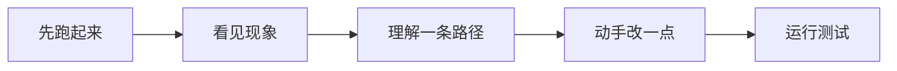
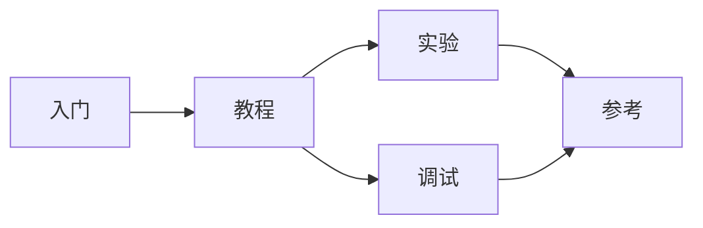

# 如何使用此 Wiki

这个 Wiki 主要写给刚开始学习 OS、或者刚准备自己动手写一个小内核的人。

你不需要一开始就理解页表、Trap、进程、文件系统、调度器这些东西。事实上，刚开始看 OS 的时候，看不懂才是正常的。

操作系统不是一个可以靠背概念快速掌握的东西。它更像一组互相咬合的机制：

```text
启动之后，内核要能控制机器；
有了内存管理，程序才有地址空间；
有了 Trap，用户程序才能进入内核；
有了进程，程序才有生命周期；
有了文件描述符，输入输出才变成统一接口；
有了文件系统，数据才能留下来；
有了 pipe 和 shell，系统才开始能被组合使用。
```

所以这个 Wiki 不会假设你已经懂这些。

它会尽量从一个最小可运行系统开始，带你一层一层往下看：
一个功能为什么需要出现，它解决了什么问题，它和前后模块怎样连接，写错以后应该怎么调试。

!!! info "代码仓库"
    此 Wiki 对应的主要代码仓库为：[FrostVistaOS](https://github.com/AuroBreeze/FrostVistaOS/tree/v1.0)

    Wiki 内容会持续跟随代码版本更新。

---

## 应该怎样阅读

如果你刚开始学习 OS，不建议一上来就从头到尾阅读所有章节。

更推荐按下面的方式走：

!!! tip "推荐的阅读节奏"
    一次不要读太多。读完一小节 → 跑起来看一眼 → 理解一条路径 → 再读下一节。

    把系统跑通一次的收获，远大于把教程从头看到尾。
也就是说，这个 Wiki 的重点不是让你一次性理解整个内核，而是让你不断完成小闭环。

比如，第一次你只需要理解：



这就是一条完整路径。

等这条路径看懂了，再去看 `fork`、`exec`、文件系统、pipe、shell。
OS 学习最怕的不是慢，而是还没建立闭环就去追求全局理解。

---

## 这个 Wiki 分成哪些部分



## 入门

入门部分解决最现实的问题：

> 怎么把系统跑起来？

这里会介绍：

* 如何准备工具链；
* 如何构建 FrostVistaOS；
* 如何启动 QEMU；
* 如何看到内核输出；
* 如何进入 shell；
* 如何连接 GDB；
* 如何运行第一个用户程序。

!!! example "先跑起来"
    如果你是第一次接触这个项目，建议先不要急着看源码。先把系统跑起来。

    因为只有系统能跑，你后面看到的每个概念才有落点。

---

## 教程

教程部分是主线。

它会按照 FrostVistaOS 的能力演进来组织，而不是一开始就铺开所有概念。

大致路线是：

```text
启动
  ↓
分页
  ↓
Trap
  ↓
用户态
  ↓
系统调用
  ↓
进程
  ↓
文件描述符
  ↓
VFS
  ↓
文件系统
  ↓
Pipe
  ↓
Shell
  ↓
mmap / 用户地址空间
```

每一章尽量回答几个问题：

!!! question "阅读每一章时可以问自己"
    - 这个模块为什么需要出现？
    - 它解决了什么问题？
    - 如果没有它，系统会怎样？
    - 它依赖前面哪些东西？
    - 它会被后面哪些模块使用？
    - 它最容易在哪里出 bug？

这个教程不是为了一次性实现一个完整 Linux。

它更像是带你观察：
一个小内核是怎么一点点从“能启动”，变成“能运行用户程序”，再变成“有一点 Unix-like 系统形状”的。

---

## 实验

实验部分是为了防止“看懂了，但其实不会改”。

每个实验都会尽量围绕一个小目标展开：

```text
读懂一个概念
修改一小段代码
运行一次测试
观察一个现象
解释为什么
```

比如：

* 添加一个简单 syscall；
* 写一个用户态小程序；
* 修改 shell 的一个命令；
* 观察一次 page fault；
* 修改 pipe buffer 大小；
* 测试 `fork` 后父子进程的行为；
* 让一个文件通过 VFS 被打开、读取、关闭。

实验不追求一开始就很难。

相反，前期实验应该尽量小。
因为对刚开始学 OS 的人来说，最重要的是建立信心：

> 我改了一点东西，系统真的发生了变化。
> 我能解释这个变化为什么发生。

这就够了。

---

## 调试

调试部分非常重要。

写 OS 的时候，你会经常遇到：

- QEMU 没输出
- panic
- page fault
- 死循环
- 用户程序跑不起来
- syscall 参数不对
- fork 后状态异常
- 文件读写失败
- pipe 阻塞不醒


这些问题一开始会很吓人。

所以调试部分不会只告诉你“最后怎么修”，而是会尽量写清楚：

```text
现象是什么？
先怀疑哪一层？
怎么验证？
排除了什么？
最后定位到哪里？
怎么确认修好了？
```

!!! danger "调试核心原则"
    不要先猜答案，先分层。

看到 page fault，不要立刻乱改页表。
先问：

```text
访问的地址是多少？
这是用户地址还是内核地址？
这个地址应该存在吗？
PTE 有没有映射？
权限位对不对？
是在 load、store，还是取指时出错？
```

看到 syscall 失败，也不要立刻改实现。
先问：

```text
系统调用号对不对？
参数寄存器对不对？
用户指针有没有 copyin？
返回值语义对不对？
```

!!! note ""
    调试能力，是学习 OS 时最重要的能力之一。

---

## 参考

参考部分不是主线教程，而是查表工具。

这里会整理：

* syscall 表；
* errno / 错误码；
* RISC-V 调用约定；
* ELF 结构；
* System V ABI；
* 文件系统术语；
* VFS 术语；
* 常见缩写；
* 推荐阅读资料。

刚开始学习时，不需要把参考部分全部看完。遇到不懂的概念时再回来查就行。

!!! info "查表举例"
    - 不知道 `a0`-`a7` 在 syscall 中怎么用；
    - 不知道 ELF Program Header 是什么；
    - 不知道 `fd`、`file`、`inode` 有什么区别；
    - 不知道 `O_CREAT` / `O_TRUNC` 应该怎样工作；
    - 不知道 page fault 的地址从哪里来。

    这些都可以在参考部分找到入口。

---

## 阅读时的建议

### 1. 不要怕慢

!!! tip ""
    刚开始学 OS 慢是正常的。

    有时候一个 page fault、一个地址转换、一个 syscall 参数，都可能卡很久。

    这不说明你不适合写 OS。这只说明你真的走到了系统的边界上。

---

### 2. 不要只复制代码

!!! warning ""
    如果你只是复制代码，系统可能能跑，但你不会知道它为什么能跑。

    每次看到一段关键代码，都可以问：

    - 它解决了什么问题？
    - 它依赖什么前提？
    - 如果删掉会怎样？
    - 如果参数错了会怎样？
    - 它失败时应该怎么回滚？

    这些问题比代码本身更重要。

---

### 3. 先理解路径，再理解全局

!!! tip ""
    刚开始不要试图同时理解整个内核。

    先理解一条路径：

    ```
    write 路径
    syscall 路径
    fork 路径
    exec 路径
    open/read/write 路径
    pipe 路径
    ```

    当你理解的路径越来越多，它们会慢慢拼成系统。

---
## 最后

这个 Wiki 希望做的事情很简单：

> 帮助一个刚开始学习 OS 的人，从"完全不知道怎么进去"，慢慢走到"我能看懂一条内核路径，我能改一点东西，我能解释它为什么这样运行"。

它不会承诺捷径。

也不会假装写内核很轻松。

但如果你愿意从最小的闭环开始，一点点拆开问题，耐心地面对 bug，那么 OS 并不是遥不可及的东西。

先让它启动。  
先让它打印。  
先让一个用户程序跑起来。  
先理解一次 syscall。

然后，再继续往下走。
