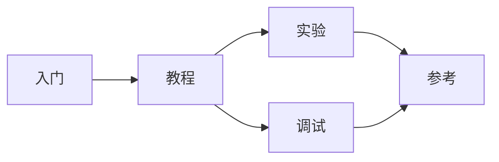

# FrostVista Wiki

很多事情在发生的时候，并不像一个开始。

我最初接触 OS，并不是因为一开始就知道自己要写一个操作系统。更早的时候，我只是一直在找一个东西：它要足够深，足够真实，也足够让我把那些说不清的好奇心放进去。

我学过很多方向，也对很多东西短暂地感兴趣过。它们有些很有用，有些很热闹，也有些能很快做出结果。可很多时候，我总觉得自己只是从一个东西跳到另一个东西，学会了一些用法，做出了一些项目，却很难真正留下什么。

后来我遇到了 OS。

OS 和那些东西不太一样。它不会只停在接口和功能上。它会把人一路带到机器的底下：地址为什么能被翻译，中断为什么会发生，用户程序为什么能被内核接住，一个文件为什么能被抽象成一个整数。

这些问题一开始并不会给我答案。

它们只会让我失败。

`panic`、`page fault`、死循环、启动失败、莫名其妙的寄存器值、看起来完全没道理的 bug。很多时候，我会在一个很小的问题上耗掉几个小时，最后发现只是一个地址错了、一个标志位没设、一个锁的约定没想清楚。

那种感觉并不好。

它会让人失望，也会让人怀疑：我是不是根本没懂？我是不是只是照着别人的代码和 AI 的回答在往前挪？我是不是真的适合写这种东西？

可也正是在这些失败里，我一次次看见 OS 的精妙。

一个页表项，可以决定一段地址是否存在。一次 Trap，可以把用户程序从失控边缘带回内核。一个 `fork`，可以让父子进程从同一个位置继续向前。一个文件描述符，可以把普通文件、设备、管道都压进同一种抽象里。一个很小的调用约定，可以让上下文切换只保存必须保存的东西。

这些设计有时候精妙得让人沉默。

它们不是炫技，而是多年系统经验沉淀下来的秩序。越是被 bug 打得狼狈，越能在某个瞬间突然意识到：原来这里不是随便这样写的，原来每一层都在接住下一层。

所以我一次次失败，也一次次回来。

不是因为我一直很有信心，而是因为我总想知道：

> 为什么？

为什么会报错？  
为什么能运行？  
为什么这里必须这样设计？  
为什么一个看似很小的边界，会牵动整个系统？

`FrostVistaOS` 就是在这些问题里慢慢长出来的。

它不是一个成熟的操作系统，也不是一个用来证明我多厉害的项目。它有很多粗糙的地方，有技术债，有没清干净的 mock，有还没写完的 shell，也有很多以后一定要重构的代码。

但它确实在一点点长出来。

从第一行输出，到分页；从用户态，到进程；从系统调用，到文件系统；再到 `pipe`、`shell`，以及那些看起来很小、却能让整个系统崩掉的边界条件。

我有时候觉得，自己写的并不只是一个内核。

我是在看着某种秩序，从混乱里一点点长出来。

这对我很重要。

因为每当我怀疑自己是不是只是在学一些零散的东西，怀疑自己是不是只是靠热情和工具撑着，怀疑自己到底有没有真正理解什么的时候，FrostVista 至少告诉我：有些东西确实被我一点点留下来了。

它不是完成品。

它更像一个证据。

证明我曾经在这里，证明我真的想理解，证明一个复杂系统确实可以被拆开，也证明一个普通人可以在一次次失败和失望之后，慢慢靠近那些精妙的东西。

所以，我开始写这个 Wiki。

它不是一份完整的标准手册，也不是为了把 `FrostVistaOS` 包装成一个多么成熟的系统。它更像是一份学习路线，也像一份开发日志的整理版。

我希望这里不只是告诉你“代码最后长什么样”，而是能让你看到一条可以跟着走的路径。

不是捷径。

只是一个人曾经走过、摔过、修过、失望过，又继续往前走的路径。

---

## 从哪里开始

如果你是第一次来到这里，可以先从入门部分开始：

- [构建与运行](getting-started/build-and-run.md)：把 `FrostVistaOS` 跑起来。
- [QEMU 与 GDB](getting-started/qemu-gdb.md)：准备最基本的调试环境。
- [第一个用户程序](getting-started/first-user-program.md)：从用户态进入这个系统。

如果你想按内核能力一点点读，可以从教程主线开始：

- [总览](chapters/00-overview.md)
- [启动](chapters/01-boot.md)
- [分页](chapters/02-paging.md)
- [Trap](chapters/03-trap.md)
- [进程](chapters/04-process.md)
- [系统调用](chapters/05-syscall.md)
- [VFS](chapters/06-vfs.md)
- [Easy-FS](chapters/07-easyfs.md)
- [Pipe](chapters/08-pipe.md)
- [Shell](chapters/09-shell.md)

---

## 这里会有什么

- **入门**：解决“怎么跑起来”的问题。
- **教程**：按 FrostVistaOS 的能力演进，一章一章理解内核。
- **实验**：把读到的东西变成自己动手改的东西。
- **调试**：记录 GDB、panic 和常见 bug 的排查方式。
- **参考**：放 `syscall` 表、术语表，以及之后会用到的查表资料。

这个 Wiki 不是为了让每一章都显得很完整。

相反，我更希望它能保留一种过程感：一个功能是怎么被拆开的，一个 bug 是怎么被追到根因的，一个模块在设计时有哪些边界、妥协和技术债。

如果你只是想看最终答案，这里可能不会是最快的地方。

但如果你也想知道一个 toy kernel 是怎样一点点长出 Unix-like 系统的形状，那么这些记录也许会有一点用。

---

## 一个并不像开始的开始

我的 OS 之旅，起点其实有点荒谬。

大一暑假的时候，我在家里练车、打游戏、发呆。那段时间没有什么特别明确的目标，只是觉得无聊，也总想在网上找点新的东西看看。

后来有一天，我看到一个“赛博算命”的网站，就顺手问了 AI：我的事业运怎么样？

它说我适合做一些精密的工作，比如编程。我说我确实是软件工程的学生。它又继续说，我不太适合偏 UI 的方向，可能更适合底层、系统、无 UI 的设计。

现在回头看，这当然很像一个玩笑。

可很多事情的开始，本来就不是经过深思熟虑的宣言，而是某个偶然的瞬间，刚好把你推向了一个方向。

当时我刚做完 `build-your-own-x` 里的 Redis 项目，正想找一个更底层、更接近机器的东西。于是我问 AI：有没有什么适合继续学习的底层项目？

它给我推荐了 `xv6`。

然后我就走进去了。

最开始看 xv6 的时候，我并没有真正理解什么是内核。页表、Trap、进程、文件系统、锁、中断，这些东西都像一团雾。它们每一个都能单独讲很久，但真正难的是：它们不是孤立存在的，它们会在一个系统里互相咬合。

那时候我也不知道，这个偶然的入口后来会变成我的主线。

我只是一次次被它打断，又一次次被它吸回去。

一开始只是想知道内核怎么打印。后来想知道分页为什么能工作。再后来想知道用户态为什么能回来，系统调用为什么能分发，进程为什么能切换，文件为什么能被打开，设备为什么也能像文件一样读写。

每往下走一层，都会发现下面还有一层。

这让我很痛苦，也让我着迷。

痛苦的是，OS 很少直接告诉你错在哪里。一个小小的错误，可能来自一条指令、一个页表项、一次中断、一个锁，或者一个你以为“不重要”的边界条件。

着迷的是，当你终于把它拆开的时候，会突然看到一种很精妙的秩序。

那种感觉很难说。

不是“我又实现了一个功能”的开心。

而是：

> 原来它是这样接起来的。

原来我也可以理解它。

---

## 为什么写这个 Wiki

我开始写这个 Wiki，不是因为 FrostVista 已经足够成熟。

恰恰相反，它还很不成熟。

它有很多地方只是刚刚能跑，有很多地方写得并不好，有些模块之后一定要重构，有些技术债现在只是被我暂时压住了。

但也正因为它还不成熟，我才想把它写下来。

成熟系统往往只留下结果。你看到的是已经收束好的抽象，是漂亮的接口，是稳定的路径，是前人无数次失败之后沉淀下来的形状。

可一个人学习 OS 的时候，真正困难的往往不是看结果，而是不知道自己为什么看不懂。

不知道 panic 该从哪一层查。  
不知道 page fault 是页表错了，还是地址语义错了。  
不知道 syscall 失败，是参数传错了，还是内核没有正确理解用户态。  
不知道文件系统读不出来，是 VFS、backend、block cache，还是设备层出了问题。

所以我想记录这些过程。

我想记录：

- 一个功能是怎么从“看不懂”变成“能跑起来”的；
- 一个 bug 是怎么从“完全不知道为什么”被追到根因的；
- 一个模块在设计时有哪些边界、妥协和技术债；
- 一次失败带来了什么失望，又怎样逼着我重新理解系统；
- 一个看似精妙的设计，背后到底在解决什么问题。

如果说这个 Wiki 对后来的人有什么价值，我希望它不是让你觉得“这个人写了一个 OS，好厉害”。

而是让你觉得：

> 原来 OS 也可以这样一点点靠近。  
> 原来看不懂并不是结束。  
> 原来只要愿意拆开问题，我也可以慢慢理解它。

在某种意义上，这个 Wiki 也是写给过去的我自己的。

写给那个站在门口，不知道该怎么进去的人。

---

## 写给后来的人

写 OS 需要有一个觉悟：耐心、理解、闭环。

OS 并不像算法题，有明确的输入和输出。

它也不像前端，写一行代码，界面就立刻变化一下。

它甚至不像普通后端，接口报错了，就沿着请求链路查一遍。

OS 是一个完整的系统。它由硬件、编译器、链接器、内存、进程、文件系统、设备驱动和用户程序共同组成。

一个很小的错误，可能来自：

- 一条指令；
- 一个页表项；
- 一次中断；
- 一个锁；
- 一个错误码；
- 一个文件偏移；
- 一个你以为“不重要”的边界条件。

所以，写 OS 最重要的不是一开始就什么都懂。

而是愿意把问题拆开。

看到 `panic`，先问：它发生在哪一层？

看到 `page fault`，先问：访问的地址为什么会出现？

看到 `syscall` 失败，先问：用户态传进来的东西，内核到底有没有正确理解？

看到文件读写错误，先问：是 `VFS`、backend、`block cache`，还是设备层出了问题？

不要急着背答案。

先把事实摊开，再一点点验证。

如果你能把一个问题从“完全不知道为什么”，追到“我知道是哪一层坏了”，那其实就已经在靠近内核了。

写 OS 的过程中，你会经常觉得自己什么都不会。

你会看到成熟系统里精妙的设计，也会看到前人留下的思想火花。那些东西有时候会让人兴奋，有时候也会让人自惭形秽。

可是不要急着把这种差距理解成失败。

很多时候，失败本身就是靠近系统的一部分。

你会写错地址，会弄混 VA 和 PA，会忘记某个标志位，会在锁的边界上摔跤，会让一个本来很小的问题拖住几个小时。你会失望，会怀疑自己，会觉得自己是不是根本不适合。

这些感觉都很正常。

真正重要的是，在这些失败之后，你是否还愿意回来，多问一句：

> 为什么？

为什么会报错？  
为什么能运行？  
为什么这里必须这样设计？  
为什么这一层要这样接住下一层？

当你一步步把问题拆开、验证、排除，最后让系统重新跑起来的时候，你可能会突然意识到：

> 原来我也可以理解它。

这就是 FrostVista 对我的意义。

它不是一个完成品。

它是一条我正在走的路。

如果你也想写 OS，那就从一个最小的闭环开始。

先让它启动。

先让它打印。

先让它进入用户态。

先让它处理一次 Trap。

先让一个用户程序跑起来。

不用一开始就理解所有东西。

只要每一次遇到问题时，你都愿意多问一句：

> 为什么？

那么你就在靠近它。

遇到错误时，请不要 `panic`。

也不要轻易放弃。

---

## 参考

`FrostVistaOS` 的设计和实现并不是凭空出现的。它受到许多经典系统、规范文档和教学项目的影响，其中最重要的参考包括：

- **xv6**：在早期开发阶段，`FrostVistaOS` 从 MIT 开发的 `xv6` 操作系统中获得了许多启发。感谢 `xv6` 的作者们提供了一个清晰且具有教学意义的 Unix-like 内核实现。它为我理解文件系统、进程管理和设备驱动等内核概念打下了重要基础。在 `FrostVistaOS` 最初的设计与实现过程中，`xv6` 的源码和配套教材始终是主要参考之一。  
  <https://pdos.csail.mit.edu/6.828/2023/xv6.html>

- **Linux Kernel**：作为真实 Unix-like 系统的重要参照，Linux 在系统调用、VFS、进程模型、文件描述符和设备抽象等方面提供了大量值得学习的设计经验。FrostVistaOS 并不试图复刻 Linux，但许多边界和概念都可以从 Linux 中找到更成熟的形态。  
  <https://www.kernel.org/>

- **System V ABI**：用于理解 ELF、程序装载、调用约定和用户程序运行时的基础约定。FrostVistaOS 在实现 `exec`、用户程序装载和运行时布局时，都绕不开这些底层规范。  
  <https://refspecs.linuxfoundation.org/elf/gabi4+/contents.html>
