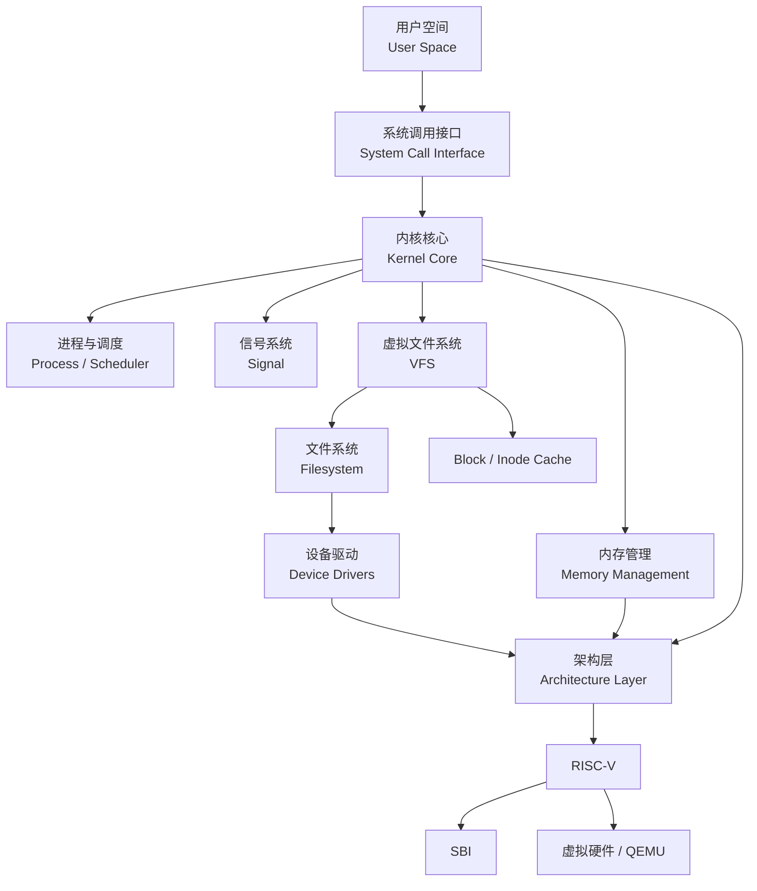
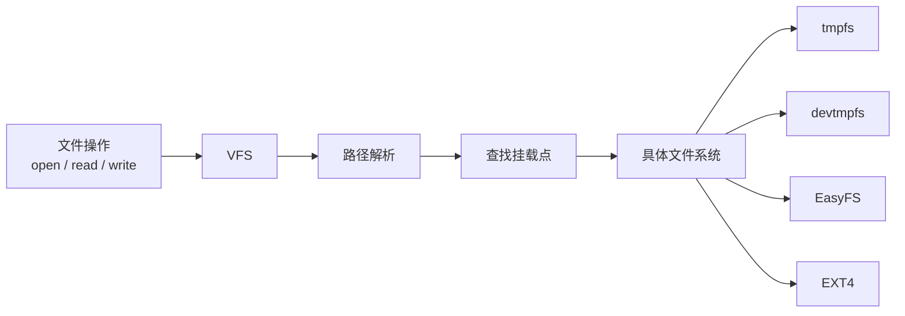
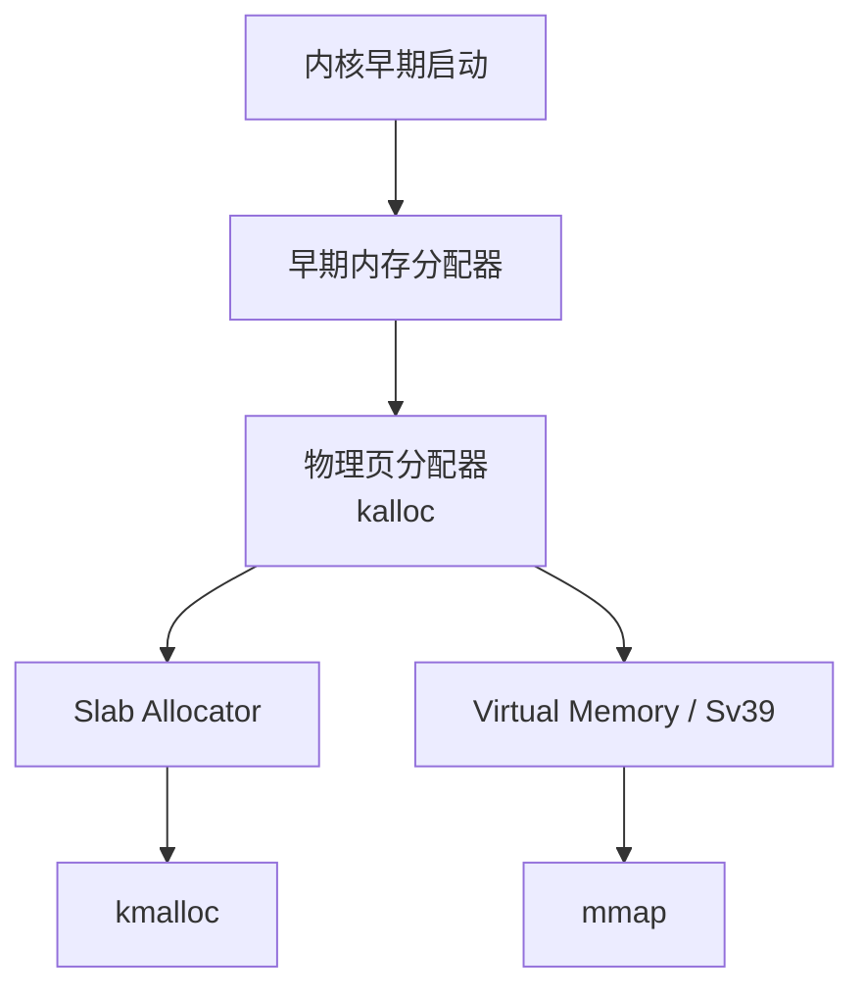
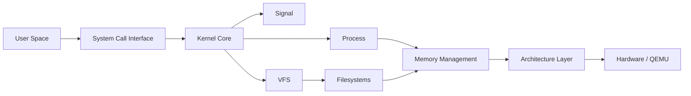

# Architecture

!!! abstract
    `FrostVista` 采用了一种紧凑的分层架构，受到传统类 Unix 系统的启发。

    内核主要由架构相关代码、核心内核服务、内存管理、文件系统以及设备驱动等子系统组成。FrostVista 不追求通过大量抽象隐藏系统内部的实现，而是尽可能保持清晰、真实的模块边界。

    每个子系统负责明确的职责，同时避免为了抽象而抽象。

## Architecture Overview

从整体上看，FrostVista 可以划分为以下几个层次：



该图描述的是 FrostVista 当前主要的逻辑依赖关系，而不是严格的函数调用关系。

其中，`kernel/` 中的大部分核心子系统并不直接处理底层硬件，而是通过架构相关代码提供的机制完成硬件交互。当前由于 FrostVista 只支持 RISC-V，部分原本应该位于架构边界之外的代码仍然存在直接的 RISC-V 依赖。

---

## Directory Structure

FrostVista 的代码按照功能和依赖关系划分为多个目录：

```text
FrostVistaOS/
|-- arch/
|   `-- riscv/              RISC-V boot, trap, paging, SBI, UART, timer, and PLIC code
|       |-- boot/
|       |-- driver/
|       |-- include/
|       |-- mm/
|       |-- tool/
|       `-- trap/
|-- kernel/
|   |-- core/               Process, syscall, exec, file descriptor, pipe, and scheduler paths
|   |-- driver/             VirtIO block device driver
|   |-- fs/                 VFS, Easy-FS, EXT4 read-only, devtmpfs, tmpfs, and block cache layers
|   |   |-- devtmpfs/
|   |   |-- easyfs/
|   |   |-- ext4fs/
|   |   `-- tmpfs/
|   `-- mm/                 Kernel memory management
|-- include/                Kernel headers and shared constants
|-- mk/                     Makefile fragments
|-- mkfs/                   Host Easy-FS image builder
|-- scripts/                Test runner and helper scripts
|-- test/                   User-mode test entry programs
|-- user/                   Shared user-mode runtime
|   `-- bin/                User applications such as echo, cat, and fvsh
|-- docs/                   Project notes and known issues
`-- devlog/                 Development notes
```

### 主要目录

| 目录 | 说明 |
|---|---|
| `arch/` | 架构相关代码。目前仅支持 RISC-V，负责启动、Trap、分页、SBI、平台相关驱动等底层功能。 |
| `kernel/` | 内核核心代码，包含进程管理、系统调用、调度、文件系统、内存管理以及设备驱动等主要子系统。 |
| `include/` | 内核共享头文件、类型定义以及公共常量。 |
| `test/` | 内核功能测试与回归测试。测试程序主要用于验证内核功能以及不同版本之间的行为是否保持一致。 |
| `user/bin/` | 用户空间应用程序，例如 `ls`、`sleep`、`cat`、`fvsh` 等。 |

### 辅助目录

| 目录 | 说明 |
|---|---|
| `mk/` | 拆分后的 Makefile 片段，用于组织工具链、源文件、镜像、运行配置以及检查流程。 |
| `mkfs/` | 运行在 Host 上的文件系统镜像生成工具，目前主要用于生成 Easy-FS 镜像。 |
| `scripts/` | 测试、构建以及其他开发辅助脚本。 |
| `docs/` | 项目文档、已知问题以及其他说明。 |
| `devlog/` | 开发过程中的记录和实验笔记。 |

---

## Architecture Layer

`arch/` 是 FrostVista 中最底层的代码区域，负责处理与具体 CPU 架构以及运行平台直接相关的功能。

当前 FrostVista 仅支持 `RISC-V 64`，因此架构相关代码主要位于：

```text
arch/riscv/
├── boot/
├── driver/
├── include/
├── mm/
├── tool/
└── trap/
```

主要职责如下：

| 目录 | 说明 |
|---|---|
| `boot/` | 内核启动以及早期初始化。 |
| `driver/` | 平台相关的设备驱动，例如 UART、PLIC 等。 |
| `include/` | RISC-V 架构相关的类型、宏以及接口定义。 |
| `mm/` | 架构相关的虚拟内存和页表操作。 |
| `trap/` | Trap 入口、中断处理以及 Trap 返回。 |
| `tool/` | 与架构相关的辅助工具。 |

架构层直接与 CPU 寄存器、页表、Trap、SBI 等底层机制交互，是整个内核与硬件之间的重要边界。

---

!!! warning "当前的架构耦合"
    FrostVista 当前尚未完全实现架构无关的内核抽象。

    由于目前只支持 RISC-V，`kernel/` 中的部分代码仍然直接依赖 `arch/riscv` 中定义的类型、宏以及底层接口。

例如：

* `virtio_blk.c`
* `sysproc.c`
* `syscall.c`

等代码目前仍存在一定程度的架构相关依赖。

这种状态是当前项目实现阶段的一个已知限制，而不是最终的架构设计目标。

随着其他架构的加入，这些依赖将逐步被抽离到明确的架构接口中，使核心内核代码减少对具体架构实现的直接依赖。

```text
当前：

kernel
 ├── core
 ├── fs
 ├── mm
 └── driver
       │
       └──── 部分代码直接依赖 ────> arch/riscv


未来：

kernel
 ├── core
 ├── fs
 ├── mm
 └── driver
       │
       ▼
Architecture Interface
       │
       ├── RISC-V
       └── LoongArch
```

---

!!! info "未来的架构支持"
    当前 FrostVista 的主要开发目标仍然是完善 RISC-V 平台。

    在后续的多架构支持中，计划优先考虑引入 `LoongArch`。

    引入新的架构不仅意味着增加新的 `arch/<arch>/` 实现，也会推动当前 `kernel/` 中存在的架构相关依赖进一步抽象。

---

## Kernel Core

`kernel/` 包含 FrostVista 的主要内核子系统：

```text
kernel/
├── core/
├── driver/
├── fs/
└── mm/
```

这些模块共同构成内核主体。

---

### core

`kernel/core/` 包含内核中的核心服务和基础机制，包括：

* 进程管理（Process）
* 调度器（Scheduler）
* 系统调用（System Call）
* `exec`
* 文件描述符（File Descriptor）
* 管道（Pipe）
* 自旋锁（Spinlock）
* 睡眠锁（Sleeplock）
* 信号（Signal）

这些代码原则上属于架构无关的内核逻辑，但当前仍存在部分架构相关依赖。

`core/` 的主要职责是管理系统中的进程、执行流以及内核提供给用户空间的基本服务。

---

### driver

`kernel/driver/` 主要存放与具体 CPU 架构相对独立的设备驱动。

当前实现：

- `virtio_blk`：VirtIO 虚拟块设备驱动。

与具体平台直接相关的驱动，例如 UART、PLIC 等，则位于：

```text
arch/riscv/driver/
```

这种划分用于区分：

> **通用设备协议 / 驱动逻辑**

和：

> **具体架构或平台相关的硬件支持。**

---

### fs

`kernel/fs/` 包含 FrostVista 的文件系统子系统以及 VFS 实现。

当前包含：

- `vfs/`：虚拟文件系统（Virtual File System）
- `devtmpfs/`：内存设备文件系统
- `tmpfs/`：内存文件系统
- `easyfs/`：FrostVista 当前使用的简单文件系统
- `ext4fs/`：只读 EXT4 文件系统支持

其中，EXT4 当前通过 `tmpfs overlay` 提供临时写能力：

```text
        EXT4
         │
      Read Layer
         │
         ▼
      tmpfs
         │
      Write Layer
         │
         ▼
      VFS
```

这种方式允许系统在不修改原始 EXT4 数据的情况下提供写操作，但当前写入的数据不会真正持久化到 EXT4 文件系统。

---

### VFS

VFS 为上层内核提供统一的文件系统接口，并负责将文件操作分发到具体的文件系统实现。

当前 VFS 已经支持基本的挂载功能，可以同时挂载不同类型的文件系统。

主要处理流程可以简化为：



VFS 当前还提供：

| 能力 | 能力 |
|---|---|
| Mount 管理 | Path Resolution |
| Block Cache | Inode Cache |

具体的 VFS 数据结构、路径解析以及缓存机制将在 `VFS Design` 中进一步介绍。

---

### mm

`kernel/mm/` 负责内核的内存管理。

当前主要包含：

* 物理页分配（Physical Page Allocation）
* 虚拟内存（Virtual Memory）
* Sv39
* `kalloc`
* Slab Allocator
* `kmalloc`
* 基础 `mmap` 支持

FrostVista 的内存管理采用分层方式：



其中：

| 组件 | 职责 |
|---|---|
| `kalloc` | 负责以页为基本单位进行物理内存管理。 |
| `Slab Allocator` | 负责内核对象级别的内存分配。 |
| `kmalloc` | 在 Slab 之上提供更加方便的通用内核内存分配接口。 |
| `mmap` | 用于管理进程中的内存映射区域。 |

具体的内存管理机制将在 **Memory Management** 章节中分别介绍。

---

## Design Boundaries

FrostVista 的架构设计并不追求将所有模块都隐藏在抽象接口之后。

相反，只有当一个边界对应系统中真实存在的职责划分，并且能够降低后续开发和维护成本时，才会引入相应的抽象。

目前可以将 FrostVista 的主要边界概括为：



这些边界目前并不是完全独立的。

特别是在多架构支持尚未实现的情况下，部分 `kernel/` 代码仍然直接依赖 RISC-V 的定义和接口。

FrostVista 的架构将随着系统功能的增加逐步演化，而不是在一开始建立一个过度复杂的抽象体系。

!!! quote
    **Small code, clear shape, real behavior.**

    这也是 FrostVista 在架构设计上希望保持的原则。
