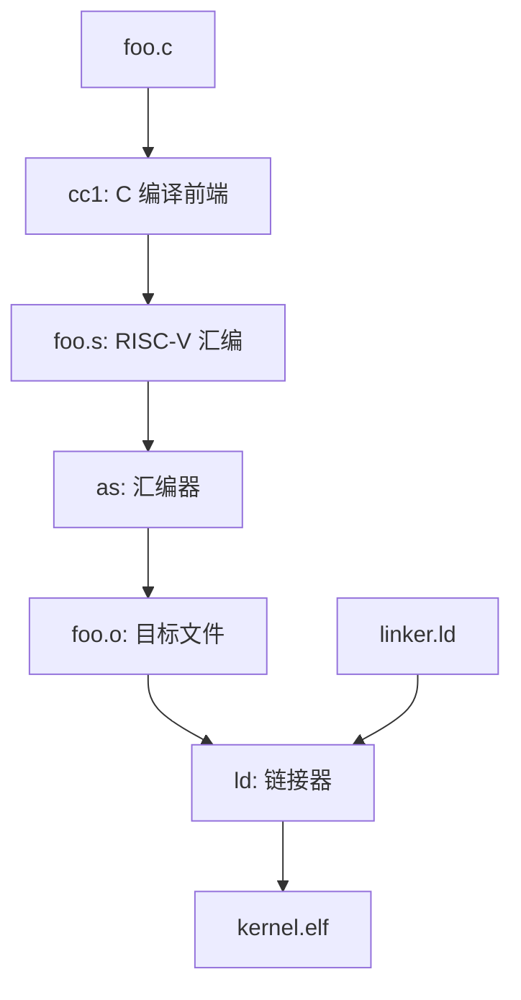

# 交叉编译器

写 FrostVistaOS 时，你在 x86_64 Linux 上写代码，但最终运行代码的是 QEMU 模拟出来的 RISC-V 64 机器。

这意味着：你手上的普通 `gcc` 不是用来生成内核代码的主角。普通 `gcc` 默认生成的是 Host 平台机器码，而 FrostVistaOS 需要的是 Target 平台机器码。

```text
Host:   x86_64 Linux       你写代码、运行 make 的地方
Target: RISC-V 64 virt     FrostVistaOS 实际运行的机器
```

交叉编译器（cross compiler）就是运行在 Host 上、但生成 Target 机器码的编译器。


!!! tip "推荐工具链"
    FrostVistaOS 后续开发默认推荐使用 `riscv64-elf-gcc`。如果你的环境里有多个 RISC-V 工具链，建议优先统一到 `CROSS=riscv64-elf`，减少调试时的差异。

## 为什么不能直接用本机 gcc

本机 `gcc` 通常默认面向当前机器，例如 x86_64 Linux：

```bash
gcc -dumpmachine
```

常见输出类似：

```text
x86_64-pc-linux-gnu
```

这表示它默认生成 x86_64 Linux 用户态程序。

FrostVistaOS 需要的是：

- RISC-V 64 指令；
- 适合裸机内核的 ABI；
- 不依赖 Linux 用户态运行时；
- 能被 linker script 组织成内核 ELF。

所以我们需要 RISC-V cross toolchain：

```bash
riscv64-elf-gcc -dumpmachine
```

常见输出类似：

```text
riscv64-unknown-elf
```

!!! note "名字可能略有差异"
    有些发行版命令叫 `riscv64-elf-gcc`，有些叫 `riscv64-unknown-elf-gcc`。它们都属于 bare-metal RISC-V 工具链。FrostVistaOS 推荐优先使用 `riscv64-elf-gcc`，但保留其他前缀作为 fallback。

---

## Host、Target、ISA 和 ABI

理解交叉编译时，先分清几个词：

| 名称 | 含义 | FrostVistaOS 中的例子 |
|------|------|------------------------|
| Host | 编译器运行在哪个平台 | x86_64 Linux |
| Target | 编译器生成给哪个平台运行 | RISC-V 64 |
| ISA | 指令集架构，CPU 能执行哪些指令 | `rv64imac_zicsr_zifencei` |
| ABI | 函数调用、寄存器、栈、数据宽度约定 | `lp64` |
| Target triple | 工具链目标描述 | `riscv64-elf` / `riscv64-unknown-elf` |

这几个词解决的是不同层次的问题：

```text
ISA  决定 CPU 能执行什么指令
ABI  决定函数之间怎么传参、返回、保存寄存器
ELF  决定最终文件怎么描述代码、数据、符号和加载信息
```

---

## 工具链前缀

RISC-V 工具链常见前缀如下：

| 前缀 | 目标环境 | 适用场景 | FrostVistaOS 建议 |
|------|----------|----------|-------------------|
| `riscv64-elf-` | bare-metal ELF | 裸机程序、教学 OS、无 libc 内核 | **推荐** |
| `riscv64-unknown-elf-` | bare-metal ELF | 同上，只是 target triple 带 `unknown` vendor | 可用 |
| `riscv64-linux-gnu-` | Linux userspace | RISC-V Linux 用户态程序 | 可用但不推荐作为默认 |

FrostVistaOS 的构建系统会在 `mk/arch-riscv.mk` 中自动检测可用工具链，优先级是：

```text
1. riscv64-elf-gcc
2. riscv64-unknown-elf-gcc
3. riscv64-linux-gnu-gcc
```

你也可以手动指定：

```bash
make qemu CROSS=riscv64-elf
```

这里的 `CROSS` 不是完整命令，而是工具链前缀。构建系统会用它拼出：

```text
$(CROSS)-gcc
$(CROSS)-ld
$(CROSS)-objdump
$(CROSS)-readelf
$(CROSS)-gdb
```

例如 `CROSS=riscv64-elf` 时：

```text
riscv64-elf-gcc
riscv64-elf-ld
riscv64-elf-objdump
riscv64-elf-readelf
riscv64-elf-gdb
```

---

## gcc 不只是编译器

命令名虽然叫 `gcc`，但在构建系统里，它经常扮演 compiler driver 的角色。

也就是说，`riscv64-elf-gcc` 会根据输入文件和参数，调用后面的工具：



如果输入是 `.S` 汇编文件，流程会更短：

```text
.S -> cpp 预处理 -> as 汇编 -> .o
```

!!! tip "为什么常用 gcc 而不是直接用 ld"
    `gcc` 作为 driver 会帮你传递目标架构、ABI、库搜索路径和部分默认参数。内核项目虽然会禁用很多默认行为，但仍常用 `gcc` 来统一驱动编译和链接。

---

## 工具链包含哪些工具

一个完整的 GNU RISC-V 工具链通常包含：

| 工具 | 作用 | 常见使用场景 |
|------|------|--------------|
| `$(CROSS)-gcc` | C compiler / driver | 编译 `.c`，也可驱动链接 |
| `$(CROSS)-as` | assembler | 汇编 `.S` / `.s` 为 `.o` |
| `$(CROSS)-ld` | linker | 合并 `.o` 为 ELF |
| `$(CROSS)-objdump` | object dump | 反汇编、查看 section 和符号 |
| `$(CROSS)-objcopy` | object copy | ELF 转 binary、提取 section |
| `$(CROSS)-readelf` | ELF reader | 查看 ELF header、program header、section |
| `$(CROSS)-nm` | symbol table viewer | 快速查看符号地址 |
| `$(CROSS)-ar` | archive tool | 打包静态库 |
| `$(CROSS)-gdb` | debugger | 调试 RISC-V 内核 |

FrostVistaOS 的日常阅读里，最常用的是：

```bash
riscv64-elf-gcc --version
riscv64-elf-readelf -h build/kernel.elf
riscv64-elf-objdump -d build/kernel.elf
riscv64-elf-nm build/kernel.elf
```

---

## 从源码到 kernel.elf

把整个构建链路摊开，大致是：

```text
源文件 .c / .S
  -> 编译 / 汇编
  -> 目标文件 .o
  -> linker script 组织布局
  -> kernel.elf
  -> QEMU / OpenSBI 加载运行
```

对应工具是：

```text
riscv64-elf-gcc / riscv64-elf-as
  -> riscv64-elf-ld 或 gcc driver 调用 ld
  -> riscv64-elf-readelf / objdump / nm 检查结果
```

这就是为什么交叉编译器和 [Linker 与 ELF](linker-elf.md) 要连在一起看：

- 交叉编译器决定生成什么 ISA / ABI 的目标文件；
- linker script 决定这些目标文件最终排到哪里；
- ELF 描述最终内核镜像如何被加载和执行。

---

## Freestanding：内核不是普通程序

普通 C 程序默认可以依赖很多运行时环境：

- libc；
- 默认入口文件，例如 `crt0.o`；
- 操作系统提供的系统调用；
- loader 帮你建立用户态栈和参数；
- `main()` 返回后由运行时处理退出。

内核不能依赖这些东西。

FrostVistaOS 是 freestanding environment：

```text
没有宿主 OS 帮内核准备运行时
没有默认 main 入口
没有 libc 初始化
入口、栈、bss 清零、页表、trap 都要内核自己处理
```

因此内核构建通常会用到这类思想或选项：

| 选项 / 思想 | 含义 |
|-------------|------|
| `-ffreestanding` | 告诉编译器当前不是 hosted C 环境，不能假设完整 libc 语义 |
| `-fno-builtin` | 不把某些函数名自动当成编译器内建函数优化 |
| `-nostdlib` | 链接时不自动链接标准库和默认启动文件 |
| 自定义 linker script | 明确控制内核入口和内存布局 |

!!! warning "不要把内核当 Linux 用户态程序编译"
    如果工具链或参数让编译结果依赖 Linux 用户态启动文件、动态链接器或 libc，内核即使能链接，也很可能无法按裸机方式启动。

---

## FrostVistaOS 的常用编译选项

FrostVistaOS 的 RISC-V 架构参数定义在 `mk/arch-riscv.mk` 中，核心形式类似：

```makefile
ARCH_CFLAGS = -march=rv64imac_zicsr_zifencei -mabi=lp64 -mcmodel=medany
```

逐项看：

| 选项 | 含义 | 为什么需要 |
|------|------|------------|
| `-march=rv64imac_zicsr_zifencei` | 目标 ISA 是 RISC-V 64，启用整数、乘除、原子、压缩指令、CSR 和 fence 扩展 | 生成 QEMU virt 能执行的指令 |
| `-mabi=lp64` | `long` 和 pointer 是 64 位，浮点不参与 ABI | 和内核 C 代码的数据模型一致 |
| `-mcmodel=medany` | 代码和数据可位于 PC 附近一定范围内 | 内核链接到高地址或非默认地址时更稳 |

调试构建通常还会加入：

| 选项 | 含义 |
|------|------|
| `-O0` | 关闭优化，方便单步调试 |
| `-g` | 生成 DWARF 调试信息，供 GDB 使用 |

!!! warning "不要用 -O0 日常运行"
    `-O0` 会显著增大内核体积并降低运行速度。日常验证用默认 release 构建即可；需要 GDB 单步时再切到 debug 构建。

---

## elf 和 linux-gnu 有什么区别

`riscv64-elf` 和 `riscv64-linux-gnu` 最容易让人混淆。

| | `riscv64-elf` | `riscv64-linux-gnu` |
|---|---|---|
| 目标环境 | bare-metal | Linux userspace |
| 默认假设 | 没有操作系统运行时 | 有 Linux、glibc、动态链接器等用户态环境 |
| 适合对象 | bootloader、kernel、裸机程序 | Linux 上运行的 RISC-V 应用程序 |
| FrostVistaOS 默认推荐 | **是** | 否 |

FrostVistaOS 使用自己的 linker script，并禁用标准库和默认启动文件。因此在某些情况下，`riscv64-linux-gnu-gcc` 也可能能把内核编出来。

但这不代表它是最好的默认选择。

!!! tip "为什么仍推荐 riscv64-elf"
    `riscv64-elf` 的目标语义更接近 FrostVistaOS：裸机、无 OS 用户态、无默认 libc 运行时。用它作为默认工具链，可以减少“工具链默认行为”和“内核真实运行环境”之间的错位。

---

## 如何验证工具链

先确认编译器存在：

```bash
riscv64-elf-gcc --version
```

确认目标 triple：

```bash
riscv64-elf-gcc -dumpmachine
```

确认可以交叉编译一个最小 ELF：

```bash
cat > /tmp/fv-test.c <<'EOF'
int _start(void) {
    return 0;
}
EOF

riscv64-elf-gcc -nostdlib -o /tmp/fv-test.elf /tmp/fv-test.c
file /tmp/fv-test.elf
riscv64-elf-readelf -h /tmp/fv-test.elf
```

你应该看到它是 RISC-V ELF，而不是 x86_64 ELF：

```text
ELF 64-bit LSB executable, UCB RISC-V, ...
```

构建 FrostVistaOS 后，也可以检查内核产物：

```bash
file build/kernel.elf
riscv64-elf-readelf -h build/kernel.elf
```

---

## 常见问题

### 找不到 riscv64-elf-gcc

先确认命令是否存在：

```bash
riscv64-elf-gcc --version
riscv64-unknown-elf-gcc --version
riscv64-linux-gnu-gcc --version
```

如果只有 `riscv64-unknown-elf-gcc`，可以临时指定：

```bash
make qemu CROSS=riscv64-unknown-elf
```

如果完全没有 RISC-V GCC，请回到[环境配置](../getting-started/environment.md)安装工具链。

### CROSS 写错

`CROSS` 写的是前缀，不包含最后的 `-gcc`。

正确：

```bash
make qemu CROSS=riscv64-elf
```

错误：

```bash
make qemu CROSS=riscv64-elf-gcc
```

如果写成后者，构建系统可能会拼出不存在的命令：

```text
riscv64-elf-gcc-gcc
```

### make gdb 找不到 GDB

`make gdb` 通常会尝试运行：

```text
$(CROSS)-gdb
```

如果你使用：

```bash
make qemu CROSS=riscv64-elf
```

那么调试时最好也有：

```bash
riscv64-elf-gdb --version
```

如果没有对应 GDB，可以用 `gdb-multiarch` 手动连接：

```bash
gdb-multiarch build/kernel.elf -ex 'target remote :1234'
```

### 编出来的是 x86_64 文件

如果 `file build/kernel.elf` 显示的是 x86_64，说明你可能用了本机工具链。

检查构建日志里实际调用的编译器，确认是 `riscv64-elf-gcc` 或其他 RISC-V 前缀。

### march 或 abi 不匹配

如果 QEMU 启动时出现非法指令，或者链接时出现 ABI 相关错误，优先检查：

```bash
riscv64-elf-gcc -v
```

再确认构建参数里 `-march` 和 `-mabi` 是否和项目一致。

---

## 下一步

- [Linker 与 ELF](linker-elf.md) — 理解交叉编译产物如何被链接成 `kernel.elf`；
- [环境配置](../getting-started/environment.md) — 安装和检查工具链；
- [构建与运行](../getting-started/build-and-run.md) — 用项目 Makefile 完整构建并启动内核。
