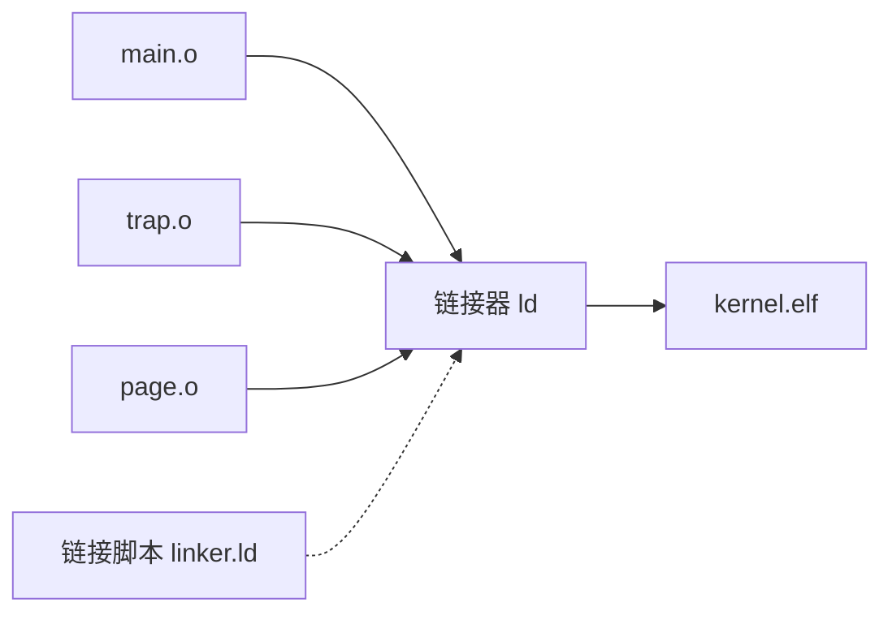

# Linker 与 ELF

## 链接做了什么

编译器把每个 `.c` 文件翻译成一个 `.o`（目标文件），但 `.o` 之间是独立的，互相不知道对方的存在。

链接器（linker）负责把这些 `.o` 合并成一个完整的可执行文件：



具体做了三件事：

1. **符号解析**：找到每个 `call`、`jump`、`load` 对应的目标地址
2. **段合并**：把所有 `.o` 的 `.text` 合并成一个 `.text`，`.data` 合并成一个 `.data`
3. **地址分配**：按照链接脚本的规则，给每个段分配最终的内存地址

---

## ELF 文件结构

ELF（Executable and Linkable Format）是 Linux 和大多数 Unix 系统使用的可执行文件格式。

一个 ELF 文件从结构上分为：

```text
┌──────────────────┐
│   ELF Header     │  文件类型、目标架构、入口地址
├──────────────────┤
│ Program Headers  │  运行时视图：告诉加载器怎么映射内存
├──────────────────┤
│ Section Headers  │  链接视图：告诉链接器有哪些段
├──────────────────┤
│   .text          │  代码
│   .rodata        │  只读数据
│   .data          │  已初始化全局变量
│   .bss           │  未初始化全局变量（不占磁盘空间）
│   .symtab        │  符号表
│   .strtab        │  字符串表
│   ...            │
├──────────────────┤
│ Section Headers  │  （位于文件末尾）
└──────────────────┘
```

!!! note ""
    内核加载时用的是 Program Headers，链接时用的是 Section Headers。
    一个典型的内核 ELF 两套头都会有。

---

## objdump：反汇编和查看段

`objdump` 是日常调试内核最常用的 binutils 工具之一。

### 反汇编内核

```bash
riscv64-elf-objdump -d build/kernel.elf | less
```

输出每一段代码对应的 RISC-V 指令。

### 只反汇编某个函数

```bash
riscv64-elf-objdump -d build/kernel.elf | grep -A 30 '<sys_write>:'
```

### 查看所有段（section）

```bash
riscv64-elf-objdump -h build/kernel.elf
```

会列出 `.text`、`.rodata`、`.data`、`.bss` 等段的大小和地址。

### 查看符号表

```bash
riscv64-elf-objdump -t build/kernel.elf | less
```

可以看到每个函数和全局变量对应的地址。

!!! tip "快速查找符号"
    ```bash
    riscv64-elf-objdump -t build/kernel.elf | grep sys_write
    ```

---

## readelf：查看 ELF 元信息

`readelf` 比 `objdump` 更专注于 ELF 结构信息。

### 查看 ELF Header

```bash
riscv64-elf-readelf -h build/kernel.elf
```

输出包括：目标架构、入口地址、Program Headers 数量和偏移等。

### 查看 Program Headers

```bash
riscv64-elf-readelf -l build/kernel.elf
```

显示每一段的虚拟地址、物理地址、文件大小、内存大小和权限。

### 查看 Section Headers

```bash
riscv64-elf-readelf -S build/kernel.elf
```

---

## objcopy：格式转换

`objcopy` 用于在不同格式之间转换。

### ELF → 纯二进制

```bash
riscv64-elf-objcopy -O binary build/kernel.elf build/kernel.bin
```

这会去掉所有 ELF 头，只保留可加载段的内容。某些 bootloader 或裸机启动流程需要 `.bin` 而不是 `.elf`。

### 只提取某个段

```bash
riscv64-elf-objcopy -O binary -j .text build/kernel.elf build/text.bin
```

---

## 链接脚本

链接脚本（linker script）告诉链接器如何组织可执行文件的布局。

FrostVistaOS 有两个链接脚本：

| 文件 | 启动方式 | 入口 |
|------|---------|------|
| `arch/riscv/linker.ld` | `BOOT=bare` | `_start`（M 态） |
| `arch/riscv/linker-sbi.ld` | `BOOT=opensbi` | `_start`（S 态） |

链接脚本决定了：

- 入口地址（ENTRY）
- `.text`、`.rodata`、`.data`、`.bss` 的起始地址和排列
- 内核栈的位置和大小
- 哪些符号需要在外部可见

!!! warning ""
    如果你修改了链接脚本，一定要 `make clean` 后重新构建。链接脚本的修改不会自动触发增量构建。

### 典型链接脚本片段

```ld
OUTPUT_ARCH(riscv)
ENTRY(_start)

SECTIONS
{
    . = 0x80200000;

    .text : {
        *(.text.entry)
        *(.text .text.*)
    }

    .rodata : {
        *(.rodata .rodata.*)
    }

    .data : {
        *(.data .data.*)
    }

    .bss : {
        *(.bss .bss.*)
    }
}
```

每一个 `*(.text .text.*)` 表示"把所有输入文件的 `.text` 和 `.text.*` 段合并到这里"。

---

## 常见问题

### 链接时报 undefined reference

```text
undefined reference to `some_function'
```

原因：某个 `.c` 调用了 `some_function`，但没有 `.o` 提供了它。

排查步骤：

1. 确认函数名拼写正确
2. 确认对应的 `.c` 被包含在编译列表中
3. 用 `objdump -t` 检查 `kernel.elf` 是否真的没有这个符号

### 入口地址不对

如果 QEMU 启动后直接跑飞，可能是内核的入口地址和 QEMU 的加载地址不匹配。

检查：
- `BOOT=bare`：`-bios none`，QEMU 跳到 `0x80000000`，链接脚本的 `.` 应该设在这个值
- `BOOT=opensbi`：OpenSBI 会把内核加载到链接脚本指定的入口

---

## 下一步

- [交叉编译器](cross-compiler.md) — 回到工具链概述
- [GDB](../debugging/gdb.md) — 用调试器追踪内核执行
