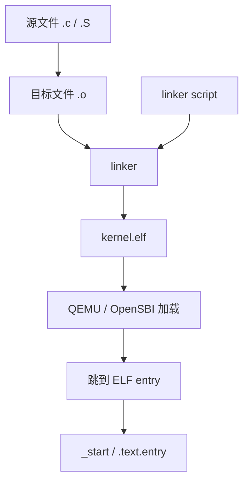
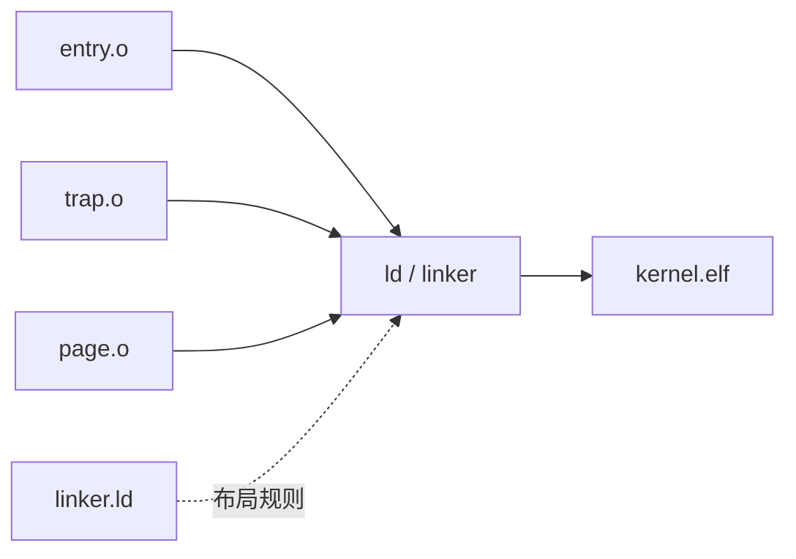
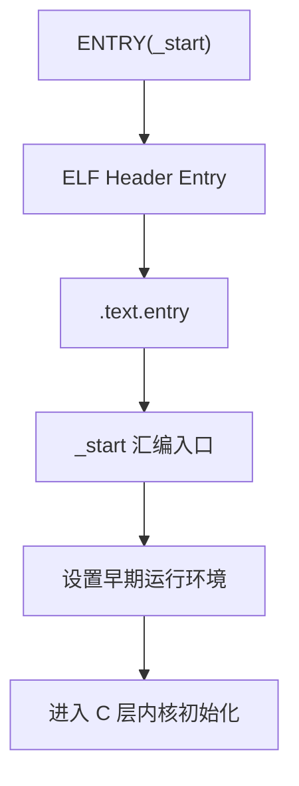

# Linker 与 ELF

写普通 C 程序时，我们通常从 `main()` 开始读代码。

但写 OS 内核时，事情不一样：内核不是由另一个操作系统加载起来的普通进程，它没有天然的 `main()` 入口，也没有 libc 帮你准备运行环境。

所以读一个小型 OS 项目时，一个很有效的问题是：

> 机器启动后，第一条属于这个内核的代码在哪里？

Linker script 和 ELF 文件就是回答这个问题的入口。

!!! tip "读小型 OS 的入口"
    对 FrostVistaOS 这样的教学内核，可以先从 linker script 找到 `ENTRY(_start)` 和 `.text.entry`，再顺着 `_start` 进入启动代码。这样比直接在源码目录里乱翻更容易建立方向感。

## 为什么 OS 项目要先看 Linker

普通程序大致是这样运行的：

```text
shell 执行程序
  -> Linux loader 读取 ELF
  -> libc 初始化运行环境
  -> 调用 main()
```

内核启动路径更接近这样：

```text
QEMU / OpenSBI 加载 kernel.elf
  -> 按 ELF 和链接脚本决定的位置放入内存
  -> 跳到 ELF 入口地址
  -> 执行 _start
  -> 内核自己初始化栈、页表、trap、设备和第一个进程
```

也就是说，普通程序的入口由运行时帮你安排；内核的入口需要你自己安排。



Linker script 解决的是：

- 入口符号是谁；
- 内核应该链接到哪个地址；
- 哪些代码必须放在最前面；
- `.text`、`.rodata`、`.data`、`.bss` 怎么排列；
- 哪些边界符号要暴露给启动代码或内存管理代码使用。

---

## 链接做了什么

编译器把每个 `.c` 或 `.S` 文件翻译成一个 `.o` 目标文件。

这些 `.o` 还不是完整程序。它们里面可能有：

- 已经生成好的机器指令；
- 当前文件定义的符号，例如 `_start`、`kernel_main`；
- 当前文件引用但还没确定地址的符号，例如 `memset`、`trap_init`；
- `.text`、`.data`、`.bss` 等 section。

链接器（linker）把这些目标文件合并成一个完整的 ELF 文件：



它主要做三件事：

| 动作 | 含义 | OS 里为什么重要 |
|------|------|------------------|
| 符号解析 | 把 `call foo` 里的 `foo` 找到最终定义 | 启动代码能跳到 C 函数，内核模块能互相调用 |
| 段合并 | 把所有 `.text.*`、`.data.*` 合并到输出 section | 内核镜像有稳定的布局 |
| 地址分配 | 给每个 section 和符号分配最终地址 | CPU 执行跳转、访存时需要真实地址 |

!!! note "目标文件还不是最终地址"
    `.o` 文件里的很多地址还没有最终确定。只有链接完成后，`kernel.elf` 里的符号地址才真正稳定下来。

---

## ELF 文件结构

ELF（Executable and Linkable Format）是 Linux 和大多数 Unix-like 系统使用的可执行文件格式。FrostVistaOS 的内核最终也会被链接成 ELF 文件，例如 `build/kernel.elf`。

完整规范可以参考 [System V ABI: ELF](https://refspecs.linuxfoundation.org/elf/gabi4+/contents.html)。这里先只讲读 FrostVistaOS 需要的部分。

一个 ELF 文件可以从两种视角看：

| 视角 | 主要结构 | 谁关心 | 解决什么问题 |
|------|----------|--------|---------------|
| 运行时视角 | Program Header | loader / QEMU / OpenSBI | 哪些内容要加载到内存，权限是什么 |
| 链接视角 | Section Header | linker / objdump / debug 工具 | `.text`、`.data`、符号表在哪里 |

```text
┌────────────────────┐
│ ELF Header          │  文件类型、目标架构、入口地址
├────────────────────┤
│ Program Headers     │  运行时视图：怎么加载进内存
├────────────────────┤
│ .text               │  代码
│ .rodata             │  只读数据
│ .data               │  已初始化全局变量
│ .bss                │  未初始化全局变量，通常不占文件空间
│ .symtab             │  符号表
│ .strtab             │  字符串表
│ ...                 │
├────────────────────┤
│ Section Headers     │  链接和调试视图：有哪些 section
└────────────────────┘
```

!!! warning "不要混淆 Program Header 和 Section Header"
    内核被加载时主要看 Program Header；你用 `objdump`、`readelf -S` 研究 `.text`、`.bss` 时主要看 Section Header。两者都在 ELF 里，但服务对象不同。

---

## 从 kernel.elf 反推入口

构建完成后，可以先看 ELF Header：

```bash
riscv64-elf-readelf -h build/kernel.elf
```

你会重点关注类似字段：

```text
Entry point address: 0x80200000
```

这个值表示 ELF 认为程序应该从哪个地址开始执行。

然后再看符号表，确认这个地址对应哪个符号：

```bash
riscv64-elf-objdump -t build/kernel.elf | grep _start
```

或：

```bash
riscv64-elf-nm build/kernel.elf | grep _start
```

如果 `_start` 的地址和 ELF header 的 entry point 对得上，就说明链接脚本里的入口符号和最终 ELF 入口是一致的。

!!! tip "推荐工具链前缀"
    本 Wiki 默认推荐使用 `riscv64-elf-` 工具链。若你的环境使用 `riscv64-unknown-elf-`，把命令里的前缀替换成 `riscv64-unknown-elf-` 即可。

---

## 链接脚本

链接脚本（linker script）告诉 linker 如何组织输出 ELF。

FrostVistaOS 有两个主要链接脚本：

| 文件 | 启动方式 | 入口 | 运行状态 |
|------|----------|------|----------|
| `arch/riscv/linker.ld` | `BOOT=bare` | `_start` | 裸机启动路径，入口较早 |
| `arch/riscv/linker-sbi.ld` | `BOOT=opensbi` | `_start` | OpenSBI 先运行，再进入内核 |

!!! note "以项目实际构建参数为准"
    不同 `BOOT` 模式下，QEMU、OpenSBI、链接脚本和入口特权级会一起变化。读启动流程时不要只看一个文件，要把 `make` 参数、运行脚本和 linker script 放在一起看。

一个典型链接脚本片段如下：

```ld
OUTPUT_ARCH(riscv)
ENTRY(_start)

SECTIONS
{
    . = 0x80200000;

    .text : {
        *(.text.entry)
        *(.text .text.*)
    }

    .rodata : {
        *(.rodata .rodata.*)
    }

    .data : {
        *(.data .data.*)
    }

    .bss : {
        *(.bss .bss.*)
    }
}
```

逐行看：

| 语句 | 含义 |
|------|------|
| `OUTPUT_ARCH(riscv)` | 输出文件目标架构是 RISC-V |
| `ENTRY(_start)` | ELF 入口符号是 `_start` |
| `. = 0x80200000` | location counter 移到指定地址，后续 section 从这里开始排 |
| `.text : { ... }` | 输出 `.text` section |
| `*(.text.entry)` | 收集所有输入文件里的 `.text.entry` section |
| `*(.text .text.*)` | 收集普通代码 section |
| `.rodata` | 只读数据，例如字符串常量 |
| `.data` | 已初始化全局变量 |
| `.bss` | 未初始化全局变量 |

---

## ENTRY(_start) 是什么

`ENTRY(_start)` 不是定义 `_start`，而是告诉 linker：

```text
最终 ELF 的入口地址 = 符号 _start 的地址
```

`_start` 本身通常定义在汇编启动代码里，例如某个 `.S` 文件中：

```asm
.section .text.entry
.globl _start
_start:
    ...
```

这个关系可以这样理解：


所以读启动代码时，不要只搜索 `main`。更可靠的路线是：

```text
linker script: ENTRY(_start)
  -> 符号表: _start 地址
  -> 源码: _start 定义
  -> 顺着汇编跳转进入 C 初始化函数
```

---

## 为什么 .text.entry 要放最前面

链接脚本里通常会把 `.text.entry` 放在普通 `.text` 前面：

```ld
.text : {
    *(.text.entry)
    *(.text .text.*)
}
```

这不是随便排的。

启动代码有两个特点：

- 它是 CPU 进入内核后最早执行的代码；
- 它运行时很多环境还没准备好，例如栈、页表、全局变量初始化、trap handler。

把 `.text.entry` 放在最前面，可以让入口代码处在一个可预期的位置，方便 linker、loader 和调试工具都对齐同一个入口。

!!! warning "入口代码不要依赖太多运行环境"
    `.text.entry` 里的代码通常应该非常克制：先设置最基础的运行环境，再跳到普通 C 初始化流程。不要在入口阶段假设内存管理、设备、中断或调度已经可用。

---

## VMA、LMA 和文件偏移

读 ELF 时，最容易混淆三种“位置”：

| 名称 | 含义 | 你会在哪里看到 |
|------|------|----------------|
| VMA | Virtual Memory Address，程序运行时认为自己所在的地址 | `objdump -h` 的 VMA |
| LMA | Load Memory Address，loader 把内容加载到内存的位置 | `objdump -h` 的 LMA |
| File offset | 内容在 ELF 文件里的偏移 | `readelf -l` 或 `objdump -h` |

对简单内核来说，VMA 和 LMA 经常相同，所以初学时容易忽略它们的区别。

但概念上它们不是一回事：

```text
ELF 文件中的偏移
  -> loader 按 Program Header 搬到 LMA
  -> CPU 执行时按 VMA 取指和访存
```

!!! note "先掌握够用版本"
    FrostVistaOS 的入门阶段不用一开始就深入所有 VMA/LMA 细节。你只需要先知道：文件里的位置、加载到内存的位置、运行时使用的地址，是三个不同问题。

---

## 用 readelf 和 objdump 验证布局

Linker script 不是靠猜的。每次你改了布局，都应该用工具看最终 ELF。

### 查看 ELF 头

```bash
riscv64-elf-readelf -h build/kernel.elf
```

重点看：

- `Machine` 是否是 RISC-V；
- `Entry point address` 是否符合预期。

### 查看 Program Headers

```bash
riscv64-elf-readelf -l build/kernel.elf
```

重点看：

- 哪些 segment 会被加载；
- 每个 segment 的 VirtAddr、PhysAddr、FileSiz、MemSiz；
- 权限是否大致符合预期，例如代码段可执行。

### 查看 Sections

```bash
riscv64-elf-readelf -S build/kernel.elf
```

重点看：

- `.text` 是否排在预期地址；
- `.rodata`、`.data`、`.bss` 的顺序是否符合 linker script；
- `.bss` 的大小是否异常。

### 查看符号表

```bash
riscv64-elf-objdump -t build/kernel.elf | grep _start
riscv64-elf-objdump -t build/kernel.elf | grep kernel
```

也可以使用：

```bash
riscv64-elf-nm build/kernel.elf
```

符号表可以回答：

- `_start` 最终地址是多少；
- 某个函数是否真的被链接进内核；
- linker script 导出的边界符号是否存在。

### 查看反汇编

```bash
riscv64-elf-objdump -d build/kernel.elf | less
```

如果你只想看入口附近，可以先找到 `_start`：

```bash
riscv64-elf-objdump -d build/kernel.elf | grep -A30 '<_start>'
```

---

## 新人怎么读 linker script

第一次读 linker script，不要试图把所有语法都背下来。按下面顺序读就够了：

```text
1. 看 ENTRY(_start)
   先知道入口符号是谁。

2. 看 `. = ...`
   知道内核从哪个链接地址开始排。

3. 看 `.text.entry`
   找到最早执行的代码被放在哪里。

4. 看 `.text`、`.rodata`、`.data`、`.bss`
   建立代码、只读数据、全局变量、未初始化变量的布局感。

5. 看导出的符号
   例如内核结束地址、bss 边界、栈边界等。

6. 回到启动源码
   搜索 `_start`，从第一条指令开始顺着读。
```

这条路线的目的不是“学会 linker script 语法”，而是建立一条可追踪的启动链：



---

## FrostVistaOS 中应该重点看什么

读 FrostVistaOS 的 linker 和 ELF 时，建议先抓这几个点：

| 关注点 | 为什么重要 |
|--------|------------|
| `ENTRY(_start)` | 找到系统入口符号 |
| `. = ...` | 知道内核链接地址 |
| `*(.text.entry)` | 知道启动代码为什么排在普通代码前 |
| `.bss` 边界符号 | 启动时通常要清零 `.bss` |
| kernel end 符号 | 物理页分配器可能从内核结束后开始管理内存 |
| stack 相关符号 | 早期启动必须先有可用栈 |

!!! tip "读源码时的搜索关键词"
    可以从这些关键词开始搜索：`ENTRY`、`.text.entry`、`_start`、`sbss`、`ebss`、`end`、`boot_stack`。

---

## 常见问题

### 链接时报 undefined reference

错误类似：

```text
undefined reference to `some_function'
```

含义是：某个 `.o` 引用了 `some_function`，但最终参与链接的目标文件里没有这个符号定义。

排查顺序：

1. 确认函数名拼写和声明一致；
2. 确认对应 `.c` 或 `.S` 文件被加入构建列表；
3. 确认该函数不是被 `#ifdef` 条件编译排除了；
4. 用 `objdump -t` 或 `nm` 检查符号是否存在。

```bash
riscv64-elf-nm build/kernel.elf | grep some_function
```

### 入口地址不对

如果 QEMU 启动后直接跑飞，或者 GDB 看到 PC 不在预期位置，可能是入口地址、加载地址和启动方式没有对齐。

排查顺序：

1. 看当前使用的是 `BOOT=bare` 还是 `BOOT=opensbi`；
2. 看构建系统选择的是哪个 linker script；
3. 用 `readelf -h` 查看 `Entry point address`；
4. 用 `objdump -t` 确认 `_start` 地址；
5. 对照 QEMU 启动参数和 OpenSBI 加载日志。

### section 顺序不对

如果 `.text.entry` 没有排在普通 `.text` 前面，入口符号可能仍然存在，但入口附近的布局不符合预期。

检查：

```bash
riscv64-elf-readelf -S build/kernel.elf
riscv64-elf-objdump -d build/kernel.elf | grep -A30 '<_start>'
```

### 修改 linker script 后没生效

修改 linker script 后建议清理再构建：

```bash
make clean
make qemu ROOTFS=easyfs FS_LIST="easyfs devtmpfs" TEST=fvsh
```

!!! warning "不要过度相信增量构建"
    Linker script 的变化如果没有触发完整重链，最终 ELF 可能还保留旧布局。遇到入口、section、符号边界相关问题时，先 `make clean` 是很便宜的排除手段。

---

## 下一步

理解 linker 和 ELF 后，可以继续读：

- [交叉编译器](cross-compiler.md) — 理解 `riscv64-elf-gcc`、`objdump`、`readelf` 从哪里来；
- [总览](../chapters/00-overview.md) — 把 linker 入口放回 FrostVistaOS 的整体阅读路线；
- [启动](../chapters/01-boot.md) — 顺着 `_start` 进入内核启动流程。
