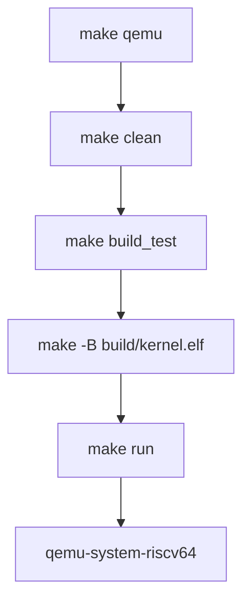
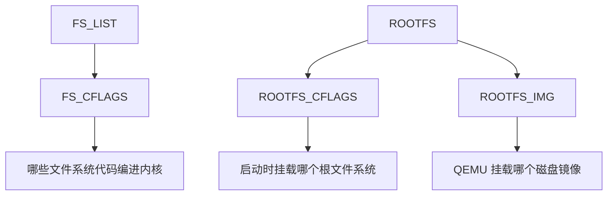

# Make

第一次看到 FrostVistaOS 的启动命令时，很多人会下意识把它当成“一条很长的命令”：

```bash
make qemu BOOT=opensbi ROOTFS=easyfs FS_LIST="easyfs devtmpfs" TEST=fvsh
```

但这条命令真正做的事情远不止“运行 QEMU”。它会选择工具链、选择启动路径、选择文件系统、编译用户程序、生成磁盘镜像、链接内核，最后才启动模拟器。

也就是说，`make` 在 FrostVistaOS 里不是一个可有可无的快捷方式，而是整个构建流程的调度器。


!!! tip "先看项目规则，再看 GNU Make 语法"
    学 Makefile 不需要一开始就背完所有语法。读 FrostVistaOS 时，先搞清楚本项目有哪些目标、变量从哪里来、它们怎么传到编译器和 QEMU。

## 最小语法

先看一个最小 Makefile：

```make
hello: hello.c
	gcc hello.c -o hello
```

它的意思是：如果要生成 `hello`，需要先有 `hello.c`；真正生成 `hello` 的命令是 `gcc hello.c -o hello`。

Makefile 最核心的结构是：

```make
目标: 依赖
	命令
```

这里有一个非常容易踩的坑：命令前面必须是 **tab**，不是普通空格。

!!! warning "命令行前面是 tab"
    Makefile 里规则下面的命令必须用 tab 缩进。如果你复制代码后把 tab 变成了空格，`make` 可能会报 `missing separator`。

### 目标和依赖

在 FrostVistaOS 里，`qemu`、`debug`、`gdb`、`clean` 都是目标：

```make
qemu:
	$(MAKE) clean
	$(MAKE) build_test TEST=$(TEST)
```

运行：

```bash
make qemu
```

就是让 Make 去执行 `qemu` 这个目标下面的命令。

有些目标有依赖，比如 `mk/run.mk` 里的 `run`：

```make
run: $(KERNEL_ELF) $(ROOTFS_DEPS)
	$(QEMU) $(QEMUFLAGS)
```

它的意思是：运行 QEMU 前，要先确保 `$(KERNEL_ELF)` 和 `$(ROOTFS_DEPS)` 这些依赖已经准备好。

### 变量

Makefile 里经常用变量保存命令、路径和参数：

```make
QEMU = qemu-system-riscv64
KERNEL_ELF := $(BUILD_DIR)/kernel.elf
ROOTFS ?= easyfs
```

常见赋值方式可以先记住三个：

| 写法 | 含义 | FrostVistaOS 里的例子 |
|------|------|----------------------|
| `=` | 递归展开，使用时再展开右边 | `QEMU = qemu-system-riscv64` |
| `:=` | 立即展开，定义时就确定 | `KERNEL_ELF := $(BUILD_DIR)/kernel.elf` |
| `?=` | 如果外面没传值，才使用默认值 | `ROOTFS ?= easyfs` |

这解释了为什么命令行可以覆盖默认值：

```bash
make qemu ROOTFS=ext4
```

因为 `mk/config.mk` 里写的是：

```make
ROOTFS ?= easyfs
```

如果命令行已经传了 `ROOTFS=ext4`，这个默认值就不会覆盖它。

### 变量引用

引用变量时使用：

```make
$(变量名)
```

比如：

```make
CC = $(CROSS)-gcc
```

如果 `CROSS=riscv64-elf`，那么 `$(CC)` 最后就是：

```text
riscv64-elf-gcc
```

这也是 FrostVistaOS 能通过 `CROSS=riscv64-elf` 切换工具链前缀的原因。

### 自动变量

Make 还有一些自动变量，最常见的是：

| 自动变量 | 含义 |
|----------|------|
| `$@` | 当前目标 |
| `$<` | 第一个依赖 |
| `$^` | 所有依赖 |

例如 `mk/build.mk` 里有这样的规则：

```make
$(OBJ_DIR)/%.o: %.c
	@mkdir -p $(dir $@)
	$(CC) $(CFLAGS) -c $< -o $@
```

如果 Make 正在构建：

```text
build/obj/kernel/core/proc.o
```

那么你可以粗略理解成：

```text
$@ = build/obj/kernel/core/proc.o
$< = kernel/core/proc.c
```

所以命令会变成类似：

```bash
riscv64-elf-gcc ... -c kernel/core/proc.c -o build/obj/kernel/core/proc.o
```

### 模式规则

这一句：

```make
$(OBJ_DIR)/%.o: %.c
```

里面的 `%` 可以理解成“同一段名字”。它告诉 Make：任何 `.c` 文件都可以按这个规则编译成对应的 `.o` 文件。

这就是为什么 FrostVistaOS 不需要给每个 `.c` 文件手写一条编译命令。

### phony 目标

有些目标并不是为了生成同名文件，而是为了执行动作，比如 `clean`、`qemu`、`debug`。

这类目标通常会放进 `.PHONY`：

```make
.PHONY: clean qemu debug gdb
```

它告诉 Make：这些名字不是普通文件名，每次执行都应该按命令来跑。

有了这些语法，再去看 FrostVistaOS 的 `mk/` 目录，就不会一上来全是符号了。

!!! note "更多语法资料"
    如果你想继续查完整的 Makefile 语法，可以看[在线资源参考](../reference/online-resources.md)里的 GNU Make Manual。本页只保留读 FrostVistaOS 构建系统最常用的部分。

## Make 在项目里做什么

FrostVistaOS 的 Makefile 主要负责五件事：

1. 选择默认配置，比如 `BOOT`、`ROOTFS`、`TEST`；
2. 选择交叉编译工具链，比如 `riscv64-elf-gcc`；
3. 收集源码并生成目标文件列表；
4. 编译用户程序、内核和磁盘镜像；
5. 调用 QEMU 或 GDB。

如果没有 Makefile，你就需要手动敲一长串命令：

```text
riscv64-elf-gcc ...
riscv64-elf-gcc ...
xxd ...
gcc mkfs/mkfs.c ...
dd if=/dev/zero ...
./build/mkfs_tool ...
qemu-system-riscv64 ...
```

这不仅麻烦，更重要的是容易漏掉某个参数。OS 项目里，一个 `-DOPEN_SBI_BOOT`、一个 linker script、一个 `ROOTFS` 选择错了，系统就可能完全跑不起来。

## 主 Makefile 只是入口

FrostVistaOS 根目录下的 `Makefile` 很短，核心是 include 各个 `mk/*.mk` 文件：

```make
MAKEFLAGS += -j$(shell nproc)

include mk/config.mk
include mk/toolchain.mk

ifeq ($(ARCH), riscv)
	include mk/arch-riscv.mk
else
	$(error Unsupported ARCH=$(ARCH). Use ARCH=riscv)
endif

include mk/fs.mk
include mk/sources.mk

include mk/build.mk
include mk/images.mk
include mk/run.mk

include mk/checks.mk
include mk/clean.mk
```

这里可以先抓住两点：

- `Makefile` 本身负责安排顺序；
- 真正的规则拆在 `mk/` 目录里。

这个拆法的好处是：你不需要在一个巨大 Makefile 里迷路。想看启动命令，就去 `mk/run.mk`；想看文件系统选择，就去 `mk/fs.mk`；想看工具链，就去 `mk/toolchain.mk` 和 `mk/arch-riscv.mk`。

## mk 目录分工

可以把 `mk/` 理解成 FrostVistaOS 的构建地图：

| 文件 | 负责什么 | 常见问题 |
|------|----------|----------|
| `mk/config.mk` | 用户可覆盖的默认参数 | `BOOT`、`ROOTFS`、`TEST` 默认值从哪来 |
| `mk/toolchain.mk` | 工具链命令名 | `$(CROSS)-gcc`、`$(CROSS)-objdump` 怎么拼出来 |
| `mk/arch-riscv.mk` | RISC-V 架构参数 | `-march`、`-mabi`、`BOOT`、linker script、QEMU 程序 |
| `mk/fs.mk` | 文件系统选择 | `ROOTFS` 和 `FS_LIST` 为什么必须匹配 |
| `mk/sources.mk` | 源码收集 | 哪些 `.c` / `.S` 会被编进内核 |
| `mk/build.mk` | 编译和链接 | `kernel.elf`、`init_bin`、用户程序怎么生成 |
| `mk/images.mk` | 磁盘镜像 | `build/disk.img` 和 `mkfs_tool` 怎么生成 |
| `mk/run.mk` | 运行和调试 | `make qemu`、`make debug`、`make gdb` 做什么 |
| `mk/checks.mk` | 检查工具 | format、lint、tidy、compdb |
| `mk/clean.mk` | 清理 | `make clean` 和 `clean_disk` 删除什么 |

从阅读顺序上，我建议新人先看：

```text
config.mk -> arch-riscv.mk -> fs.mk -> build.mk -> images.mk -> run.mk
```

这条线基本对应：

```text
选择配置 -> 选择架构 -> 选择文件系统 -> 构建产物 -> 生成镜像 -> 启动运行
```

## 常用目标

FrostVistaOS 里常用的 make target 大致如下：

| 目标 | 用法 | 做什么 |
|------|------|--------|
| `make qemu` | `make qemu BOOT=opensbi ROOTFS=easyfs ...` | 清理、构建、生成镜像并启动 QEMU |
| `make run` | 通常不直接手动调用 | 直接用当前构建产物启动 QEMU |
| `make debug` | `make debug TEST=fvsh` | 构建 debug 内核，QEMU 加 `-s -S` 等待 GDB |
| `make gdb` | 另一个终端运行 | 连接 QEMU 的 GDB stub |
| `make build_test` | `make build_test TEST=fvsh` | 只构建测试入口 `init_bin` |
| `make build_user_apps` | 通常由镜像规则调用 | 构建 `user/bin/` 下的用户程序 |
| `make disasm` | 构建后运行 | 生成 `build/disasm.txt` |
| `make clean` | 清理构建目录 | 删除 `build/` 和 `kernel-rv` |

这里要注意：`make qemu` 会先 `make clean`，所以它更像“重新构建并运行”。如果你只是想用已有产物跑 QEMU，才会关心 `make run`。

## 常用变量

Make 的一个重要用法是：命令行变量可以覆盖默认值。

比如：

```bash
make qemu BOOT=opensbi ROOTFS=easyfs FS_LIST="easyfs devtmpfs" TEST=fvsh BUILD=debug
```

这些变量的默认值主要来自 `mk/config.mk`：

```make
ARCH ?= riscv
TEST ?= runner
BOOT ?= bare
LOG_NUM ?= 2
BUILD ?= release
FS_LIST ?= easyfs
ROOTFS ?= easyfs
EXT4_IMG ?= sdcard-rv.img
```

常用变量可以这样理解：

| 变量 | 示例 | 影响什么 |
|------|------|----------|
| `ARCH` | `riscv` | 选择架构，目前只支持 RISC-V |
| `BOOT` | `opensbi` / `bare` | 影响 QEMU `-bios`、linker script、条件编译 |
| `ROOTFS` | `easyfs` / `ext4` | 启动时挂载哪个根文件系统 |
| `FS_LIST` | `"easyfs devtmpfs"` | 哪些文件系统代码会编进内核 |
| `TEST` | `fvsh` / `runner` | 哪个 `test/test_<name>.c` 会成为 `/init` |
| `BUILD` | `release` / `debug` | 编译优化级别和调试信息 |
| `LOG` | `TRACE` / `DEBUG` / `INFO` | 内核日志级别 |
| `CROSS` | `riscv64-elf` | 交叉编译工具链前缀 |

!!! warning "ROOTFS 必须在 FS_LIST 里"
    `mk/fs.mk` 会检查 `ROOTFS` 是否包含在 `FS_LIST` 中。比如 `ROOTFS=easyfs FS_LIST="ext4 devtmpfs"` 是不成立的，因为内核没有把 Easy-FS 编进去，却要求启动时挂载 Easy-FS。

## make qemu 的构建链路

`make qemu` 的规则在 `mk/run.mk`：

```make
qemu:
	$(MAKE) clean
	$(MAKE) build_test TEST=$(TEST)
	$(MAKE) -B $(KERNEL_ELF) BOOT=$(BOOT) FS_LIST="$(FS_LIST)" ROOTFS=$(ROOTFS) BUILD=$(BUILD) TEST=$(TEST)
	$(MAKE) run BOOT=$(BOOT) FS_LIST="$(FS_LIST)" ROOTFS=$(ROOTFS) BUILD=$(BUILD) TEST=$(TEST)
```

展开成流程就是：



其中 `-B` 的意思是强制重新构建目标。这里强制重建 `build/kernel.elf` 很重要，因为 `/init` 会被嵌入内核。

## TEST 为什么会影响内核

`TEST=fvsh` 看起来像是“选择一个用户程序”，但在 FrostVistaOS 当前构建方式里，它会影响内核镜像。

`mk/build.mk` 里的 `build_test` 会做几件事：

1. 编译 `user/ulib.c`；
2. 编译 `test/test_$(TEST).c`；
3. 链接成 `build/test/init_bin`；
4. 用 `xxd` 或 `od + awk` 生成 `build/gen/kernel/init_code.h`；
5. 内核构建时把这个 `init_code.h` 编进去。

所以链路是：


这解释了一个常见现象：你切换 `TEST` 后，如果没有重新链接内核，系统可能还在跑旧的 `/init`。

## FS_LIST 和 ROOTFS

`FS_LIST` 和 `ROOTFS` 是两个不同层面的选择。

`FS_LIST` 决定哪些文件系统代码被编进内核：

```make
ifneq ($(filter easyfs,$(FS_LIST)),)
  FS_CFLAGS += -DCONFIG_FS_EASYFS
endif
```

`ROOTFS` 决定启动时选择哪个根文件系统：

```make
ifeq ($(ROOTFS), easyfs)
  ROOTFS_CFLAGS := -DROOTFS_EASYFS
  ROOTFS_IMG := $(DISK_IMG)
  ROOTFS_DEPS := $(DISK_IMG)
endif
```

所以这两个变量必须一起看：



如果你想用 Easy-FS，推荐显式写：

```bash
make qemu BOOT=opensbi ROOTFS=easyfs FS_LIST="easyfs devtmpfs" TEST=fvsh
```

如果你想用 EXT4，通常要写：

```bash
make qemu BOOT=opensbi ROOTFS=ext4 FS_LIST="ext4 devtmpfs" TEST=runner BUILD=debug
```

## make debug 和 make gdb

调试路径也由 Makefile 串起来。

`make debug` 会：

1. 构建测试程序；
2. 用 `BUILD=debug` 重新构建 `kernel.elf`；
3. 启动 QEMU，并追加 `-s -S`。

然后另开一个终端运行：

```bash
make gdb
```

`make gdb` 会用当前 `CROSS` 推导 GDB 命令：

```make
$(CROSS)-gdb $(BUILD_DIR)/kernel.elf \
    -ex 'set confirm off' \
    -ex 'target remote :1234'
```

所以如果 `make gdb` 报找不到命令，要检查的不是 QEMU，而是 `$(CROSS)-gdb` 是否存在。

## 常见问题

### make qemu 后运行的不是我想要的测试

先确认 `TEST` 是否对应真实文件：

```text
TEST=fvsh -> test/test_fvsh.c
```

如果文件不存在，`build_test` 会失败。切换 `TEST` 后建议用完整 `make qemu` 路径，让它重新构建并链接内核。

### ROOTFS 和 FS_LIST 报错

如果看到类似：

```text
ROOTFS=easyfs must be included in FS_LIST=...
```

说明你要求系统挂载 Easy-FS，但 `FS_LIST` 没有把 Easy-FS 编进内核。修正方式是让两者匹配：

```bash
make qemu ROOTFS=easyfs FS_LIST="easyfs devtmpfs" TEST=fvsh
```

### 修改源码后没有生效

先用完整路径重跑：

```bash
make qemu BOOT=opensbi ROOTFS=easyfs FS_LIST="easyfs devtmpfs" TEST=fvsh
```

这个目标会先 `make clean`，再重新构建。如果你绕过 `make qemu` 直接跑了 `make run`，那它可能只是使用已有的 `kernel.elf` 和磁盘镜像。

### make gdb 找不到命令

如果 `CROSS=riscv64-elf`，项目会尝试运行：

```bash
riscv64-elf-gdb
```

如果你只安装了 `gdb-multiarch`，可以手动连接：

```bash
gdb-multiarch build/kernel.elf -ex 'target remote :1234'
```

### 不知道该看哪个 mk 文件

可以按问题查：

| 问题 | 先看哪里 |
|------|----------|
| 默认参数是什么 | `mk/config.mk` |
| 工具链前缀怎么来的 | `mk/arch-riscv.mk`、`mk/toolchain.mk` |
| linker script 为什么变了 | `mk/arch-riscv.mk` |
| 文件系统为什么没编进去 | `mk/fs.mk`、`mk/sources.mk` |
| `/init` 为什么变了 | `mk/build.mk` |
| 磁盘镜像怎么生成 | `mk/images.mk` |
| QEMU 参数怎么拼 | `mk/run.mk` |

## 下一步

如果你想继续理解 Makefile 调用了哪些工具，可以读：

- [交叉编译器](cross-compiler.md)
- [Linker Script 与 ELF](linker-elf.md)
- [QEMU](qemu.md)

如果你想先跑通项目，可以回到：

- [构建与运行](../getting-started/build-and-run.md)
