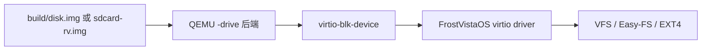
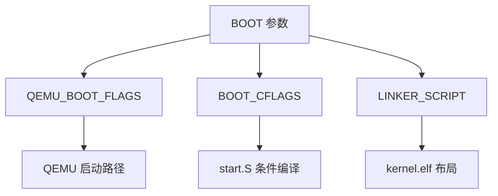
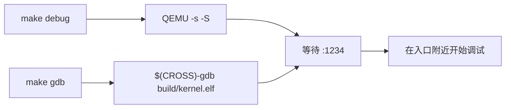

# QEMU

写 OS 的时候，我们没有真的拿一块 RISC-V 开发板来反复烧录内核。

FrostVistaOS 日常开发使用的是 QEMU：它在你的电脑上模拟一台 RISC-V 64 机器，然后把 `build/kernel.elf` 放进去运行。

所以很多问题表面看起来是“内核启动失败”，实际上要同时看三件事：


如果你只看内核代码，不看 QEMU 是怎么启动它的，很容易不知道第一条指令为什么在那里、磁盘为什么能被识别、GDB 为什么能连上。

!!! tip "先用 make，不要手写 QEMU 命令"
    FrostVistaOS 推荐通过 `make qemu`、`make debug` 启动 QEMU。手写完整 QEMU 命令只适合调试 Makefile 或确认参数展开结果。

## QEMU 在项目里做什么

在 FrostVistaOS 里，QEMU 主要做四件事：

1. 模拟一台 RISC-V 64 机器；
2. 加载 FrostVistaOS 内核镜像；
3. 提供串口、时钟、中断控制器、VirtIO block 等设备；
4. 提供 GDB remote debugging stub，方便调试内核。

项目里选择的 QEMU 程序定义在 FrostVistaOS 的 `mk/arch-riscv.mk`：

```make
QEMU = qemu-system-riscv64
```

这里有个容易混淆的点：

| 命令 | 作用 | 适合场景 |
|------|------|----------|
| `qemu-system-riscv64` | 模拟完整 RISC-V 机器 | 运行 OS 内核 |
| `qemu-riscv64` | 只运行 RISC-V Linux 用户态程序 | 运行普通 ELF 程序 |

FrostVistaOS 是内核，不是 Linux 用户态程序，所以需要 `qemu-system-riscv64`。

## 为什么是 virt machine

项目启动 QEMU 时会使用：

```text
-machine virt
```

`virt` 是 QEMU 提供的一台“虚拟 RISC-V 开发板”。它不是某块真实板子的完整复刻，而是为了 OS 开发准备的一套常用设备组合。

对 FrostVistaOS 来说，`virt` 至少提供了这些关键东西：

- RISC-V 64 CPU；
- 一段从 `0x80000000` 附近开始的物理内存；
- UART 串口，用来输出日志；
- timer / interrupt 相关设备；
- VirtIO MMIO 设备总线；
- VirtIO block device，用来挂载磁盘镜像。

这也是为什么你会在启动日志里看到类似：

```text
virtio-blk initialized, mmio version 2
```

这不是 FrostVistaOS 凭空造出来的设备，而是 QEMU `virt` machine 暴露给 guest OS 的虚拟硬件。

## make qemu 背后发生了什么

日常启动命令一般长这样：

```bash
make qemu BOOT=opensbi ROOTFS=easyfs FS_LIST="easyfs devtmpfs" TEST=fvsh
```

如果你想先理解 `make qemu` 这条命令本身如何被拆开，可以阅读[Make](make.md)。本节只关注它最终如何走到 QEMU。

它不是只做“启动 QEMU”一件事。FrostVistaOS 的 `mk/run.mk` 中，`qemu` 目标会依次做：

1. `make clean` 清理旧构建产物；
2. `make build_test TEST=$(TEST)` 构建测试入口；
3. 重新构建 `build/kernel.elf`；
4. 准备 rootfs 镜像；
5. 执行 `qemu-system-riscv64`。

真正运行 QEMU 的目标是 `run`：

```make
run: $(KERNEL_ELF) $(ROOTFS_DEPS)
	$(QEMU) $(QEMUFLAGS)
```

也就是说：

```text
make qemu
  -> 构建测试程序
  -> 构建 kernel.elf
  -> 生成或准备磁盘镜像
  -> make run
  -> qemu-system-riscv64 $(QEMUFLAGS)
```

如果你启动后发现运行的不是预期测试，或者文件系统内容不对，问题不一定在 QEMU，也可能是 `TEST`、`ROOTFS`、`FS_LIST` 导致构建产物变了。

## 本项目的 QEMU 参数

FrostVistaOS 的核心 QEMU 参数在 `mk/run.mk` 中拼出来，形式是：

```make
QEMUFLAGS := -machine virt -nographic $(QEMU_BOOT_FLAGS) -kernel $(KERNEL_ELF)
QEMUFLAGS += -drive file=$(ROOTFS_IMG),if=none,format=raw,id=x0
QEMUFLAGS += -device virtio-blk-device,drive=x0,bus=virtio-mmio-bus.0
QEMUFLAGS += -global virtio-mmio.force-legacy=false
```

拆开看：

| 参数 | 含义 | 为什么需要 |
|------|------|------------|
| `-machine virt` | 使用 QEMU RISC-V virt machine | 提供教学 OS 常用的虚拟硬件 |
| `-nographic` | 不打开图形窗口，串口走终端 | 内核日志和 shell 直接显示在当前终端 |
| `$(QEMU_BOOT_FLAGS)` | 根据 `BOOT` 选择 BIOS / OpenSBI 路径 | 控制 QEMU 先运行什么启动固件 |
| `-kernel $(KERNEL_ELF)` | 加载 `build/kernel.elf` | 把 FrostVistaOS 内核交给 QEMU |
| `-drive file=$(ROOTFS_IMG),if=none,format=raw,id=x0` | 声明一个后端磁盘镜像 | 告诉 QEMU host 上哪个文件是磁盘 |
| `-device virtio-blk-device,drive=x0,bus=virtio-mmio-bus.0` | 暴露 VirtIO block 设备 | 让内核能通过 VirtIO 访问这个磁盘 |
| `-global virtio-mmio.force-legacy=false` | 使用较新的 VirtIO MMIO 行为 | 和内核的 VirtIO 驱动路径对齐 |

这里最容易误解的是 `-drive` 和 `-device`。

`-drive` 只是告诉 QEMU：“host 上有一个文件，可以当作磁盘后端。”  
`-device virtio-blk-device` 才是告诉 guest OS：“我给你暴露一个 VirtIO block 硬件设备。”

所以磁盘链路可以这样理解：



## BOOT=opensbi 和 BOOT=bare

FrostVistaOS 支持两种启动方式：

| `BOOT` | QEMU 参数 | 链接脚本 | 大致含义 |
|--------|-----------|----------|----------|
| `opensbi` | `-bios default` | `arch/riscv/linker-sbi.ld` | QEMU 先运行 OpenSBI，再进入内核 S mode |
| `bare` | `-bios none` | `arch/riscv/linker.ld` | 不使用 OpenSBI，内核从更早的裸机路径启动 |

这个映射定义在 `mk/arch-riscv.mk`：

```make
ifeq ($(BOOT), opensbi)
  BOOT_CFLAGS := -DOPEN_SBI_BOOT
  LINKER_SCRIPT := arch/$(ARCH)/linker-sbi.ld
  QEMU_BOOT_FLAGS := -bios default
else ifeq ($(BOOT), bare)
  BOOT_CFLAGS :=
  LINKER_SCRIPT := arch/$(ARCH)/linker.ld
  QEMU_BOOT_FLAGS := -bios none
endif
```

这几项必须一起看：



如果只改 `BOOT`，但没有意识到链接脚本、条件编译、入口地址也会跟着变，就很容易在 GDB 里看到 PC 停在意料之外的位置。

!!! note "日常建议"
    当前 Wiki 的运行示例更推荐显式使用 `BOOT=opensbi`。这样启动路径更接近“OpenSBI 先完成 M mode 相关工作，然后把控制权交给 S mode 内核”的模型。

## ROOTFS、磁盘镜像和 VirtIO block

FrostVistaOS 的根文件系统由 `ROOTFS` 决定：

| `ROOTFS` | 常见镜像 | 适合场景 |
|----------|----------|----------|
| `easyfs` | `build/disk.img` | 日常实验和 Wiki 示例推荐 |
| `ext4` | `sdcard-rv.img` | 特定兼容和测试场景 |

不管是 Easy-FS 还是 EXT4，最后交给 QEMU 的都是一个磁盘镜像文件。QEMU 把它挂成 VirtIO block device，FrostVistaOS 再通过自己的块设备驱动读写它。

所以如果你看到：

```text
virtio-blk initialized, mmio version 2
```

说明至少这几步已经通了：

1. QEMU 创建了 VirtIO block 设备；
2. FrostVistaOS 扫到了这个设备；
3. VirtIO block 初始化代码跑起来了。

但这不代表文件系统一定正常。块设备正常只是下游 VFS / Easy-FS / EXT4 能继续工作的前提。

## make debug、-s -S 和 GDB stub

如果需要调试内核，可以使用：

```bash
make debug BOOT=opensbi ROOTFS=easyfs FS_LIST="easyfs devtmpfs" TEST=fvsh
```

`make debug` 会重新构建 debug 版本内核，然后启动 QEMU：

```make
$(QEMU) $(QEMUFLAGS) -s -S
```

这里的两个参数很关键：

| 参数 | 含义 |
|------|------|
| `-s` | 等价于 `-gdb tcp::1234`，打开 GDB remote debugging stub |
| `-S` | CPU 启动后先暂停，等待 GDB 连接 |

然后另开一个终端：

```bash
make gdb
```

项目里的 `gdb` 目标会执行类似：

```bash
$(CROSS)-gdb build/kernel.elf \
    -ex 'set confirm off' \
    -ex 'target remote :1234'
```

这个链路可以理解成：



如果 GDB 连不上，先确认终端 1 跑的是 `make debug`，不是 `make qemu`。普通 `make qemu` 不会停住等 GDB。

## 什么时候需要看原始 QEMU 参数

大部分时候你不需要手写 QEMU 命令。

但遇到这些问题时，可以回到 `mk/run.mk` 看实际参数：

- 启动后没有任何输出；
- GDB 看到 PC 不在预期入口；
- 切换 `BOOT` 后行为异常；
- VirtIO block 没有初始化；
- 切换 `ROOTFS` 后系统还像在使用旧镜像；
- 想确认 QEMU 有没有带上 `-s -S`。

一个实用习惯是：

```bash
make qemu BOOT=opensbi ROOTFS=easyfs FS_LIST="easyfs devtmpfs" TEST=fvsh
```

跑不通时，不要先猜内核错了。先确认：

1. `BOOT` 是否是你以为的值；
2. `ROOTFS` 和 `FS_LIST` 是否匹配；
3. `TEST` 是否对应正确的 `test/test_<name>.c`；
4. 是否需要 `make clean`；
5. `mk/run.mk` 里 QEMU 参数是否符合预期。

## 常见问题

### QEMU 没有退出

`-nographic` 模式下，QEMU 和 guest 串口共用当前终端。有时候 guest 卡住了，看起来像终端不能用了。

可以尝试：

```text
Ctrl-a x
```

这是 QEMU 在 `-nographic` 模式下退出模拟器的快捷键。

如果还有旧进程残留，可以清理：

```bash
pkill -f qemu-system-riscv
```

### GDB 连接失败

先确认启动命令是：

```bash
make debug ...
```

而不是：

```bash
make qemu ...
```

然后确认 `make gdb` 使用的 GDB 是否存在。比如 `CROSS=riscv64-elf` 时，项目会尝试运行：

```bash
riscv64-elf-gdb build/kernel.elf -ex 'target remote :1234'
```

如果没有对应 GDB，可以临时使用 `gdb-multiarch` 手动连接。

### 切换 BOOT 后入口不对

`BOOT=opensbi` 和 `BOOT=bare` 不只是 QEMU 参数不同。它们还会改变 linker script 和条件编译宏。

排查顺序：

1. 看命令里 `BOOT` 的值；
2. 看 `mk/arch-riscv.mk` 选择了哪个 `LINKER_SCRIPT`；
3. 看 `build/kernel.elf` 的入口地址；
4. 用 GDB 连接后检查 PC；
5. 对照 `arch/riscv/boot/start.S` 的条件编译路径。

### VirtIO block 没有初始化

先确认 QEMU 参数里有这两项：

```text
-drive file=$(ROOTFS_IMG),if=none,format=raw,id=x0
-device virtio-blk-device,drive=x0,bus=virtio-mmio-bus.0
```

再确认 `ROOTFS_IMG` 指向的镜像文件存在。Easy-FS 日常路径一般是 `build/disk.img`，EXT4 路径一般是 `sdcard-rv.img`。

### 切换 ROOTFS 后行为异常

切换过 `ROOTFS`、`FS_LIST` 或 `TEST` 后，建议先清理再运行：

```bash
make clean
make qemu BOOT=opensbi ROOTFS=easyfs FS_LIST="easyfs devtmpfs" TEST=fvsh
```

尤其要注意：`ROOTFS` 决定启动时挂载哪个根文件系统，`FS_LIST` 决定哪些文件系统代码会编进内核。两者不一致时，很容易出现“镜像有了，但内核不认识这个文件系统”的问题。

## 下一步

如果你想理解 QEMU 加载的 `kernel.elf` 是怎么来的，可以继续读：

- [交叉编译器](cross-compiler.md)
- [Linker Script 与 ELF](linker-elf.md)

如果你只想先跑起来，可以回到：

- [构建与运行](../getting-started/build-and-run.md)
